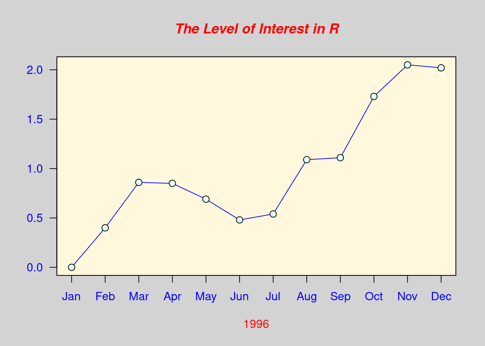

# R及Python语言简介

### R简介
1. R语言是从S统计绘图语言演变而来, 可看作S的“方言”; 
2. S语言诞生于上世纪70年代的贝尔实验室,  由Rick Becker, John Chambers, Allan Wilks开发; 基于S语言开发的商业软件Splus, 可以方便的编写函数、建立模型, 具有良好的扩展性, 在国外学术界应用很广. 
3. 1995年, 新西兰Auckland大学统计系的Robert Gentleman和Ross Ihaka, 基于S语言的源代码, 编写了能执行S语言的软件, 并将该软件的源代码全部公开, 这就是R软件, 其命令统称为R语言.

### R语言安装及环境配置

- 下载R：
[R官方网站](https://www.r-project.org/)
1. 选择合适的源；
2. 根据操作系统选择合适的包下载
- 安装r软件；

### Rstudio软件安装
- 下载Rstudio：
[Rstudio官方网站](https://www.rstudio.com/products/rstudio/download/)
1. 选择free的下载；
2. 根据操作系统选择合适的包下载
- 安装r软件；
- R语言安装（win版）：[下载软件](https://cran.r-project.org/bin/windows/base/R-3.6.1-win.exe)

- 双击，按照提示完成安装（使用默认安装）

- Rstudio安装：Studio是R最佳的图形编辑环境

### R基础

```r
#试试R编程 
x=1:100#把1,2,...,100这个整数向量赋值到x
(x=1:100) #同上, 只不过显示出来
```

```
##   [1]   1   2   3   4   5   6   7   8   9  10  11  12  13  14  15  16  17  18
##  [19]  19  20  21  22  23  24  25  26  27  28  29  30  31  32  33  34  35  36
##  [37]  37  38  39  40  41  42  43  44  45  46  47  48  49  50  51  52  53  54
##  [55]  55  56  57  58  59  60  61  62  63  64  65  66  67  68  69  70  71  72
##  [73]  73  74  75  76  77  78  79  80  81  82  83  84  85  86  87  88  89  90
##  [91]  91  92  93  94  95  96  97  98  99 100
```

```r
sample(x,20) #从1,2,...,100中随机不放回地抽取20个值作为样本
```

```
##  [1] 26 76 56 24 97 53 74 66 51 32 90 21 55 92 69 94 10  8  4 78
```

```r
set.seed(0);sample(1:10,3)#先设随机种子再抽样
```

```
## [1] 9 4 7
```

```r
#从1,2,...,200000中随机不放回地抽取10000个值作为样本:
z=sample(1:20,5)
z[1:3]#方括号中为向量z的下标
```

```
## [1]  1  2 11
```

```r
y=c(1,3,7,3,4,2)
z[y]#以y为下标的z的元素值
```

```
## [1]  1 11 NA 11 14  2
```

```r
(z=sample(x,100,rep=T))#从x有放回地随机抽取100个值作为样本
```

```
##   [1]  59  51  97  85  21  54  74   7  73  79  85  37  89  37  34  89  44  79
##  [19]  33  84  35  70  74  42  38  20  28  20  44  87  70  40  44  25  70  39
##  [37]  51  42   6  24  32  14   2  45  18  22  78  65  70  87  70  75  81 100
##  [55]  13  40  89  48  89  23  84  29  13  22  93  28  48  33  45  21  31  17
##  [73]  73  87  83  90  48  64  94  96  60  51  93  34  10   1  43  59  26  15
##  [91]  58  29  24  42  48  76  39  24  53  92
```

```r
(z1=unique(z))
```

```
##  [1]  59  51  97  85  21  54  74   7  73  79  37  89  34  44  33  84  35  70  42
## [20]  38  20  28  87  40  25  39   6  24  32  14   2  45  18  22  78  65  75  81
## [39] 100  13  48  23  29  93  31  17  83  90  64  94  96  60  10   1  43  26  15
## [58]  58  76  53  92
```

```r
length(z1)#z中不同元素的个数
```

```
## [1] 61
```

```r
xz=setdiff(x,z) #x和z之间的不同元素--集合差
sort(union(xz,z))#对xz及z的并的元素从小到大排序
```

```
##   [1]   1   2   3   4   5   6   7   8   9  10  11  12  13  14  15  16  17  18
##  [19]  19  20  21  22  23  24  25  26  27  28  29  30  31  32  33  34  35  36
##  [37]  37  38  39  40  41  42  43  44  45  46  47  48  49  50  51  52  53  54
##  [55]  55  56  57  58  59  60  61  62  63  64  65  66  67  68  69  70  71  72
##  [73]  73  74  75  76  77  78  79  80  81  82  83  84  85  86  87  88  89  90
##  [91]  91  92  93  94  95  96  97  98  99 100
```

```r
setequal(union(xz,z),x) #xz及z的并的元素与x是否一样
```

```
## [1] TRUE
```

```r
intersect(1:10,7:50) #两个数据的交
```

```
## [1]  7  8  9 10
```

```r
sample(1:100,20,prob=1:100)#从1:100中不等概率随机抽样,
```

```
##  [1] 91 50 95 36 62 67 82 74 70 90 66 97 84 87 81 29 71 43 31 75
```

```r
#上一语句各数字被抽到的概率与其值大小成比例
pi*10^2 #能够用?"*"、?"^"等来看某些基本算子的帮助, pi是圆周率
```

```
## [1] 314.1593
```

```r
"*"(pi,"^"(10,2)) #和上面一样, 有些烦琐, 是吧! 没有人这么用
```

```
## [1] 314.1593
```

```r
pi*(1:10)^-2.3#可以对向量求指数幂
```

```
##  [1] 3.14159265 0.63794154 0.25105622 0.12954239 0.07753876 0.05098025
##  [7] 0.03576221 0.02630528 0.02006283 0.01574526
```

```r
x = pi * 10^2 ; print(x) 
```

```
## [1] 314.1593
```

```r
(x=pi *10^2) #赋值带打印
```

```
## [1] 314.1593
```

```r
pi^(1:5) #指数也可以是向量
```

```
## [1]   3.141593   9.869604  31.006277  97.409091 306.019685
```

```r
print(x, digits= 12)#输出x的12位数字
```

```
## [1] 314.159265359
```

```r
#R对象的类型
x=pi*10^2
class(x) #x的class
```

```
## [1] "numeric"
```

```r
typeof(x) #x的type
```

```
## [1] "double"
```

```r
class(cars)#cars是一个R中自带的数据
```

```
## [1] "data.frame"
```

```r
typeof(cars) #cars的type
```

```
## [1] "list"
```

```r
names(cars)#cars数据的变量名字
```

```
## [1] "speed" "dist"
```

```r
summary(cars) #cars的汇总
```

```
##      speed           dist       
##  Min.   : 4.0   Min.   :  2.00  
##  1st Qu.:12.0   1st Qu.: 26.00  
##  Median :15.0   Median : 36.00  
##  Mean   :15.4   Mean   : 42.98  
##  3rd Qu.:19.0   3rd Qu.: 56.00  
##  Max.   :25.0   Max.   :120.00
```

```r
head(cars)#cars的头几行数据, 和cars[1:6,]相同
```

```
##   speed dist
## 1     4    2
## 2     4   10
## 3     7    4
## 4     7   22
## 5     8   16
## 6     9   10
```

```r
tail(cars) #cars的最后几行数据
```

```
##    speed dist
## 45    23   54
## 46    24   70
## 47    24   92
## 48    24   93
## 49    24  120
## 50    25   85
```

```r
str(cars)#也是汇总
```

```
## 'data.frame':	50 obs. of  2 variables:
##  $ speed: num  4 4 7 7 8 9 10 10 10 11 ...
##  $ dist : num  2 10 4 22 16 10 18 26 34 17 ...
```

```r
row.names(cars) #行名字
```

```
##  [1] "1"  "2"  "3"  "4"  "5"  "6"  "7"  "8"  "9"  "10" "11" "12" "13" "14" "15"
## [16] "16" "17" "18" "19" "20" "21" "22" "23" "24" "25" "26" "27" "28" "29" "30"
## [31] "31" "32" "33" "34" "35" "36" "37" "38" "39" "40" "41" "42" "43" "44" "45"
## [46] "46" "47" "48" "49" "50"
```

```r
attributes(cars)#cars的一些信息
```

```
## $names
## [1] "speed" "dist" 
## 
## $class
## [1] "data.frame"
## 
## $row.names
##  [1]  1  2  3  4  5  6  7  8  9 10 11 12 13 14 15 16 17 18 19 20 21 22 23 24 25
## [26] 26 27 28 29 30 31 32 33 34 35 36 37 38 39 40 41 42 43 44 45 46 47 48 49 50
```

```r
class(dist~speed)#公式形式,"~"左边是因变量,右边是自变量
```

```
## [1] "formula"
```

```r
plot(dist~speed,cars)#两个变量的散点图
```


```r
plot(cars$speed,cars$dist) #同上
```


```r
#包括简单自变量为定量变量及定性变量的回归

ncol(cars);nrow(cars) #cars的行列数
```

```
## [1] 2
```

```
## [1] 50
```

```r
dim(cars) #cars的维数
```

```
## [1] 50  2
```

```r
lm(dist ~ speed, data = cars)#以dist为因变量,speed为自变量做OLS回归
```

```
## 
## Call:
## lm(formula = dist ~ speed, data = cars)
## 
## Coefficients:
## (Intercept)        speed  
##     -17.579        3.932
```

```r
cars$qspeed =cut(cars$speed, breaks=quantile(cars$speed),
include.lowest = TRUE) #增加定性变量qspeed, 四分位点为分割点
names(cars) #数据cars多了一个变量
```

```
## [1] "speed"  "dist"   "qspeed"
```

```r
cars[3]#第三个变量的值, 和cars[,3]类似
```

```
##     qspeed
## 1   [4,12]
## 2   [4,12]
## 3   [4,12]
## 4   [4,12]
## 5   [4,12]
## 6   [4,12]
## 7   [4,12]
## 8   [4,12]
## 9   [4,12]
## 10  [4,12]
## 11  [4,12]
## 12  [4,12]
## 13  [4,12]
## 14  [4,12]
## 15  [4,12]
## 16 (12,15]
## 17 (12,15]
## 18 (12,15]
## 19 (12,15]
## 20 (12,15]
## 21 (12,15]
## 22 (12,15]
## 23 (12,15]
## 24 (12,15]
## 25 (12,15]
## 26 (12,15]
## 27 (15,19]
## 28 (15,19]
## 29 (15,19]
## 30 (15,19]
## 31 (15,19]
## 32 (15,19]
## 33 (15,19]
## 34 (15,19]
## 35 (15,19]
## 36 (15,19]
## 37 (15,19]
## 38 (15,19]
## 39 (19,25]
## 40 (19,25]
## 41 (19,25]
## 42 (19,25]
## 43 (19,25]
## 44 (19,25]
## 45 (19,25]
## 46 (19,25]
## 47 (19,25]
## 48 (19,25]
## 49 (19,25]
## 50 (19,25]
```

```r
table(cars[3])#列表
```

```
## 
##  [4,12] (12,15] (15,19] (19,25] 
##      15      11      12      12
```

```r
is.factor(cars$qspeed)
```

```
## [1] TRUE
```

```r
plot(dist ~ qspeed, data = cars)#点出箱线图
```


```r
#拟合线性模型(简单最小二乘回归):
(a=lm(dist ~ qspeed, data = cars))
```

```
## 
## Call:
## lm(formula = dist ~ qspeed, data = cars)
## 
## Coefficients:
##   (Intercept)  qspeed(12,15]  qspeed(15,19]  qspeed(19,25]  
##         18.20          21.98          31.97          51.13
```

```r
summary(a)#回归结果(包括一些检验)
```

```
## 
## Call:
## lm(formula = dist ~ qspeed, data = cars)
## 
## Residuals:
##    Min     1Q Median     3Q    Max 
## -37.33 -13.96  -3.75   9.30  50.67 
## 
## Coefficients:
##               Estimate Std. Error t value Pr(>|t|)    
## (Intercept)     18.200      4.551   3.999 0.000228 ***
## qspeed(12,15]   21.982      6.996   3.142 0.002933 ** 
## qspeed(15,19]   31.967      6.826   4.683 2.52e-05 ***
## qspeed(19,25]   51.133      6.826   7.491 1.68e-09 ***
## ---
## Signif. codes:  0 '***' 0.001 '**' 0.01 '*' 0.05 '.' 0.1 ' ' 1
## 
## Residual standard error: 17.62 on 46 degrees of freedom
## Multiple R-squared:  0.5609,	Adjusted R-squared:  0.5322 
## F-statistic: 19.59 on 3 and 46 DF,  p-value: 2.517e-08
```

```r
x <- round(runif(20,0,20), digits=2)#四舍五入
summary(x) #汇总
```

```
##    Min. 1st Qu.  Median    Mean 3rd Qu.    Max. 
##    1.28    6.74   12.36   11.29   16.89   18.06
```

```r
min(x);max(x) #极值, 与range(x)类似
```

```
## [1] 1.28
```

```
## [1] 18.06
```

```r
median(x)  # 中位数(median)
```

```
## [1] 12.36
```

```r
mean(x)    # 均值(mean)
```

```
## [1] 11.29
```

```r
var(x)     #方差(variance)
```

```
## [1] 30.12734
```

```r
sd(x)      # 标准差(standard deviation),为方差的平方根
```

```
## [1] 5.488837
```

```r
sqrt(var(x)) #平方根
```

```
## [1] 5.488837
```

```r
rank(x)    # 秩(rank)
```

```
##  [1]  1  5 13  6 11 15 16  8  7 19 12 14 10 20  4  3 18  9 17  2
```

```r
order(x)#升序排列的x的下标
```

```
##  [1]  1 20 16 15  2  4  9  8 18 13  5 11  3 12  6  7 19 17 10 14
```

```r
order(x,decreasing = T)#降序排列的x的下标
```

```
##  [1] 14 10 17 19  7  6 12  3 11  5 13 18  8  9  4  2 15 16 20  1
```

```r
x[order(x)] #和sort(x)相同
```

```
##  [1]  1.28  3.78  3.83  5.87  6.71  6.75  7.61  7.83 10.07 12.11 12.61 12.89
## [13] 14.47 14.82 16.81 17.12 17.54 17.73 17.91 18.06
```

```r
sort(x)     #同上: 升序排列的x
```

```
##  [1]  1.28  3.78  3.83  5.87  6.71  6.75  7.61  7.83 10.07 12.11 12.61 12.89
## [13] 14.47 14.82 16.81 17.12 17.54 17.73 17.91 18.06
```

```r
sort(x,decreasing=T)#sort(x,dec=T) 降序排列的x
```

```
##  [1] 18.06 17.91 17.73 17.54 17.12 16.81 14.82 14.47 12.89 12.61 12.11 10.07
## [13]  7.83  7.61  6.75  6.71  5.87  3.83  3.78  1.28
```

```r
sum(x);length(x)#元素和及向量元素个数
```

```
## [1] 225.8
```

```
## [1] 20
```

```r
round(x) #四舍五入,等于round(x,0),而round(x,5)为留到小数点后5位
```

```
##  [1]  1  7 14  7 13 17 17  8  8 18 13 15 12 18  6  4 18 10 18  4
```

```r
fivenum(x)  # 五数汇总, quantile
```

```
## [1]  1.280  6.730 12.360 16.965 18.060
```

```r
quantile(x) # 分位点 quantile (different convention)有多种定义
```

```
##      0%     25%     50%     75%    100% 
##  1.2800  6.7400 12.3600 16.8875 18.0600
```

```r
quantile(x, c(0,.33,.66,1))
```

```
##      0%     33%     66%    100% 
##  1.2800  7.6694 14.6590 18.0600
```

```r
mad(x) # "median average distance":
```

```
## [1] 7.368522
```

```r
cummax(x)#累积最大值
```

```
##  [1]  1.28  6.71 14.47 14.47 14.47 16.81 17.12 17.12 17.12 17.91 17.91 17.91
## [13] 17.91 18.06 18.06 18.06 18.06 18.06 18.06 18.06
```

```r
cummin(x)#累积最小值
```

```
##  [1] 1.28 1.28 1.28 1.28 1.28 1.28 1.28 1.28 1.28 1.28 1.28 1.28 1.28 1.28 1.28
## [16] 1.28 1.28 1.28 1.28 1.28
```

```r
cumprod(x)#累积积
```

```
##  [1] 1.280000e+00 8.588800e+00 1.242799e+02 8.388896e+02 1.057840e+04
##  [6] 1.778229e+05 3.044327e+06 2.383708e+07 1.814002e+08 3.248878e+09
## [11] 4.187803e+10 6.206325e+11 7.515859e+12 1.357364e+14 7.967727e+14
## [16] 3.051640e+15 5.410557e+16 5.448431e+17 9.556548e+18 3.612375e+19
```

```r
cor(x,sin(x/20)) #线性相关系数 (linear correlation)
```

```
## [1] 0.9981333
```

```r
#一些简单图形
x=rnorm(200)#将200个随机正态数赋值到x
hist(x, col = "light blue")#直方图(histogram)
rug(x) #在直方图下面加上实际点的大小位置
```


```r
stem(x)#茎叶图
```

```
## 
##   The decimal point is at the |
## 
##   -2 | 9
##   -2 | 4330
##   -1 | 977665555
##   -1 | 4443333222222110000
##   -0 | 999999887777776666666665555555
##   -0 | 444444444333333333333333222222222211111111000000
##    0 | 0001112222222333444444444444
##    0 | 55555556666677777778899999
##    1 | 0000000011112223344
##    1 | 5566777889
##    2 | 1123
##    2 | 56
```

```r
x <- rnorm(500)
y <- x + rnorm(500) #构造一个线性关系
plot(y~ x) #散点图
a=lm(y~x) #做回归
abline(a,col="red")#或者abline(lm(y~x),col="red")散点图加拟合线
```


```r
print("Hello World!")
```

```
## [1] "Hello World!"
```

```r
paste("x 的最小值= ", min(x)) #打印
```

```
## [1] "x 的最小值=  -3.00804859892048"
```

```r
demo(graphics)#演示画图(点击Enter来切换)
```

```
## 
## 
## 	demo(graphics)
## 	---- ~~~~~~~~
## 
## > #  Copyright (C) 1997-2009 The R Core Team
## > 
## > require(datasets)
## 
## > require(grDevices); require(graphics)
## 
## > ## Here is some code which illustrates some of the differences between
## > ## R and S graphics capabilities.  Note that colors are generally specified
## > ## by a character string name (taken from the X11 rgb.txt file) and that line
## > ## textures are given similarly.  The parameter "bg" sets the background
## > ## parameter for the plot and there is also an "fg" parameter which sets
## > ## the foreground color.
## > 
## > 
## > x <- stats::rnorm(50)
## 
## > opar <- par(bg = "white")
## 
## > plot(x, ann = FALSE, type = "n")
```


```
## 
## > abline(h = 0, col = gray(.90))
## 
## > lines(x, col = "green4", lty = "dotted")
## 
## > points(x, bg = "limegreen", pch = 21)
## 
## > title(main = "Simple Use of Color In a Plot",
## +       xlab = "Just a Whisper of a Label",
## +       col.main = "blue", col.lab = gray(.8),
## +       cex.main = 1.2, cex.lab = 1.0, font.main = 4, font.lab = 3)
## 
## > ## A little color wheel.	 This code just plots equally spaced hues in
## > ## a pie chart.	If you have a cheap SVGA monitor (like me) you will
## > ## probably find that numerically equispaced does not mean visually
## > ## equispaced.  On my display at home, these colors tend to cluster at
## > ## the RGB primaries.  On the other hand on the SGI Indy at work the
## > ## effect is near perfect.
## > 
## > par(bg = "gray")
## 
## > pie(rep(1,24), col = rainbow(24), radius = 0.9)
```


```
## 
## > title(main = "A Sample Color Wheel", cex.main = 1.4, font.main = 3)
## 
## > title(xlab = "(Use this as a test of monitor linearity)",
## +       cex.lab = 0.8, font.lab = 3)
## 
## > ## We have already confessed to having these.  This is just showing off X11
## > ## color names (and the example (from the postscript manual) is pretty "cute".
## > 
## > pie.sales <- c(0.12, 0.3, 0.26, 0.16, 0.04, 0.12)
## 
## > names(pie.sales) <- c("Blueberry", "Cherry",
## + 		      "Apple", "Boston Cream", "Other", "Vanilla Cream")
## 
## > pie(pie.sales,
## +     col = c("purple","violetred1","green3","cornsilk","cyan","white"))
```


```
## 
## > title(main = "January Pie Sales", cex.main = 1.8, font.main = 1)
## 
## > title(xlab = "(Don't try this at home kids)", cex.lab = 0.8, font.lab = 3)
## 
## > ## Boxplots:  I couldn't resist the capability for filling the "box".
## > ## The use of color seems like a useful addition, it focuses attention
## > ## on the central bulk of the data.
## > 
## > par(bg="cornsilk")
## 
## > n <- 10
## 
## > g <- gl(n, 100, n*100)
## 
## > x <- rnorm(n*100) + sqrt(as.numeric(g))
## 
## > boxplot(split(x,g), col="lavender", notch=TRUE)
```


```
## 
## > title(main="Notched Boxplots", xlab="Group", font.main=4, font.lab=1)
## 
## > ## An example showing how to fill between curves.
## > 
## > par(bg="white")
## 
## > n <- 100
## 
## > x <- c(0,cumsum(rnorm(n)))
## 
## > y <- c(0,cumsum(rnorm(n)))
## 
## > xx <- c(0:n, n:0)
## 
## > yy <- c(x, rev(y))
## 
## > plot(xx, yy, type="n", xlab="Time", ylab="Distance")
```


```
## 
## > polygon(xx, yy, col="gray")
## 
## > title("Distance Between Brownian Motions")
## 
## > ## Colored plot margins, axis labels and titles.	 You do need to be
## > ## careful with these kinds of effects.	It's easy to go completely
## > ## over the top and you can end up with your lunch all over the keyboard.
## > ## On the other hand, my market research clients love it.
## > 
## > x <- c(0.00, 0.40, 0.86, 0.85, 0.69, 0.48, 0.54, 1.09, 1.11, 1.73, 2.05, 2.02)
## 
## > par(bg="lightgray")
## 
## > plot(x, type="n", axes=FALSE, ann=FALSE)
```



```
## 
## > usr <- par("usr")
## 
## > rect(usr[1], usr[3], usr[2], usr[4], col="cornsilk", border="black")
## 
## > lines(x, col="blue")
## 
## > points(x, pch=21, bg="lightcyan", cex=1.25)
## 
## > axis(2, col.axis="blue", las=1)
## 
## > axis(1, at=1:12, lab=month.abb, col.axis="blue")
## 
## > box()
## 
## > title(main= "The Level of Interest in R", font.main=4, col.main="red")
## 
## > title(xlab= "1996", col.lab="red")
## 
## > ## A filled histogram, showing how to change the font used for the
## > ## main title without changing the other annotation.
## > 
## > par(bg="cornsilk")
## 
## > x <- rnorm(1000)
## 
## > hist(x, xlim=range(-4, 4, x), col="lavender", main="")
```


```
## 
## > title(main="1000 Normal Random Variates", font.main=3)
## 
## > ## A scatterplot matrix
## > ## The good old Iris data (yet again)
## > 
## > pairs(iris[1:4], main="Edgar Anderson's Iris Data", font.main=4, pch=19)
```


```
## 
## > pairs(iris[1:4], main="Edgar Anderson's Iris Data", pch=21,
## +       bg = c("red", "green3", "blue")[unclass(iris$Species)])
```


```
## 
## > ## Contour plotting
## > ## This produces a topographic map of one of Auckland's many volcanic "peaks".
## > 
## > x <- 10*1:nrow(volcano)
## 
## > y <- 10*1:ncol(volcano)
## 
## > lev <- pretty(range(volcano), 10)
## 
## > par(bg = "lightcyan")
## 
## > pin <- par("pin")
## 
## > xdelta <- diff(range(x))
## 
## > ydelta <- diff(range(y))
## 
## > xscale <- pin[1]/xdelta
## 
## > yscale <- pin[2]/ydelta
## 
## > scale <- min(xscale, yscale)
## 
## > xadd <- 0.5*(pin[1]/scale - xdelta)
## 
## > yadd <- 0.5*(pin[2]/scale - ydelta)
## 
## > plot(numeric(0), numeric(0),
## +      xlim = range(x)+c(-1,1)*xadd, ylim = range(y)+c(-1,1)*yadd,
## +      type = "n", ann = FALSE)
```


```
## 
## > usr <- par("usr")
## 
## > rect(usr[1], usr[3], usr[2], usr[4], col="green3")
## 
## > contour(x, y, volcano, levels = lev, col="yellow", lty="solid", add=TRUE)
## 
## > box()
## 
## > title("A Topographic Map of Maunga Whau", font= 4)
## 
## > title(xlab = "Meters North", ylab = "Meters West", font= 3)
## 
## > mtext("10 Meter Contour Spacing", side=3, line=0.35, outer=FALSE,
## +       at = mean(par("usr")[1:2]), cex=0.7, font=3)
## 
## > ## Conditioning plots
## > 
## > par(bg="cornsilk")
## 
## > coplot(lat ~ long | depth, data = quakes, pch = 21, bg = "green3")
```


```
## 
## > par(opar)
```

```r
#复数运算、求函数极值、多项式的根
(2+4i)^-3.5+(2i+4.5)*(-1.7-2.3i)/((2.6-7i)*(-4+5.1i))#复数运算
```

```
## [1] -0.2790593-0.091246i
```

```r
#下面构造一个10维复向量, 实部和虚部均为10个标准正态样本点:
(z <-complex(real=rnorm(10), imaginary =rnorm(10)))
```

```
##  [1] -0.4742553+0.5064816i -0.0698126+0.5236044i -0.7625232+0.6249499i
##  [4] -0.5726097-2.9808548i -1.1276920+1.8869267i  0.1227265+0.4598803i
##  [7]  1.2287895+0.3914276i -0.5875730-1.1872535i -1.8391681+0.4443236i
## [10]  0.4978261-0.7539440i
```

```r
complex(re=rnorm(3),im=rnorm(3))#3维复向量
```

```
## [1]  0.2110114+0.6801056i -0.1367521-0.0557254i  0.0132440-0.4990980i
```

```r
Re(z) #实部
```

```
##  [1] -0.47425527 -0.06981258 -0.76252319 -0.57260970 -1.12769199  0.12272654
##  [7]  1.22878953 -0.58757302 -1.83916811  0.49782614
```

```r
Im(z) #虚部
```

```
##  [1]  0.5064816  0.5236044  0.6249499 -2.9808548  1.8869267  0.4598803
##  [7]  0.3914276 -1.1872535  0.4443236 -0.7539440
```

```r
Mod(z) #模
```

```
##  [1] 0.6938600 0.5282380 0.9859026 3.0353545 2.1982224 0.4759744 1.2896276
##  [8] 1.3246935 1.8920790 0.9034724
```

```r
Arg(z) #辐角
```

```
##  [1]  2.3233470  1.7033453  2.4550253 -1.7605803  2.1094745  1.3100076
##  [7]  0.3083847 -2.0303565  2.9045454 -0.9872172
```

```r
choose(3,2) #组合
```

```
## [1] 3
```

```r
factorial(6)#排列6!
```

```
## [1] 720
```

```r
#求函数极值
f=function(x) x^2+2*x+1 #定义一个二次函数
optimize(f,c(-2,2))#在区间(-2,2)内求极值
```

```
## $minimum
## [1] -1
## 
## $objective
## [1] 0
```

```r
curve(f, from = -3,to=2)#在区间(-3,2)内画上面定义的函数f图
```


```r
#求从常数项开始到5次方项的系数分别为1, 2, 2, 4, -9, 8的多项式的根: 
polyroot(c(1,2,2,4,-9,8))
```

```
## [1] -0.1128081+0.4980033i -0.3912226+0.0000000i -0.1128081-0.4980033i
## [4]  0.8709194-0.6833257i  0.8709194+0.6833257i
```

```r
#字符型向量和因子型变量
a=factor(letters[1:10]);a #letters:小写字母向量,LETTERS:大写
```

```
##  [1] a b c d e f g h i j
## Levels: a b c d e f g h i j
```

```r
a[3]="w" #不行! 会给出警告
```

```
## Warning in `[<-.factor`(`*tmp*`, 3, value = "w"): invalid factor level, NA
## generated
```

```r
a=as.character(a) #转换一下
a[3]="w" #可以了
a;factor(a) #两种不同的类型
```

```
##  [1] "a" "b" "w" "d" "e" "f" "g" "h" "i" "j"
```

```
##  [1] a b w d e f g h i j
## Levels: a b d e f g h i j w
```

```r
#定性变量的水平:
levels(factor(a))
```

```
##  [1] "a" "b" "d" "e" "f" "g" "h" "i" "j" "w"
```

```r
sex=sample(0:1,10,r=T)
sex=factor(sex);levels(sex)
```

```
## [1] "0" "1"
```

```r
#改变因子的水平:
levels(sex)=c("Male","Female");levels(sex)
```

```
## [1] "Male"   "Female"
```

```r
#确定水平次序:
sex=ordered(sex,c("Female","Male"));sex
```

```
##  [1] Female Female Female Female Male   Male   Male   Female Female Female
## Levels: Female < Male
```

```r
levels(sex)
```

```
## [1] "Female" "Male"
```

```r
#序列

(z=seq(-1,10,length=100))#从-1到10等间隔的100个数组成的序列
```

```
##   [1] -1.0000000 -0.8888889 -0.7777778 -0.6666667 -0.5555556 -0.4444444
##   [7] -0.3333333 -0.2222222 -0.1111111  0.0000000  0.1111111  0.2222222
##  [13]  0.3333333  0.4444444  0.5555556  0.6666667  0.7777778  0.8888889
##  [19]  1.0000000  1.1111111  1.2222222  1.3333333  1.4444444  1.5555556
##  [25]  1.6666667  1.7777778  1.8888889  2.0000000  2.1111111  2.2222222
##  [31]  2.3333333  2.4444444  2.5555556  2.6666667  2.7777778  2.8888889
##  [37]  3.0000000  3.1111111  3.2222222  3.3333333  3.4444444  3.5555556
##  [43]  3.6666667  3.7777778  3.8888889  4.0000000  4.1111111  4.2222222
##  [49]  4.3333333  4.4444444  4.5555556  4.6666667  4.7777778  4.8888889
##  [55]  5.0000000  5.1111111  5.2222222  5.3333333  5.4444444  5.5555556
##  [61]  5.6666667  5.7777778  5.8888889  6.0000000  6.1111111  6.2222222
##  [67]  6.3333333  6.4444444  6.5555556  6.6666667  6.7777778  6.8888889
##  [73]  7.0000000  7.1111111  7.2222222  7.3333333  7.4444444  7.5555556
##  [79]  7.6666667  7.7777778  7.8888889  8.0000000  8.1111111  8.2222222
##  [85]  8.3333333  8.4444444  8.5555556  8.6666667  8.7777778  8.8888889
##  [91]  9.0000000  9.1111111  9.2222222  9.3333333  9.4444444  9.5555556
##  [97]  9.6666667  9.7777778  9.8888889 10.0000000
```

```r
z=seq(-1,10,len=100)#和上面写法等价
(z=seq(10,-1,-0.1)) #10到-1间隔为-0.1的序列
```

```
##   [1] 10.0  9.9  9.8  9.7  9.6  9.5  9.4  9.3  9.2  9.1  9.0  8.9  8.8  8.7  8.6
##  [16]  8.5  8.4  8.3  8.2  8.1  8.0  7.9  7.8  7.7  7.6  7.5  7.4  7.3  7.2  7.1
##  [31]  7.0  6.9  6.8  6.7  6.6  6.5  6.4  6.3  6.2  6.1  6.0  5.9  5.8  5.7  5.6
##  [46]  5.5  5.4  5.3  5.2  5.1  5.0  4.9  4.8  4.7  4.6  4.5  4.4  4.3  4.2  4.1
##  [61]  4.0  3.9  3.8  3.7  3.6  3.5  3.4  3.3  3.2  3.1  3.0  2.9  2.8  2.7  2.6
##  [76]  2.5  2.4  2.3  2.2  2.1  2.0  1.9  1.8  1.7  1.6  1.5  1.4  1.3  1.2  1.1
##  [91]  1.0  0.9  0.8  0.7  0.6  0.5  0.4  0.3  0.2  0.1  0.0 -0.1 -0.2 -0.3 -0.4
## [106] -0.5 -0.6 -0.7 -0.8 -0.9 -1.0
```

```r
(x=rep(1:3,3))  #三次重复1:3
```

```
## [1] 1 2 3 1 2 3 1 2 3
```

```r
(x=rep(3:5,1:3)) #自己看, 这又是什么呢?
```

```
## [1] 3 4 4 5 5 5
```

```r
x=rep(c(1,10),c(4,5))
w=c(1,3,x,z);w[3]#把数据(包括向量)组合(combine)成一个向量
```

```
## [1] 1
```

```r
x=rep(0,10);z=1:3;x+z #向量加法(如果长度不同, R给出警告和结果)
```

```
## Warning in x + z: longer object length is not a multiple of shorter object
## length
```

```
##  [1] 1 2 3 1 2 3 1 2 3 1
```

```r
x*z   #向量乘法
```

```
## Warning in x * z: longer object length is not a multiple of shorter object
## length
```

```
##  [1] 0 0 0 0 0 0 0 0 0 0
```

```r
rev(x)#颠倒次序
```

```
##  [1] 0 0 0 0 0 0 0 0 0 0
```

```r
z=c("no cat","has ","nine","tails") #字符向量
z[1]=="no cat" #双等号为逻辑等式
```

```
## [1] TRUE
```

```r
z=1:5
z[7]=8;z #什么结果? 注:NA为缺失值(not available)
```

```
## [1]  1  2  3  4  5 NA  8
```

```r
z=NULL
z[c(1,3,5)]=1:3;
z
```

```
## [1]  1 NA  2 NA  3
```

```r
rnorm(10)[c(2,5)]
```

```
## [1]  0.4232452 -1.2447383
```

```r
z[-c(1,3)]#去掉第1、3元素
```

```
## [1] NA NA  3
```

```r
z=sample(1:100,10);z
```

```
##  [1] 57 59 72 81 35 80 78 46  9 50
```

```r
which(z==max(z))#给出最大值的下标
```

```
## [1] 4
```

```r
#矩阵
x=sample(1:100,12);x #抽样
```

```
##  [1] 74 77 82 90 35 53 73 32  9 97 25 87
```

```r
all(x>0);all(x!=0);any(x>0);(1:10)[x>0]#逻辑符号的应用
```

```
## [1] TRUE
```

```
## [1] TRUE
```

```
## [1] TRUE
```

```
##  [1]  1  2  3  4  5  6  7  8  9 10 NA NA
```

```r
diff(x) #差分
```

```
##  [1]   3   5   8 -55  18  20 -41 -23  88 -72  62
```

```r
diff(x,lag=2) #差分
```

```
##  [1]   8  13 -47 -37  38 -21 -64  65  16 -10
```

```r
x=matrix(1:20,4,5);x #矩阵的构造
```

```
##      [,1] [,2] [,3] [,4] [,5]
## [1,]    1    5    9   13   17
## [2,]    2    6   10   14   18
## [3,]    3    7   11   15   19
## [4,]    4    8   12   16   20
```

```r
x=matrix(1:20,4,5,byrow=T);x#矩阵的构造, 按行排列
```

```
##      [,1] [,2] [,3] [,4] [,5]
## [1,]    1    2    3    4    5
## [2,]    6    7    8    9   10
## [3,]   11   12   13   14   15
## [4,]   16   17   18   19   20
```

```r
t(x) #矩阵转置
```

```
##      [,1] [,2] [,3] [,4]
## [1,]    1    6   11   16
## [2,]    2    7   12   17
## [3,]    3    8   13   18
## [4,]    4    9   14   19
## [5,]    5   10   15   20
```

```r
x=matrix(sample(1:100,20),4,5)
2*x
```

```
##      [,1] [,2] [,3] [,4] [,5]
## [1,]   10  156  180   42  192
## [2,]  142   68   50   16   36
## [3,]   92  188   34  160  116
## [4,]  168   76  178   72    2
```

```r
x+5
```

```
##      [,1] [,2] [,3] [,4] [,5]
## [1,]   10   83   95   26  101
## [2,]   76   39   30   13   23
## [3,]   51   99   22   85   63
## [4,]   89   43   94   41    6
```

```r
y=matrix(sample(1:100,20),5,4)
x+t(y) #矩阵之间相加
```

```
##      [,1] [,2] [,3] [,4] [,5]
## [1,]   90  121  141  107  153
## [2,]   75   88   38   41   73
## [3,]   91  168   40  180   85
## [4,]  178  134  123   48   54
```

```r
(z=x%*%y) #矩阵乘法
```

```
##       [,1]  [,2]  [,3]  [,4]
## [1,] 15647 11375 12759 16358
## [2,] 10486  3699  7572 11838
## [3,] 19005 11311 18983 17960
## [4,] 16466  4788 12266 15055
```

```r
z1=solve(z) #用solve(a,b)可以解方程ax=b
z1%*%z #应该是单位向量, 但浮点运算不可能得到干净的0
```

```
##               [,1]          [,2]         [,3]          [,4]
## [1,]  1.000000e+00  4.440892e-16 8.881784e-16  0.000000e+00
## [2,]  6.661338e-16  1.000000e+00 1.665335e-16  7.216450e-16
## [3,] -1.332268e-15 -2.220446e-16 1.000000e+00 -8.881784e-16
## [4,] -8.881784e-16 -4.440892e-16 8.881784e-16  1.000000e+00
```

```r
round(z1%*%z,14)  #四舍五入
```

```
##      [,1] [,2] [,3] [,4]
## [1,]    1    0    0    0
## [2,]    0    1    0    0
## [3,]    0    0    1    0
## [4,]    0    0    0    1
```

```r
b=solve(z,1:4); b #解联立方程
```

```
## [1]  0.0003395198 -0.0004037309  0.0001621552 -0.0001093633
```

```r
nrow(x);ncol(x);dim(x)#行列数目
```

```
## [1] 4
```

```
## [1] 5
```

```
## [1] 4 5
```

```r
x=matrix(rnorm(24),4,6)
x[c(2,1),]#第2和第1行
```

```
##            [,1]      [,2]        [,3]       [,4]       [,5]       [,6]
## [1,] -0.9365147 0.1059030 -0.08914275  1.4195890 -0.4112898 -0.2461206
## [2,] -0.3927860 0.7224822 -0.65481462 -0.5366891  0.4255549 -0.3605743
```

```r
x[,c(1,3)] #第1和第3列
```

```
##            [,1]        [,2]
## [1,] -0.3927860 -0.65481462
## [2,] -0.9365147 -0.08914275
## [3,] -1.7652404 -0.68941147
## [4,] -1.7593115  0.14239838
```

```r
x[2,1] #第[2,1]元素
```

```
## [1] -0.9365147
```

```r
x[x[,1]>0,1] #第1列大于0的元素
```

```
## numeric(0)
```

```r
sum(x[,1]>0) #第1列大于0的元素的个数
```

```
## [1] 0
```

```r
sum(x[,1]<=0) #第1列不大于0的元素的个数
```

```
## [1] 4
```

```r
x[,-c(1,3)]#没有第1、3列的x.
```

```
##            [,1]       [,2]       [,3]        [,4]
## [1,]  0.7224822 -0.5366891  0.4255549 -0.36057432
## [2,]  0.1059030  1.4195890 -0.4112898 -0.24612056
## [3,]  0.3901370  0.5257376  1.0709248  2.63284399
## [4,] -1.6439634 -0.3600024  1.0468222  0.08287321
```

```r
diag(x)  #x的对角线元素
```

```
## [1] -0.3927860  0.1059030 -0.6894115 -0.3600024
```

```r
diag(1:5) #以1:5为对角线元素,其他元素为0的对角线矩阵
```

```
##      [,1] [,2] [,3] [,4] [,5]
## [1,]    1    0    0    0    0
## [2,]    0    2    0    0    0
## [3,]    0    0    3    0    0
## [4,]    0    0    0    4    0
## [5,]    0    0    0    0    5
```

```r
diag(5) #5维单位矩阵
```

```
##      [,1] [,2] [,3] [,4] [,5]
## [1,]    1    0    0    0    0
## [2,]    0    1    0    0    0
## [3,]    0    0    1    0    0
## [4,]    0    0    0    1    0
## [5,]    0    0    0    0    1
```

```r
x[-2,-c(1,3)]#没有第2行, 第1、3列的x
```

```
##            [,1]       [,2]      [,3]        [,4]
## [1,]  0.7224822 -0.5366891 0.4255549 -0.36057432
## [2,]  0.3901370  0.5257376 1.0709248  2.63284399
## [3,] -1.6439634 -0.3600024 1.0468222  0.08287321
```

```r
x[x[,1]>0&x[,3]<=1,1]#第1列>0并且第3列<=1的第1列元素
```

```
## numeric(0)
```

```r
x[x[,2]>0|x[,1]<.51,1]#第1列<.51或者第2列>0的第1列元素
```

```
## [1] -0.3927860 -0.9365147 -1.7652404 -1.7593115
```

```r
x[!x[,2]<.51,1]#第1列中相应于第2列>=.51的元素
```

```
## [1] -0.392786
```

```r
apply(x,1,mean)#对行(第一维)求均值
```

```
## [1] -0.13280450 -0.02626265  0.36083192 -0.41519726
```

```r
apply(x,2,sum)#对列(第二维)求和
```

```
## [1] -4.8538526 -0.4254413 -1.2909705  1.0486350  2.1320120  2.1090223
```

```r
x=matrix(rnorm(24),4,6)
x[lower.tri(x)]=0;x #得到上三角阵
```

```
##            [,1]     [,2]        [,3]       [,4]       [,5]       [,6]
## [1,] -0.9937466 0.328458  0.12652026 -0.5102973 -0.4326447  0.8705996
## [2,]  0.0000000 1.116416  1.08006177  0.9086136 -0.6296527  1.4198028
## [3,]  0.0000000 0.000000 -0.03321312 -0.3875161 -0.7808975  0.6927386
## [4,]  0.0000000 0.000000  0.00000000  2.0610544  0.1123042 -2.2616133
```

```r
#为得到下三角阵, 用x[upper.tri(x)]=0)

#高维数组
x=array(runif(24),c(4,3,2));x
```

```
## , , 1
## 
##           [,1]         [,2]       [,3]
## [1,] 0.7621944 0.6249739686 0.66882891
## [2,] 0.5977404 0.3937319745 0.03062896
## [3,] 0.9377406 0.0006681741 0.26985517
## [4,] 0.1647563 0.9758263885 0.58781404
## 
## , , 2
## 
##           [,1]      [,2]       [,3]
## [1,] 0.9329398 0.3036185 0.08949422
## [2,] 0.7366948 0.1091237 0.85924212
## [3,] 0.1824314 0.7497612 0.56492248
## [4,] 0.6861288 0.6995164 0.45189637
```

```r
#上面用24个服从均匀分布的样本点构造4乘3乘2的三维数组
is.matrix(x)
```

```
## [1] FALSE
```

```r
dim(x)#得到维数(4,3,2)
```

```
## [1] 4 3 2
```

```r
is.matrix(x[1,,])#部分三维数组是矩阵
```

```
## [1] TRUE
```

```r
x=array(1:24,c(4,3,2))
x[c(1,3),,]
```

```
## , , 1
## 
##      [,1] [,2] [,3]
## [1,]    1    5    9
## [2,]    3    7   11
## 
## , , 2
## 
##      [,1] [,2] [,3]
## [1,]   13   17   21
## [2,]   15   19   23
```

```r
x=array(1:24,c(4,3,2))
apply(x,1,mean)   #可以对部分维做求均值运算
```

```
## [1] 11 12 13 14
```

```r
apply(x,1:2,sum)  #可以对部分维做求和运算
```

```
##      [,1] [,2] [,3]
## [1,]   14   22   30
## [2,]   16   24   32
## [3,]   18   26   34
## [4,]   20   28   36
```

```r
apply(x,c(1,3),prod) #可以对部分维做求乘积运算
```

```
##      [,1] [,2]
## [1,]   45 4641
## [2,]  120 5544
## [3,]  231 6555
## [4,]  384 7680
```

```r
#矩阵与向量之间的运算

x=matrix(1:20,5,4) #5乘4矩阵
sweep(x,1,1:5,"*")#把向量1:5的每个元素乘到每一行
```

```
##      [,1] [,2] [,3] [,4]
## [1,]    1    6   11   16
## [2,]    4   14   24   34
## [3,]    9   24   39   54
## [4,]   16   36   56   76
## [5,]   25   50   75  100
```

```r
sweep(x,2,1:4,"+")#把向量1:4的每个元素加到每一列
```

```
##      [,1] [,2] [,3] [,4]
## [1,]    2    8   14   20
## [2,]    3    9   15   21
## [3,]    4   10   16   22
## [4,]    5   11   17   23
## [5,]    6   12   18   24
```

```r
x*1:5
```

```
##      [,1] [,2] [,3] [,4]
## [1,]    1    6   11   16
## [2,]    4   14   24   34
## [3,]    9   24   39   54
## [4,]   16   36   56   76
## [5,]   25   50   75  100
```

```r
#下面把x标准化,即每一元素减去该列均值,除以该列标准差
(x=matrix(sample(1:100,24),6,4));(x1=scale(x))
```

```
##      [,1] [,2] [,3] [,4]
## [1,]   42   10    3    2
## [2,]   21   50   92   30
## [3,]   68   47   33   72
## [4,]   36   98   86   39
## [5,]   87   20   80   54
## [6,]   45   56    8    4
```

```
##            [,1]         [,2]       [,3]       [,4]
## [1,] -0.3299111 -1.190175934 -1.1672959 -1.1414992
## [2,] -1.2143536  0.102322818  1.0275492 -0.1268332
## [3,]  0.7651129  0.005385411 -0.4274605  1.3951657
## [4,] -0.5826089  1.653321320  0.8795821  0.1993094
## [5,]  1.5653228 -0.867051246  0.7316150  0.7428804
## [6,] -0.2035622  0.296197631 -1.0439900 -1.0690230
## attr(,"scaled:center")
## [1] 49.83333 46.83333 50.33333 33.50000
## attr(,"scaled:scale")
## [1] 23.74377 30.94781 40.54956 27.59529
```

```r
(x2=scale(x,scale=F))#自己观察并总结结果
```

```
##            [,1]        [,2]      [,3]  [,4]
## [1,]  -7.833333 -36.8333333 -47.33333 -31.5
## [2,] -28.833333   3.1666667  41.66667  -3.5
## [3,]  18.166667   0.1666667 -17.33333  38.5
## [4,] -13.833333  51.1666667  35.66667   5.5
## [5,]  37.166667 -26.8333333  29.66667  20.5
## [6,]  -4.833333   9.1666667 -42.33333 -29.5
## attr(,"scaled:center")
## [1] 49.83333 46.83333 50.33333 33.50000
```

```r
(x3=scale(x,center=F)) #自己观察并总结结果
```

```
##           [,1]      [,2]      [,3]       [,4]
## [1,] 0.7055287 0.1669033 0.0438323 0.04355862
## [2,] 0.3527644 0.8345164 1.3441906 0.65337927
## [3,] 1.1422846 0.7844454 0.4821553 1.56811024
## [4,] 0.6047389 1.6356522 1.2565260 0.84939305
## [5,] 1.4614523 0.3338066 1.1688614 1.17608268
## [6,] 0.7559236 0.9346584 0.1168861 0.08711724
## attr(,"scaled:scale")
## [1] 59.52982 59.91494 68.44268 45.91514
```

```r
round(apply(x1,2,mean),14) #自己观察并总结结果
```

```
## [1] 0 0 0 0
```

```r
apply(x1,2,sd)#自己观察并总结结果
```

```
## [1] 1 1 1 1
```

```r
round(apply(x2,2,mean),14);apply(x2,2,sd)#自己观察并总结结果
```

```
## [1] 0 0 0 0
```

```
## [1] 23.74377 30.94781 40.54956 27.59529
```

```r
round(apply(x3,2,mean),14);apply(x3,2,sd)#自己观察并总结结果
```

```
## [1] 0.8371154 0.7816637 0.7354086 0.7296068
```

```
## [1] 0.3988551 0.5165290 0.5924601 0.6010063
```

```r
#缺失值, 数据的合并
airquality #有缺失值(NA)的R自带数据
```

```
##     Ozone Solar.R Wind Temp Month Day
## 1      41     190  7.4   67     5   1
## 2      36     118  8.0   72     5   2
## 3      12     149 12.6   74     5   3
## 4      18     313 11.5   62     5   4
## 5      NA      NA 14.3   56     5   5
## 6      28      NA 14.9   66     5   6
## 7      23     299  8.6   65     5   7
## 8      19      99 13.8   59     5   8
## 9       8      19 20.1   61     5   9
## 10     NA     194  8.6   69     5  10
## 11      7      NA  6.9   74     5  11
## 12     16     256  9.7   69     5  12
## 13     11     290  9.2   66     5  13
## 14     14     274 10.9   68     5  14
## 15     18      65 13.2   58     5  15
## 16     14     334 11.5   64     5  16
## 17     34     307 12.0   66     5  17
## 18      6      78 18.4   57     5  18
## 19     30     322 11.5   68     5  19
## 20     11      44  9.7   62     5  20
## 21      1       8  9.7   59     5  21
## 22     11     320 16.6   73     5  22
## 23      4      25  9.7   61     5  23
## 24     32      92 12.0   61     5  24
## 25     NA      66 16.6   57     5  25
## 26     NA     266 14.9   58     5  26
## 27     NA      NA  8.0   57     5  27
## 28     23      13 12.0   67     5  28
## 29     45     252 14.9   81     5  29
## 30    115     223  5.7   79     5  30
## 31     37     279  7.4   76     5  31
## 32     NA     286  8.6   78     6   1
## 33     NA     287  9.7   74     6   2
## 34     NA     242 16.1   67     6   3
## 35     NA     186  9.2   84     6   4
## 36     NA     220  8.6   85     6   5
## 37     NA     264 14.3   79     6   6
## 38     29     127  9.7   82     6   7
## 39     NA     273  6.9   87     6   8
## 40     71     291 13.8   90     6   9
## 41     39     323 11.5   87     6  10
## 42     NA     259 10.9   93     6  11
## 43     NA     250  9.2   92     6  12
## 44     23     148  8.0   82     6  13
## 45     NA     332 13.8   80     6  14
## 46     NA     322 11.5   79     6  15
## 47     21     191 14.9   77     6  16
## 48     37     284 20.7   72     6  17
## 49     20      37  9.2   65     6  18
## 50     12     120 11.5   73     6  19
## 51     13     137 10.3   76     6  20
## 52     NA     150  6.3   77     6  21
## 53     NA      59  1.7   76     6  22
## 54     NA      91  4.6   76     6  23
## 55     NA     250  6.3   76     6  24
## 56     NA     135  8.0   75     6  25
## 57     NA     127  8.0   78     6  26
## 58     NA      47 10.3   73     6  27
## 59     NA      98 11.5   80     6  28
## 60     NA      31 14.9   77     6  29
## 61     NA     138  8.0   83     6  30
## 62    135     269  4.1   84     7   1
## 63     49     248  9.2   85     7   2
## 64     32     236  9.2   81     7   3
## 65     NA     101 10.9   84     7   4
## 66     64     175  4.6   83     7   5
## 67     40     314 10.9   83     7   6
## 68     77     276  5.1   88     7   7
## 69     97     267  6.3   92     7   8
## 70     97     272  5.7   92     7   9
## 71     85     175  7.4   89     7  10
## 72     NA     139  8.6   82     7  11
## 73     10     264 14.3   73     7  12
## 74     27     175 14.9   81     7  13
## 75     NA     291 14.9   91     7  14
## 76      7      48 14.3   80     7  15
## 77     48     260  6.9   81     7  16
## 78     35     274 10.3   82     7  17
## 79     61     285  6.3   84     7  18
## 80     79     187  5.1   87     7  19
## 81     63     220 11.5   85     7  20
## 82     16       7  6.9   74     7  21
## 83     NA     258  9.7   81     7  22
## 84     NA     295 11.5   82     7  23
## 85     80     294  8.6   86     7  24
## 86    108     223  8.0   85     7  25
## 87     20      81  8.6   82     7  26
## 88     52      82 12.0   86     7  27
## 89     82     213  7.4   88     7  28
## 90     50     275  7.4   86     7  29
## 91     64     253  7.4   83     7  30
## 92     59     254  9.2   81     7  31
## 93     39      83  6.9   81     8   1
## 94      9      24 13.8   81     8   2
## 95     16      77  7.4   82     8   3
## 96     78      NA  6.9   86     8   4
## 97     35      NA  7.4   85     8   5
## 98     66      NA  4.6   87     8   6
## 99    122     255  4.0   89     8   7
## 100    89     229 10.3   90     8   8
## 101   110     207  8.0   90     8   9
## 102    NA     222  8.6   92     8  10
## 103    NA     137 11.5   86     8  11
## 104    44     192 11.5   86     8  12
## 105    28     273 11.5   82     8  13
## 106    65     157  9.7   80     8  14
## 107    NA      64 11.5   79     8  15
## 108    22      71 10.3   77     8  16
## 109    59      51  6.3   79     8  17
## 110    23     115  7.4   76     8  18
## 111    31     244 10.9   78     8  19
## 112    44     190 10.3   78     8  20
## 113    21     259 15.5   77     8  21
## 114     9      36 14.3   72     8  22
## 115    NA     255 12.6   75     8  23
## 116    45     212  9.7   79     8  24
## 117   168     238  3.4   81     8  25
## 118    73     215  8.0   86     8  26
## 119    NA     153  5.7   88     8  27
## 120    76     203  9.7   97     8  28
## 121   118     225  2.3   94     8  29
## 122    84     237  6.3   96     8  30
## 123    85     188  6.3   94     8  31
## 124    96     167  6.9   91     9   1
## 125    78     197  5.1   92     9   2
## 126    73     183  2.8   93     9   3
## 127    91     189  4.6   93     9   4
## 128    47      95  7.4   87     9   5
## 129    32      92 15.5   84     9   6
## 130    20     252 10.9   80     9   7
## 131    23     220 10.3   78     9   8
## 132    21     230 10.9   75     9   9
## 133    24     259  9.7   73     9  10
## 134    44     236 14.9   81     9  11
## 135    21     259 15.5   76     9  12
## 136    28     238  6.3   77     9  13
## 137     9      24 10.9   71     9  14
## 138    13     112 11.5   71     9  15
## 139    46     237  6.9   78     9  16
## 140    18     224 13.8   67     9  17
## 141    13      27 10.3   76     9  18
## 142    24     238 10.3   68     9  19
## 143    16     201  8.0   82     9  20
## 144    13     238 12.6   64     9  21
## 145    23      14  9.2   71     9  22
## 146    36     139 10.3   81     9  23
## 147     7      49 10.3   69     9  24
## 148    14      20 16.6   63     9  25
## 149    30     193  6.9   70     9  26
## 150    NA     145 13.2   77     9  27
## 151    14     191 14.3   75     9  28
## 152    18     131  8.0   76     9  29
## 153    20     223 11.5   68     9  30
```

```r
complete.cases(airquality)#判断每行有没有缺失值
```

```
##   [1]  TRUE  TRUE  TRUE  TRUE FALSE FALSE  TRUE  TRUE  TRUE FALSE FALSE  TRUE
##  [13]  TRUE  TRUE  TRUE  TRUE  TRUE  TRUE  TRUE  TRUE  TRUE  TRUE  TRUE  TRUE
##  [25] FALSE FALSE FALSE  TRUE  TRUE  TRUE  TRUE FALSE FALSE FALSE FALSE FALSE
##  [37] FALSE  TRUE FALSE  TRUE  TRUE FALSE FALSE  TRUE FALSE FALSE  TRUE  TRUE
##  [49]  TRUE  TRUE  TRUE FALSE FALSE FALSE FALSE FALSE FALSE FALSE FALSE FALSE
##  [61] FALSE  TRUE  TRUE  TRUE FALSE  TRUE  TRUE  TRUE  TRUE  TRUE  TRUE FALSE
##  [73]  TRUE  TRUE FALSE  TRUE  TRUE  TRUE  TRUE  TRUE  TRUE  TRUE FALSE FALSE
##  [85]  TRUE  TRUE  TRUE  TRUE  TRUE  TRUE  TRUE  TRUE  TRUE  TRUE  TRUE FALSE
##  [97] FALSE FALSE  TRUE  TRUE  TRUE FALSE FALSE  TRUE  TRUE  TRUE FALSE  TRUE
## [109]  TRUE  TRUE  TRUE  TRUE  TRUE  TRUE FALSE  TRUE  TRUE  TRUE FALSE  TRUE
## [121]  TRUE  TRUE  TRUE  TRUE  TRUE  TRUE  TRUE  TRUE  TRUE  TRUE  TRUE  TRUE
## [133]  TRUE  TRUE  TRUE  TRUE  TRUE  TRUE  TRUE  TRUE  TRUE  TRUE  TRUE  TRUE
## [145]  TRUE  TRUE  TRUE  TRUE  TRUE FALSE  TRUE  TRUE  TRUE
```

```r
which(complete.cases(airquality)==F) #有缺失值的行号
```

```
##  [1]   5   6  10  11  25  26  27  32  33  34  35  36  37  39  42  43  45  46  52
## [20]  53  54  55  56  57  58  59  60  61  65  72  75  83  84  96  97  98 102 103
## [39] 107 115 119 150
```

```r
sum(complete.cases(airquality)) #完整观测值的个数
```

```
## [1] 111
```

```r
na.omit(airquality) #删去缺失值的数据
```

```
##     Ozone Solar.R Wind Temp Month Day
## 1      41     190  7.4   67     5   1
## 2      36     118  8.0   72     5   2
## 3      12     149 12.6   74     5   3
## 4      18     313 11.5   62     5   4
## 7      23     299  8.6   65     5   7
## 8      19      99 13.8   59     5   8
## 9       8      19 20.1   61     5   9
## 12     16     256  9.7   69     5  12
## 13     11     290  9.2   66     5  13
## 14     14     274 10.9   68     5  14
## 15     18      65 13.2   58     5  15
## 16     14     334 11.5   64     5  16
## 17     34     307 12.0   66     5  17
## 18      6      78 18.4   57     5  18
## 19     30     322 11.5   68     5  19
## 20     11      44  9.7   62     5  20
## 21      1       8  9.7   59     5  21
## 22     11     320 16.6   73     5  22
## 23      4      25  9.7   61     5  23
## 24     32      92 12.0   61     5  24
## 28     23      13 12.0   67     5  28
## 29     45     252 14.9   81     5  29
## 30    115     223  5.7   79     5  30
## 31     37     279  7.4   76     5  31
## 38     29     127  9.7   82     6   7
## 40     71     291 13.8   90     6   9
## 41     39     323 11.5   87     6  10
## 44     23     148  8.0   82     6  13
## 47     21     191 14.9   77     6  16
## 48     37     284 20.7   72     6  17
## 49     20      37  9.2   65     6  18
## 50     12     120 11.5   73     6  19
## 51     13     137 10.3   76     6  20
## 62    135     269  4.1   84     7   1
## 63     49     248  9.2   85     7   2
## 64     32     236  9.2   81     7   3
## 66     64     175  4.6   83     7   5
## 67     40     314 10.9   83     7   6
## 68     77     276  5.1   88     7   7
## 69     97     267  6.3   92     7   8
## 70     97     272  5.7   92     7   9
## 71     85     175  7.4   89     7  10
## 73     10     264 14.3   73     7  12
## 74     27     175 14.9   81     7  13
## 76      7      48 14.3   80     7  15
## 77     48     260  6.9   81     7  16
## 78     35     274 10.3   82     7  17
## 79     61     285  6.3   84     7  18
## 80     79     187  5.1   87     7  19
## 81     63     220 11.5   85     7  20
## 82     16       7  6.9   74     7  21
## 85     80     294  8.6   86     7  24
## 86    108     223  8.0   85     7  25
## 87     20      81  8.6   82     7  26
## 88     52      82 12.0   86     7  27
## 89     82     213  7.4   88     7  28
## 90     50     275  7.4   86     7  29
## 91     64     253  7.4   83     7  30
## 92     59     254  9.2   81     7  31
## 93     39      83  6.9   81     8   1
## 94      9      24 13.8   81     8   2
## 95     16      77  7.4   82     8   3
## 99    122     255  4.0   89     8   7
## 100    89     229 10.3   90     8   8
## 101   110     207  8.0   90     8   9
## 104    44     192 11.5   86     8  12
## 105    28     273 11.5   82     8  13
## 106    65     157  9.7   80     8  14
## 108    22      71 10.3   77     8  16
## 109    59      51  6.3   79     8  17
## 110    23     115  7.4   76     8  18
## 111    31     244 10.9   78     8  19
## 112    44     190 10.3   78     8  20
## 113    21     259 15.5   77     8  21
## 114     9      36 14.3   72     8  22
## 116    45     212  9.7   79     8  24
## 117   168     238  3.4   81     8  25
## 118    73     215  8.0   86     8  26
## 120    76     203  9.7   97     8  28
## 121   118     225  2.3   94     8  29
## 122    84     237  6.3   96     8  30
## 123    85     188  6.3   94     8  31
## 124    96     167  6.9   91     9   1
## 125    78     197  5.1   92     9   2
## 126    73     183  2.8   93     9   3
## 127    91     189  4.6   93     9   4
## 128    47      95  7.4   87     9   5
## 129    32      92 15.5   84     9   6
## 130    20     252 10.9   80     9   7
## 131    23     220 10.3   78     9   8
## 132    21     230 10.9   75     9   9
## 133    24     259  9.7   73     9  10
## 134    44     236 14.9   81     9  11
## 135    21     259 15.5   76     9  12
## 136    28     238  6.3   77     9  13
## 137     9      24 10.9   71     9  14
## 138    13     112 11.5   71     9  15
## 139    46     237  6.9   78     9  16
## 140    18     224 13.8   67     9  17
## 141    13      27 10.3   76     9  18
## 142    24     238 10.3   68     9  19
## 143    16     201  8.0   82     9  20
## 144    13     238 12.6   64     9  21
## 145    23      14  9.2   71     9  22
## 146    36     139 10.3   81     9  23
## 147     7      49 10.3   69     9  24
## 148    14      20 16.6   63     9  25
## 149    30     193  6.9   70     9  26
## 151    14     191 14.3   75     9  28
## 152    18     131  8.0   76     9  29
## 153    20     223 11.5   68     9  30
```

```r
#附加, 横或竖合并数据: append,cbind,rbind
x=1:10;x[12]=3
(x1=append(x,77,after=5))
```

```
##  [1]  1  2  3  4  5 77  6  7  8  9 10 NA  3
```

```r
cbind(1:5,rnorm(5))
```

```
##      [,1]        [,2]
## [1,]    1 -0.90721116
## [2,]    2 -0.09268695
## [3,]    3 -2.50332775
## [4,]    4 -0.58279251
## [5,]    5  1.12082699
```

```r
rbind(1:5,rnorm(5))
```

```
##          [,1]      [,2]      [,3]      [,4]       [,5]
## [1,] 1.000000  2.000000 3.0000000  4.000000  5.0000000
## [2,] 1.165117 -1.013695 0.2718095 -0.910262 -0.7411211
```

```r
cbind(1:3,4:6);rbind(1:3,4:6) #去掉矩阵重复的行
```

```
##      [,1] [,2]
## [1,]    1    4
## [2,]    2    5
## [3,]    3    6
```

```
##      [,1] [,2] [,3]
## [1,]    1    2    3
## [2,]    4    5    6
```

```r
(x=rbind(1:5,runif(5),runif(5),1:5,7:11))
```

```
##           [,1]      [,2]         [,3]       [,4]       [,5]
## [1,] 1.0000000 2.0000000 3.0000000000  4.0000000  5.0000000
## [2,] 0.3347674 0.2420137 0.7735781306  0.3814162  0.7419370
## [3,] 0.7229625 0.3269700 0.0009185066  0.8552947  0.2524031
## [4,] 1.0000000 2.0000000 3.0000000000  4.0000000  5.0000000
## [5,] 7.0000000 8.0000000 9.0000000000 10.0000000 11.0000000
```

```r
x[!duplicated(x),]
```

```
##           [,1]      [,2]         [,3]       [,4]       [,5]
## [1,] 1.0000000 2.0000000 3.0000000000  4.0000000  5.0000000
## [2,] 0.3347674 0.2420137 0.7735781306  0.3814162  0.7419370
## [3,] 0.7229625 0.3269700 0.0009185066  0.8552947  0.2524031
## [4,] 7.0000000 8.0000000 9.0000000000 10.0000000 11.0000000
```

```r
unique(x)
```

```
##           [,1]      [,2]         [,3]       [,4]       [,5]
## [1,] 1.0000000 2.0000000 3.0000000000  4.0000000  5.0000000
## [2,] 0.3347674 0.2420137 0.7735781306  0.3814162  0.7419370
## [3,] 0.7229625 0.3269700 0.0009185066  0.8552947  0.2524031
## [4,] 7.0000000 8.0000000 9.0000000000 10.0000000 11.0000000
```

```r
#列表 list
#list可以是任何对象(包括list本身)的集合
z=list(1:3,Tom=c(1:2,a=list("R",letters[1:5]),w="hi!"))
z[[1]];z[[2]]
```

```
## [1] 1 2 3
```

```
## [[1]]
## [1] 1
## 
## [[2]]
## [1] 2
## 
## $a1
## [1] "R"
## 
## $a2
## [1] "a" "b" "c" "d" "e"
## 
## $w
## [1] "hi!"
```

```r
z$T
```

```
## [[1]]
## [1] 1
## 
## [[2]]
## [1] 2
## 
## $a1
## [1] "R"
## 
## $a2
## [1] "a" "b" "c" "d" "e"
## 
## $w
## [1] "hi!"
```

```r
z$T$a2
```

```
## [1] "a" "b" "c" "d" "e"
```

```r
z$T[[3]]
```

```
## [1] "R"
```

```r
z$T$w
```

```
## [1] "hi!"
```

```r
for (i in z){
  print(i)
  for (j in i)
    print(j)
}
```

```
## [1] 1 2 3
## [1] 1
## [1] 2
## [1] 3
## [[1]]
## [1] 1
## 
## [[2]]
## [1] 2
## 
## $a1
## [1] "R"
## 
## $a2
## [1] "a" "b" "c" "d" "e"
## 
## $w
## [1] "hi!"
## 
## [1] 1
## [1] 2
## [1] "R"
## [1] "a" "b" "c" "d" "e"
## [1] "hi!"
```

```r
y=list(1:5,rnorm(10))
lapply(y, function(x) sum(x^2))#对list中的每个元素实施函数运算, 输出list
```

```
## [[1]]
## [1] 55
## 
## [[2]]
## [1] 14.28871
```

```r
sapply(y, function(x) sum(x^2))#同上, 但输出为向量或矩阵等形式
```

```
## [1] 55.00000 14.28871
```

```r
#条形图和表格

x=scan()#30个顾客在五个品牌中的挑选
x <- c(3, 3, 3, 4, 1, 4, 2, 1, 3, 2, 5, 3, 1, 2, 5, 2, 3, 4, 2, 2, 5, 3, 1, 4, 2, 2, 4, 3, 5, 2)

barplot(x) #不合题意的图
```


```r
table(x) #制表
```

```
## x
## 1 2 3 4 5 
## 4 9 8 5 4
```

```r
barplot(table(x)) #正确的图
```


```r
barplot(table(x)/length(x)) #比例图(和上图形状一样)
```


```r
table(x)/length(x)
```

```
## x
##         1         2         3         4         5 
## 0.1333333 0.3000000 0.2666667 0.1666667 0.1333333
```

```r
#形成表格
library(MASS)#载入程序包MASS
quine #MASS所带数据
```

```
##     Eth Sex Age Lrn Days
## 1     A   M  F0  SL    2
## 2     A   M  F0  SL   11
## 3     A   M  F0  SL   14
## 4     A   M  F0  AL    5
## 5     A   M  F0  AL    5
## 6     A   M  F0  AL   13
## 7     A   M  F0  AL   20
## 8     A   M  F0  AL   22
## 9     A   M  F1  SL    6
## 10    A   M  F1  SL    6
## 11    A   M  F1  SL   15
## 12    A   M  F1  AL    7
## 13    A   M  F1  AL   14
## 14    A   M  F2  SL    6
## 15    A   M  F2  SL   32
## 16    A   M  F2  SL   53
## 17    A   M  F2  SL   57
## 18    A   M  F2  AL   14
## 19    A   M  F2  AL   16
## 20    A   M  F2  AL   16
## 21    A   M  F2  AL   17
## 22    A   M  F2  AL   40
## 23    A   M  F2  AL   43
## 24    A   M  F2  AL   46
## 25    A   M  F3  AL    8
## 26    A   M  F3  AL   23
## 27    A   M  F3  AL   23
## 28    A   M  F3  AL   28
## 29    A   M  F3  AL   34
## 30    A   M  F3  AL   36
## 31    A   M  F3  AL   38
## 32    A   F  F0  SL    3
## 33    A   F  F0  AL    5
## 34    A   F  F0  AL   11
## 35    A   F  F0  AL   24
## 36    A   F  F0  AL   45
## 37    A   F  F1  SL    5
## 38    A   F  F1  SL    6
## 39    A   F  F1  SL    6
## 40    A   F  F1  SL    9
## 41    A   F  F1  SL   13
## 42    A   F  F1  SL   23
## 43    A   F  F1  SL   25
## 44    A   F  F1  SL   32
## 45    A   F  F1  SL   53
## 46    A   F  F1  SL   54
## 47    A   F  F1  AL    5
## 48    A   F  F1  AL    5
## 49    A   F  F1  AL   11
## 50    A   F  F1  AL   17
## 51    A   F  F1  AL   19
## 52    A   F  F2  SL    8
## 53    A   F  F2  SL   13
## 54    A   F  F2  SL   14
## 55    A   F  F2  SL   20
## 56    A   F  F2  SL   47
## 57    A   F  F2  SL   48
## 58    A   F  F2  SL   60
## 59    A   F  F2  SL   81
## 60    A   F  F2  AL    2
## 61    A   F  F3  AL    0
## 62    A   F  F3  AL    2
## 63    A   F  F3  AL    3
## 64    A   F  F3  AL    5
## 65    A   F  F3  AL   10
## 66    A   F  F3  AL   14
## 67    A   F  F3  AL   21
## 68    A   F  F3  AL   36
## 69    A   F  F3  AL   40
## 70    N   M  F0  SL    6
## 71    N   M  F0  SL   17
## 72    N   M  F0  SL   67
## 73    N   M  F0  AL    0
## 74    N   M  F0  AL    0
## 75    N   M  F0  AL    2
## 76    N   M  F0  AL    7
## 77    N   M  F0  AL   11
## 78    N   M  F0  AL   12
## 79    N   M  F1  SL    0
## 80    N   M  F1  SL    0
## 81    N   M  F1  SL    5
## 82    N   M  F1  SL    5
## 83    N   M  F1  SL    5
## 84    N   M  F1  SL   11
## 85    N   M  F1  SL   17
## 86    N   M  F1  AL    3
## 87    N   M  F1  AL    4
## 88    N   M  F2  SL   22
## 89    N   M  F2  SL   30
## 90    N   M  F2  SL   36
## 91    N   M  F2  AL    8
## 92    N   M  F2  AL    0
## 93    N   M  F2  AL    1
## 94    N   M  F2  AL    5
## 95    N   M  F2  AL    7
## 96    N   M  F2  AL   16
## 97    N   M  F2  AL   27
## 98    N   M  F3  AL    0
## 99    N   M  F3  AL   30
## 100   N   M  F3  AL   10
## 101   N   M  F3  AL   14
## 102   N   M  F3  AL   27
## 103   N   M  F3  AL   41
## 104   N   M  F3  AL   69
## 105   N   F  F0  SL   25
## 106   N   F  F0  AL   10
## 107   N   F  F0  AL   11
## 108   N   F  F0  AL   20
## 109   N   F  F0  AL   33
## 110   N   F  F1  SL    5
## 111   N   F  F1  SL    7
## 112   N   F  F1  SL    0
## 113   N   F  F1  SL    1
## 114   N   F  F1  SL    5
## 115   N   F  F1  SL    5
## 116   N   F  F1  SL    5
## 117   N   F  F1  SL    5
## 118   N   F  F1  SL    7
## 119   N   F  F1  SL   11
## 120   N   F  F1  SL   15
## 121   N   F  F1  AL    5
## 122   N   F  F1  AL   14
## 123   N   F  F1  AL    6
## 124   N   F  F1  AL    6
## 125   N   F  F1  AL    7
## 126   N   F  F1  AL   28
## 127   N   F  F2  SL    0
## 128   N   F  F2  SL    5
## 129   N   F  F2  SL   14
## 130   N   F  F2  SL    2
## 131   N   F  F2  SL    2
## 132   N   F  F2  SL    3
## 133   N   F  F2  SL    8
## 134   N   F  F2  SL   10
## 135   N   F  F2  SL   12
## 136   N   F  F2  AL    1
## 137   N   F  F3  AL    1
## 138   N   F  F3  AL    9
## 139   N   F  F3  AL   22
## 140   N   F  F3  AL    3
## 141   N   F  F3  AL    3
## 142   N   F  F3  AL    5
## 143   N   F  F3  AL   15
## 144   N   F  F3  AL   18
## 145   N   F  F3  AL   22
## 146   N   F  F3  AL   37
```

```r
attach(quine)#把数据变量的名字放入内存
#下面语句产生从该数据得到的各种表格
table(Age)
```

```
## Age
## F0 F1 F2 F3 
## 27 46 40 33
```

```r
table(Sex, Age); tab=xtabs(~ Sex + Age, quine); unclass(tab)
```

```
##    Age
## Sex F0 F1 F2 F3
##   F 10 32 19 19
##   M 17 14 21 14
```

```
##    Age
## Sex F0 F1 F2 F3
##   F 10 32 19 19
##   M 17 14 21 14
## attr(,"call")
## xtabs(formula = ~Sex + Age, data = quine)
```

```r
tapply(Days, Age, mean)
```

```
##       F0       F1       F2       F3 
## 14.85185 11.15217 21.05000 19.60606
```

```r
tapply(Days, list(Sex, Age), mean)
```

```
##         F0       F1       F2       F3
## F 18.70000 12.96875 18.42105 14.00000
## M 12.58824  7.00000 23.42857 27.21429
```

```r
#编写简单的函数
#下面这个函数是按照定义(编程简单, 但效率不高)求n以内的素数
ss=function(n=100){
  z=2
  for (i in 2:n)
    if(any(i%%2:(i-1)==0)==F)z=c(z,i)
  return(z) 
}
#fix(ss) #用来修改任何函数或编写一个新函数
ss() #计算100以内的素数
```

```
##  [1]  2  3  5  7 11 13 17 19 23 29 31 37 41 43 47 53 59 61 67 71 73 79 83 89 97
```

```r
#t1=Sys.time() #记录时间点
#ss(10000) #计算10000以内的素数
#Sys.time()-t1 #计算费了多少时间
#system.time(ss(10000))#计算执行ss(10000)所用时间
#函数可以不写return,这时最后一个值为return的值
#为了输出多个值最好使用list输出
detach(quine) #attach的逆运行

#画图

x=seq(-3,3,len=20);y=dnorm(x)#产生数据
w= data.frame(x,y)#合并x,成为数据w
par(mfcol=c(2,2))#准备画四个图的地方
plot(y ~ x, w,main="正态密度函数")
plot(y ~ x,w,type="l", main="正态密度函数")
plot(y ~ x,w,type="o", main="正态密度函数")
plot(y ~ x,w,type="b",main="正态密度函数")
```


```r
par(mfcol=c(1,1))#取消par(mfcol=c(2,2))

#色彩和符号等的调整
plot(1,1,xlim=c(1,7.5),ylim=c(0,5),type="n") #画出框架
#在plot命令后面追加点(如要追加线可用lines函数):
points(1:7,rep(4.5,7),cex=seq(1,4,l=7),col=1:7, pch=0:6)
text(1:7,rep(3.5,7),labels=paste(0:6,letters[1:7]),
cex=seq(1,4,l=7),col=1:7)#在指定位置加文字
points(1:7,rep(2,7), pch=(0:6)+7)#点出符号7到13
text((1:7)+0.25, rep(2,7), paste((0:6)+7))#加符号号码
points(1:7,rep(1,7), pch=(0:6)+14) #点出符号14到20
text((1:7)+0.25, rep(1,7), paste((0:6)+14)) #加符号号码
```


```r
#关于符号形状、大小、颜色以及其他画图选项的说明可用"?par"来查看
```

### python语言安装及环境配置

- 直接安装Anaconda编辑环境；
- python基础；


```python
x = [1,2,3,4]
print(x[2])
```

```
## 3
```

