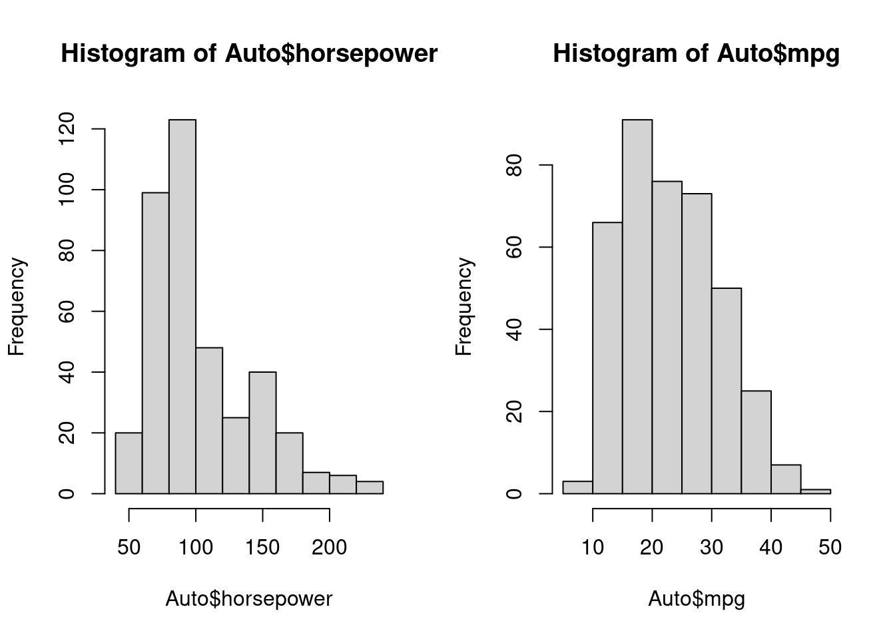
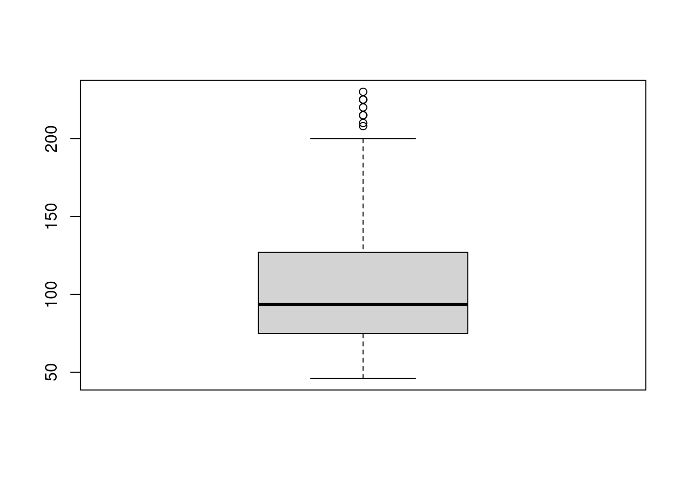

---
output:
  html_document: default
  word_document: default
  pdf_document: default
---
# 数据描述

### 数据的意义及获取

1. 数据的类型：使用不同的标准，可将数据分成不同的类型，如数量型和质量型；
    + 质量型(Categorical)：定类变量(Nominal)、定序变量(Ordinal)；
    + 数量型(Numerical)：定距数据(interval data)、等比变量(ratio); 
2. 数据的获取：实验数据、观察数据、网络抓取及公用数据库(UCI,kaggle)等；
   +  datalist([datalist](https://www.datasetlist.com/))汇集了多       个网站上的数据集;
   +  UCI数据库([uci dataset](http://archive.ics.uci.edu/ml/datasets.php)):创建于1987年，是一个比较有历史的数据集数据库，是一个含有数据库、领域知识及数据产生器的网站；
   + Fastai([Fastai](https://course.fast.ai/datasets)):进行图像分类、NLP及图像定位(image localization)的数据集；
   + Kaggle([kaggle](https://www.kaggle.com/datasets))：数据科学竞赛的主要网站；
   + Sklearn([Skearn](https://scikit-learn.org/stable/))：数据科学非常重要的包；
3. 数据的产生过程：总体(有限、无限，未知）和样本（总体的子集，随机性，已知）；

4. 表格型数据（结构化数据）：行(样本数量,rows), 列(变量名,columns)


```r
library(ISLR)
#View(Auto)
head(Auto) # 查看数据的前5行
```

```
##   mpg cylinders displacement horsepower weight acceleration year origin
## 1  18         8          307        130   3504         12.0   70      1
## 2  15         8          350        165   3693         11.5   70      1
## 3  18         8          318        150   3436         11.0   70      1
## 4  16         8          304        150   3433         12.0   70      1
## 5  17         8          302        140   3449         10.5   70      1
## 6  15         8          429        198   4341         10.0   70      1
##                        name
## 1 chevrolet chevelle malibu
## 2         buick skylark 320
## 3        plymouth satellite
## 4             amc rebel sst
## 5               ford torino
## 6          ford galaxie 500
```

```r
names(Auto) # 查看变量名
```

```
## [1] "mpg"          "cylinders"    "displacement" "horsepower"   "weight"      
## [6] "acceleration" "year"         "origin"       "name"
```

### 简单的数据汇总

```r
library(ISLR)
summary(Auto)
```

```
##       mpg          cylinders      displacement     horsepower        weight    
##  Min.   : 9.00   Min.   :3.000   Min.   : 68.0   Min.   : 46.0   Min.   :1613  
##  1st Qu.:17.00   1st Qu.:4.000   1st Qu.:105.0   1st Qu.: 75.0   1st Qu.:2225  
##  Median :22.75   Median :4.000   Median :151.0   Median : 93.5   Median :2804  
##  Mean   :23.45   Mean   :5.472   Mean   :194.4   Mean   :104.5   Mean   :2978  
##  3rd Qu.:29.00   3rd Qu.:8.000   3rd Qu.:275.8   3rd Qu.:126.0   3rd Qu.:3615  
##  Max.   :46.60   Max.   :8.000   Max.   :455.0   Max.   :230.0   Max.   :5140  
##                                                                                
##   acceleration        year           origin                      name    
##  Min.   : 8.00   Min.   :70.00   Min.   :1.000   amc matador       :  5  
##  1st Qu.:13.78   1st Qu.:73.00   1st Qu.:1.000   ford pinto        :  5  
##  Median :15.50   Median :76.00   Median :1.000   toyota corolla    :  5  
##  Mean   :15.54   Mean   :75.98   Mean   :1.577   amc gremlin       :  4  
##  3rd Qu.:17.02   3rd Qu.:79.00   3rd Qu.:2.000   amc hornet        :  4  
##  Max.   :24.80   Max.   :82.00   Max.   :3.000   chevrolet chevette:  4  
##                                                  (Other)           :365
```

```r
mean(Auto$mpg)
```

```
## [1] 23.44592
```
- 样本平均值的计算：$$\bar{Y}=\frac{1}{n}\sum\limits_{i=1}^ny_i$$
- 样本的方差：$$s^2=\frac{1}{n-1}\sum\limits_{i=1}^n(x_i-\bar{x})^2$$
- 线性相关系数：$$r=\frac{\sum\limits_{i=1}^n(x_i-\bar{x})(y_i-\bar{y})}{\sqrt{\sum\limits_{i=1}^n(x_i-\bar{x})^2}\sqrt{\sum\limits_{i=1}^n(y_i-\bar{y})^2}}$$

- 课堂练习：
统计7位同学周未的学习时间，数据为：8，11，7，13，9，5，9，计算同学学习时间的均值，中位数、四分位数、标准差和极差（使用手算）。

   + $\bar{x}=\frac{8+11+7+13+9+5+9}{7}=8.85$
   + $s^2=\frac{(8-8.85)^2+\cdots+(9-8.85)^2}{7-1}=6.81$
   + $s=\sqrt{s^2}=\sqrt{6.81}=2.6$
   + Median = 9; Mode = 9; Range = Max - min = 13-5=8
   

```r
d <- c(8,11,7,13,9,5,9)
mean(d)
```

```
## [1] 8.857143
```

```r
median(d)
```

```
## [1] 9
```

```r
mode(d)
```

```
## [1] "numeric"
```

```r
quantile(d)
```

```
##   0%  25%  50%  75% 100% 
##  5.0  7.5  9.0 10.0 13.0
```

```r
sd(d)
```

```
## [1] 2.609506
```
  

### 数据的可视化

1. 两个变量之间的关系：散点图(scatter)

```r
library(ISLR)
plot(Auto$mpg,Auto$horsepower)
```


2. 描述数量变量数据分布情况的图形：直方图(histogram)

```r
par(mfrow=c(1,2))
hist(Auto$horsepower)
hist(Auto$mpg)
```


3. 描述数量变量数据分布情况的图形：盒形图或箱线图(boxplot)

```r
boxplot(Auto$horsepower)
```



4. 把一些数目以矩形形式显示, 表面上类似于直方图, 但直方图是描述连续数量变量的, 而条形图描述离散变量或分类变量各个水平计数(频数):条形图(barplot)。

```r
# Simple Bar Plot
counts <- table(mtcars$gear)
barplot(counts, main="Car Distribution",
   xlab="Number of Gears")
```


5. ggplot2([ggplot2](https://ggplot2.tidyverse.org/index.html)):ggplot2是一个用于声明性地创建图形的系统，基于图形语法。你提供数据，告诉ggplot2如何将变量映射到美学上，使用什么图形基元，它就会处理好这些细节。
  + 一个简单的ggplot2例子

```r
library(ggplot2)
ggplot(mpg, aes(displ, hwy, colour = class)) + 
  geom_point()
```


```r
# Generate some sample data, then compute mean and standard deviation
# in each group
df <- data.frame(
  gp = factor(rep(letters[1:3], each = 10)),
  y = rnorm(30)
)
ds <- do.call(rbind, lapply(split(df, df$gp), function(d) {
  data.frame(mean = mean(d$y), sd = sd(d$y), gp = d$gp)
}))

# The summary data frame ds is used to plot larger red points on top
# of the raw data. Note that we don't need to supply `data` or `mapping`
# in each layer because the defaults from ggplot() are used.
ggplot(df, aes(gp, y)) +
  geom_point() +
  geom_point(data = ds, aes(y = mean), colour = 'red', size = 3)
```


6. 漂亮图形的几大要素：
   +  数据类型（Data Component）: 不同的数据类型使用合适的图形来表示，条形图（离散型数据）、直方图（连续型数据）等。
   +  几何要素（Geometric Component）: 根据数据选择合适的的图形scatter plot, line graphs, barplots, histograms, qqplots, smooth densities, boxplots, pairplots, heatmaps, etc.
   +  坐标要素（Mapping Component）: 选择合适的横坐标和纵坐标.
   +  刻度要素（Scale Component）:选择合适的刻度. linear scale, log scale, etc.
   +  标识要素（Labels Component）: This include things like axes labels, titles, legends, font size to use, etc.
   +  Ethical Component: Here, you want to make sure your visualization tells the true story. You need to be aware of your actions when cleaning, summarizing, manipulating and producing a data visualization and ensure you aren’t using your visualization to mislead or manipulate your audience.
