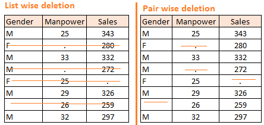

# 数据整理和清理

-  从各种不同来源得到的数据可能存在数据的格式混乱、数据冗余（重复）、含缺失值(missing data)、异常值(outlier)等问题，无法直接用于模型构建，所以建模的第一步就是完成数据清洗和重构。

-  数据科学家日常的工作大约有80%的时间都用于清洗数据。

## 数据的筛选

- 选出符合条件的数据：根据一定的条件筛选出符合条件的数据子集；

```{r datacleaning,echo=TRUE}
# download data from http://data.un.org/Data.aspx?q=GDP&d=SNAAMA&f=grID%3a101%3bcurrID%3aNCU%3bpcFlag%3a0
library(tidyverse)
library(ggplot2)

gdp1 <- read.csv("./data/UNdata_Export_20220406_093714228.csv")

head(gdp1)
names(gdp1)
#levels(as.factor(gdp1[,3]))=paste0("V",1:9)
tb <- as.tibble(gdp1)
head(tb)
names(tb)

# filter year 2016 data
tb2016 <- tb[tb$Year==2016,-2]%>%spread(key="Item",value="Value")
head(tb2016,3)
names(tb2016)[2:10] <- paste0("V",1:9)
head(tb2016)
ggplot(tb2016,aes(x=V4,y=V5))+
  geom_point()+
  geom_smooth()
# Draw time series chart
tb %>% subset(Country.or.Area=="Japan") %>%
  ggplot(aes(x=Year,y=Value))+
    geom_line(aes(color=Item),size=1)+
    theme_minimal()
```

## 数据合并
- 把多个数据合并在一起；
```{r combinefiles,echo=TRUE}
NN <-  c("./data/D1.csv","./data/D2.csv","./data/D3.csv")
df <- lapply(NN,read.csv)
head(df)

# delete rows and columns
U <- NULL
for (i in 1:length(df)){
  U = unique(c(U,unique(as.character(df[[i]][,1]))))
}
Trash = c("1","2","3","4","footnoteSeqID")
U = setdiff(U,Trash)

df = lapply(df,function(x) x[x[,1]%in% U,])
df = lapply(df,function(x) select(x,-Value.Footnotes))
head(df)

# combine data
x = df[[1]]
for(i in 2:length(NN)){
  x = merge.data.frame(x,df[[i]],by="Country.or.Area")
}
head(x)
write.csv(x,"./data/dp.csv",row.names = FALSE)
```


## 数据的缺失
- 数据中经常会含有缺失值，缺失值的产生有不同的机制（完全随机缺失CMAR，随机缺失MAR和非随机缺失MNAR）;
- 在R中缺失值通常用NA(not available)表示；


### 缺失值的审视与标记


### 删除缺失值的方法及问题


### 利用可预测模型来填补缺失值

First, the missing values are filled in using median/mode imputation. Then, we mark the missing values as ‘Predict’ and the others as training rows, which are fed into a Random Forest model trained to predict, in this case, Age based on Score. The generated prediction for that row is then filled in to produce a transformed dataset.


### 处理缺失值的R包
1. MICE
(Multivariate Imputation via Chained Equations) is one of the commonly used package by R users. Creating multiple imputations as compared to a single imputation (such as mean) takes care of uncertainty in missing values.
MICE assumes that the missing data are Missing at Random (MAR), which means that the probability that a value is missing depends only on observed value and can be predicted using them. It imputes data on a variable by variable basis by specifying an imputation model per variable.
For example: Suppose we have X1, X2….Xk variables. If X1 has missing values, then it will be regressed on other variables X2 to Xk. The missing values in X1 will be then replaced by predictive values obtained. Similarly, if X2 has missing values, then X1, X3 to Xk variables will be used in prediction model as independent variables. Later, missing values will be replaced with predicted values.
By default, linear regression is used to predict continuous missing values. Logistic regression is used for categorical missing values. Once this cycle is complete, multiple data sets are generated. These data sets differ only in imputed missing values. Generally, it’s considered to be a good practice to build models on these data sets separately and combining their results.
2. Amelia
3. missForest
4. Hmisc
5. mi

### 实例
```{r mdcase,echo=TRUE}
#install.packages("mice")
#install.packages("missForest")
library(mice)
library(missForest)
#load data
data <- iris 
# Get summary
summary(data)
#Generate 10% missing values at Random
iris.mis <- prodNA(data, noNA = 0.1)
#Check missing values introduced in the data
summary(iris.mis)
# Removing categorical data
iris.mis <- subset(iris.mis, select = -c(Species))
summary(iris.mis)
md.pattern(iris.mis)

# make it beautiful missing pattern
#install.packages("VIM")
library(VIM)
mice_plot <- aggr(iris.mis, col=c('navyblue','yellow'),
numbers=TRUE, sortVars=TRUE,
labels=names(iris.mis), cex.axis=.7,
gap=3, ylab=c("Missing data","Pattern"))

# impute the missing data using mice
imputed_Data <- mice(iris.mis, m=5, maxit = 50, method = 'pmm', seed = 500)
#m — Refers to 5 imputed data sets;maxit — Refers to no. of iterations taken to impute missing values;method — Refers to method used in imputation. we used predictive mean matching
summary(imputed_Data)
#check imputed values
imputed_Data$imp$Sepal.Width
#get complete data ( 2nd out of 5)
completeData <- complete(imputed_Data,2)
#build predictive model
library(dplyr)
fit <- with(data = iris.mis, exp = lm(Sepal.Width ~ Sepal.Length + Petal.Width))
#combine results of all 5 models
#combine <- pool(fit)
summary(fit)
```

