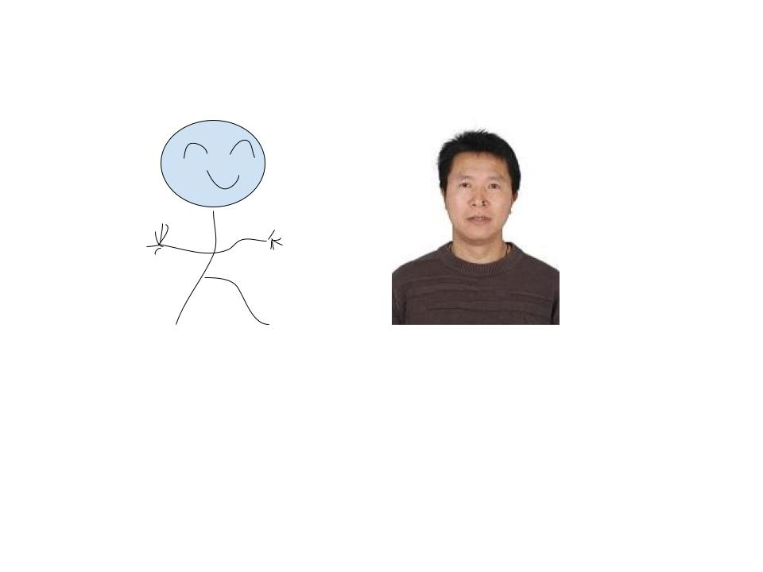
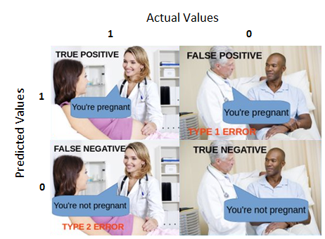

# 有监督学习概论

### 机器学习

   + 机器学习1959年由Arthur Samuel首次提出；
   + 机器学习是研究计算机算法，这个算法可通过数据产生的经验自动地改善（Machine learning (ML) is the study of computer algorithms that can improve automatically through experience and by the use of data）（Mitchell,Tom，1959）
   + 机器学习是计算机程序，如果该程序在T类任务中的表现，如P所衡量的，随着经验E的增加而提高，那么就可以说它从经验E中学习到了一些任务T和性能指标P。（A computer program is said to learn from experience E with respect to some class of tasks T and performance measure P if its performance at tasks in T, as measured by P, improves with experience E.）（Tom M. Mitchell ）
   +  一系列的数据驱动的算法和工具，它的主要目的是根据观测到的数据来预测没有观测到的数据，它的最大特点就是数据驱动。
   + 机器学习的种类:
   


### 机器学习实例

  +  房价预测：如何对房子的价格进行预测？采集与房子有关的变量：区域、房子朝向、楼层、周围是否有地铁、面积、房屋的价格等数据，构建一个回归模型来进行预测。$$y=f(X)+\epsilon$$
  
  + 垃圾邮件分类：根据邮件内容提取出一些特征关键词作为X，而响应变量y为两个是值：1垃圾邮件，0好邮件，构建一个分类器进行邮件分类。$$C(x)=P(y=1|X)$$
  
  + 我们做过的舆情分析案例（聚类分析）：使用评论数据，通过词向量技术解析得到词向量，然后进行主题分析，得到网络谣言、疫情趋势、地点（国外）、处罚、疫苗等主题，从而根据这些主题词来识别谣言。
  
  + 强化学习:玩Super Mario Bros游戏
  
 
 
## 模型及拟合

1. 模型：人们对所关心的真实世界问题的一个近似描述。
   


2. 决策树模型：是一种有监督学习的算法，使用一系列的是和否规则（if-then rules)来进行决策，和人进行决策的过程类似。


    + 数据：
```{r decisiontree,echo=TRUE}
# install.packages{"rpart"}
# install.packages{"rattle"}
# install.packages{"partykit"}
library(rpart)
library(rpart.plot)
library(rattle)
library(partykit)

# inpput the file
data(trees)
head(trees)
volume <- rpart(Volume ~ ., data = trees)
rpart.plot(volume, type = 3, clip.right.labs = FALSE, branch = .3, under = TRUE)

df <- read.csv("./data/simple4.csv")
df
#sex <- factor(df$sex, levels = 0:1, labels = c("M", "F"))
#haircol <- factor(df$haircol,levels = 0:1, labels = c("yellow", "black"))
#skirt <- factor(df$skirt,levels = 0:1, labels = c("y", "n"))
#style <- factor(df$style,levels = 0:1, labels = c("y", "n"))
#df[] <- lapply(df,factor)
#str(df)
#output.tree<- rpart(sex~.,data=df,cp=0.02)
#print(output.tree)
#rpart.plot(output.tree)


```
   
    
3.节点纯度的度量：Gini系数和熵
    + 也称Gini不纯度，当随机选择一个特征，这个特定特征的总概率的计算（Gini Index, also known as Gini impurity, calculates the amount of probability of a specific feature that is classified incorrectly when selected randomly）.
    $$GiniIndex=1-\sum\limits_{i=1}^kp_i^2$$
    +  是数据不纯度或随机性的测度（it is the measurement of the impurity or randomness in the data points）.
    $$Entropy=-\sum\limits_{i=1}^kp_i\times log(p_i)$$
    + 不同的决策树算法使用不同的计算方法，CART树使用Gini系数，ID3和C4.5算法使用熵。（Different decision tree algorithms utilize different impurity metrics: CART uses Gini; ID3 and C4.5 use Entropy).

4.决策树例子

```{r dataframe,echo=TRUE}
decisiontree <- data.frame(emotion=c('sick','sick','sick','notsick','notsick','sick','notsick','notsick'),
                 temperature=c('under','over','under','under','over','over','under','over'),
                 stayhome=c('N','Y','Y','N','Y','N','N','Y'))
decisiontree
```

- 计算步骤：

    + 选择stayhome作为因变量y,emotion和temperature作为自变量$x_1,x_2$;
    + 首先计算根结点的GiniIndex：$GiniIndex_r=\frac{1}{2}$;
    + 随机选择一个变量，如$x_2$进行根结点裂分，分别计算左节点(condition为True)的Gini系数$GiniIndex_1=\frac{3}{8}$和右节点(condition为False)的Gini系数$GiniIndex_2=\frac{3}{8}$，然后计算加权的GiniIndex$GiniIndex_w=\frac{3}{8}\times\frac{4}{8}+\frac{3}{8}\times\frac{4}{8}=\frac{1}{2}$,最后计算使用$x_2$进行根结点裂分得到的基尼不纯度的降低值$GiniIndex_r-GiniIndex_w=\frac{1}{2}-\frac{3}{8}=\frac{1}{8}$;
    + 根据上述过程选择另一个变量($x_1$)，进行类似的计算得到的基尼不纯度的降低值为0
    + 所以第一轮选择$x_2$进行裂分。
- 使用信息熵的方法进行相似的计算。
    
5.预测值、拟合值及误判率

   + 如果用训练得到的模型作用于一个(也有这几个自变量的) 数据, 那么就会得到预测值(predicted value). 
   + 对于训练模型的训练集做预测所得到的预测值也称为拟合值(fitted value).
   + 使用训练模型的训练集会产生一个误判, 这实际上是用训练集“学习到” 的模型对训练集的因变量sex做预测。
   + 混淆矩阵(confusion Matrix)是机器学习用来衡量分类好坏的方法（Confusion Matrix is a performance measurement for machine learning classification）.
   

6.过拟合

  - 机器学习的目的是得到一个泛化误差比较小的模型；
  - 如果用训练集所得到的误判率和用非训练集(或测试集) 得到的误判率之间差别很大, 则说明该模型有过拟合现象(overfitting). 
  - 在大数据时代，过拟合是模型构建过程中最易出现的情况，得到的模型是一个看上去很好，而实际上无用的模型。
  - 简单来说就是模型在训练集上得到的误差非常小（偏差较小）而在不同数据集之间得到的误差非常大（方差较大），而模型总的误差基本由偏差和方差组成。
  - 例子：买家秀和卖家秀；
```{r overfitting,echo=TRUE}
###Overfitting
require(data.table)
library(rpart)
require(ggplot2)
set.seed(456)
##Reading data
overfitting_data=data.table(airquality)
ggplot(overfitting_data,aes(Wind,Ozone))+geom_point()+ggtitle("Ozone vs wind speed")
data_test=na.omit(overfitting_data[,.(Wind,Ozone)])
train_sample=sample(1:nrow(data_test),size = 0.7*nrow(data_test))
###creation of polynomial models
degree_of_poly=1:20
degree_to_plot=c(1,3,5,10,20)
polynomial_model=list()
df_result=NULL
for (degree in degree_of_poly)
{
 fm=as.formula(paste0("Ozone~poly(Wind,",degree,",raw=T)"))
 polynomial_model=c(polynomial_model,list(lm(fm,data_test[train_sample])))
 Polynomial_degree=paste0(degree)
 data_fitted=tail(polynomial_model,1)[[1]]$fitted.values
 new_df=data.table(Wind=data_test[train_sample,Wind],Ozone_real=data_test[train_sample,Ozone],Ozone_fitted=tail(polynomial_model,1)[[1]]$fitted.values,degree=as.factor(degree))
 if (is.null(df_result))
 df_result=new_df
 else
 df_result=rbind(df_result,new_df)
}
gg=ggplot(df_result[degree%in%degree_to_plot],aes(x=Wind))+geom_point(aes(y=Ozone_real))+geom_line(aes(color=degree,y=Ozone_fitted))
gg+ggtitle('Ozone vs wind for several polynomial regressions')+ylab('Ozone')
###Computing SE
SE_train_list=c()
SE_test_list=c()
for (poly_mod in polynomial_model)
{
 print(summary(poly_mod))
 SE_train_list=c(SE_train_list,sqrt(mean(poly_mod$residuals^2)))
 SE_test=sqrt(mean((data_test[-train_sample]-predict(poly_mod,data_test[-train_sample,]))^2))
 SE_test_list=c(SE_test_list,SE_test)
}
data_plot=data.table(SE_test_list,SE_train_list,degree_of_poly)
ggplot(data_plot[degree_of_poly<=8])+geom_line(aes(x=degree_of_poly,y=SE_test_list),color='red')+geom_line(aes(x=degree_of_poly,y=SE_train_list))+ylab('MSE')+xlab('Degrees of polynomial')

```

## 训练最小二乘线性回归模型的例子 

- 回归(regression)：因变量(y)是连续型变量，自变量$X\in R^p$是p维的连续型或离散型变量，一般求解$E(y|X=x)$的模型。
- 线性回归模型(一般形式）,其中$\epsilon$是服从均值为0，方差为$\sigma^2$的正态分布的随机变量：$$y=\beta_0+\beta_1\times x_1+,\cdots,+\beta_p\times x_p+\epsilon=\sum\limits_{i=0}^p\beta_i\times x_i+\epsilon=X\beta+\epsilon$$
- 一元线性模型(simple linear model,SLM):最简单的线性模型，只包含一个自变量。$$y=\beta_0+\beta_1\times x_1+\epsilon$$

```{r slm,echo=TRUE}
# data come from the R basic package which related to the black cherry tree,Girth is diameter of tree, Height and Volume
data("trees")
head(trees)
plot(Girth ~ Height, data = trees, pch=16)

# run the model
fit <- lm(Girth~Height,data=trees)
fit
summary(fit)
# visualize the results
plot(Girth~Height,data=trees,pch=16)
# plot the fitted line
abline(fit,col="red",lwd=2)
#quantile regression
#install.packages("quantreg")
library(quantreg)
fitq <- rq(Girth~Height,data=trees)
abline(fitq,col="blue",lwd=2)
legend("topright", legend = c("lm", "rq"), col = c("red", "blue"), lwd = 2)
```

- 最小一乘回归思想:计算$\frac{1}{n}\sum\limits_{i=1}^n(y_i-\hat{y_i})$

- 最小二乘回归：计算MSE=$\frac{1}{n}\sum\limits_{i=1}^n(y_i-\hat{y_i})^2$

## 模型评价

- 把数据分成：训练集(training data)、验证集(validate data)和测试集(test data),训练集用来学习模型；验证集进行参数优化和调节；测试集对模型的好坏进行最终的判定（泛化能力的评价），优点是相对比较客观，大家认可；缺点是需要较多的数据（大多数竞赛网站都不提供测试集中y的数值）。
- 交叉验证（K折交叉验证）：数据即是训练集又是测试集，把数据分成k个子集，使用其中一个作为测试集，剩下的k-1个作为训练集，依次反复进行k次训练和测试，最后把所有测试集得到的预测值进行平均，计算得到一个平均的测试误差。优点：可充分的利用数据，缺点:可能得到的解不一定是最优解，但基本为一个次优解。
- 模拟数据
- 分类模型的预测精度：混淆矩阵；
- 回归问题交叉验证预测精度标准：
   + 均方误差：$$MSE=\frac{1}{n}\sum\limits_{i=1}^n(y_i-\hat{y_i})^2$$
   + 均方误差平方根：$$RMSE=\sqrt{MSE}=\sqrt{\frac{1}{n}\sum\limits_{i=1}^n(y_i-\hat{y_i})^2}$$
   + 标准化均方误差: $$NMSE=\frac{\sum\limits_{i=1}^n(y_i-\hat{y_i})^2}{\sum\limits_{i=1}^n(y_i-\bar{y_i})^2}$$
   + 误差平均绝对值:$$MAE=\frac{\sum\limits_{i=1}^n|y_i-\hat{y_i}|}{n}$$
   + $R^2$:$$R^2=1-NMSE$$

## Exercise
