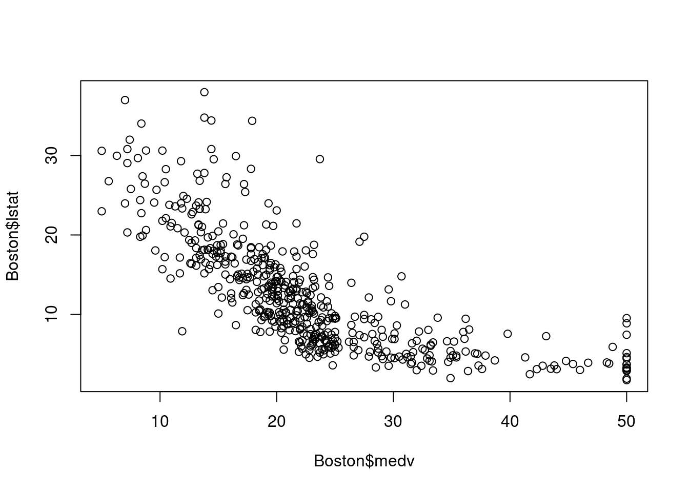

# 最小二乘线性回归法

## 相关概念

1. 因变量(Dependent variable,Y)：依赖于其它变量的变化而变化，响应变量；
2. 自变量(Independent variable,X)：可以直接控制的变量，协变量；
3. 有监督学习的数据表示：$D=\{(x_1,y_1),\cdots,x_n,y_n)\},x\in R^p,y \in R$;
4. 模型（model)：函数；
5. 参数(Parameters)：参数是添加到模型中用于估计输出的成分;

## 线性模型

因变量的值由独立自变量之间的线性数学模型决定。$$y=\beta_0+\beta_1\times x_1+,\cdots,+\beta_p\times x_p$$,模型表示：

\begin{bmatrix}
    y_{1} \\
    y_{2} \\
    \cdots\\
    y_{n} 
\end{bmatrix}

=\begin{bmatrix}
    \beta_0 \\
    \beta_0 \\
    \cdots \\
    \beta_0 
\end{bmatrix}\+
\begin{bmatrix}
    x_{11}       & x_{12}  & \dots & x_{1p} \\
    x_{21}       & x_{22}  & \dots & x_{2p} \\
    \cdots       & \cdots  & \cdots & \cdots\\
    x_{n1}       & x_{n2}  & \dots & x_{np}
\end{bmatrix}
\times
\begin{bmatrix}
    \beta_1 \\
    \beta_2 \\
    \cdots \\
    \beta_p 
\end{bmatrix}


模型的矩阵表示：
$$Y=X\beta$$

### 模型的估计

+ 损失函数（平方和损失）：$$RSS=(y-X\beta)^T(Y-X\beta)$$
+ 数值解：$$\hat{\beta}=(X^TX)^{-1}X^Ty$$

### 回归实例
+ 使用MASS库中所带的波士顿房价数据，其中的因变量为房价的中位数，自变量为房龄、房间数等，想预测房价。


```r
library(MASS)
library(ISLR)
#fix(Boston)
# Simple linear regression model
names(Boston)
```

```
##  [1] "crim"    "zn"      "indus"   "chas"    "nox"     "rm"      "age"    
##  [8] "dis"     "rad"     "tax"     "ptratio" "black"   "lstat"   "medv"
```

```r
plot(Boston$medv,Boston$lstat)
```



```r
slm.fit <- lm(Boston$medv~Boston$lstat,data=Boston)
summary(slm.fit)
```

```
## 
## Call:
## lm(formula = Boston$medv ~ Boston$lstat, data = Boston)
## 
## Residuals:
##     Min      1Q  Median      3Q     Max 
## -15.168  -3.990  -1.318   2.034  24.500 
## 
## Coefficients:
##              Estimate Std. Error t value Pr(>|t|)    
## (Intercept)  34.55384    0.56263   61.41   <2e-16 ***
## Boston$lstat -0.95005    0.03873  -24.53   <2e-16 ***
## ---
## Signif. codes:  0 '***' 0.001 '**' 0.01 '*' 0.05 '.' 0.1 ' ' 1
## 
## Residual standard error: 6.216 on 504 degrees of freedom
## Multiple R-squared:  0.5441,	Adjusted R-squared:  0.5432 
## F-statistic: 601.6 on 1 and 504 DF,  p-value: < 2.2e-16
```

```r
# multiple variance regression
mlm.fit <- lm(Boston$medv~Boston$lstat+Boston$age,data=Boston)
summary(mlm.fit)
```

```
## 
## Call:
## lm(formula = Boston$medv ~ Boston$lstat + Boston$age, data = Boston)
## 
## Residuals:
##     Min      1Q  Median      3Q     Max 
## -15.981  -3.978  -1.283   1.968  23.158 
## 
## Coefficients:
##              Estimate Std. Error t value Pr(>|t|)    
## (Intercept)  33.22276    0.73085  45.458  < 2e-16 ***
## Boston$lstat -1.03207    0.04819 -21.416  < 2e-16 ***
## Boston$age    0.03454    0.01223   2.826  0.00491 ** 
## ---
## Signif. codes:  0 '***' 0.001 '**' 0.01 '*' 0.05 '.' 0.1 ' ' 1
## 
## Residual standard error: 6.173 on 503 degrees of freedom
## Multiple R-squared:  0.5513,	Adjusted R-squared:  0.5495 
## F-statistic:   309 on 2 and 503 DF,  p-value: < 2.2e-16
```
+ 结果解释：变量之间独立的情况下，系数就为影响程度，若存在多重共线性，则系数的解释比较复杂。

### 练习
+ 例6.1
