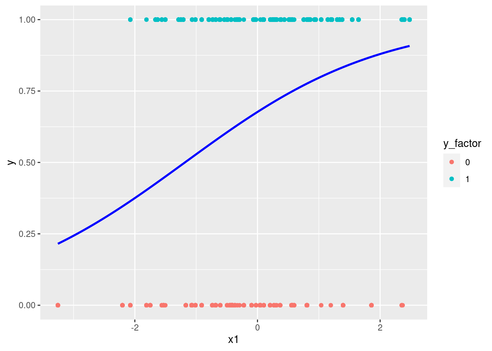
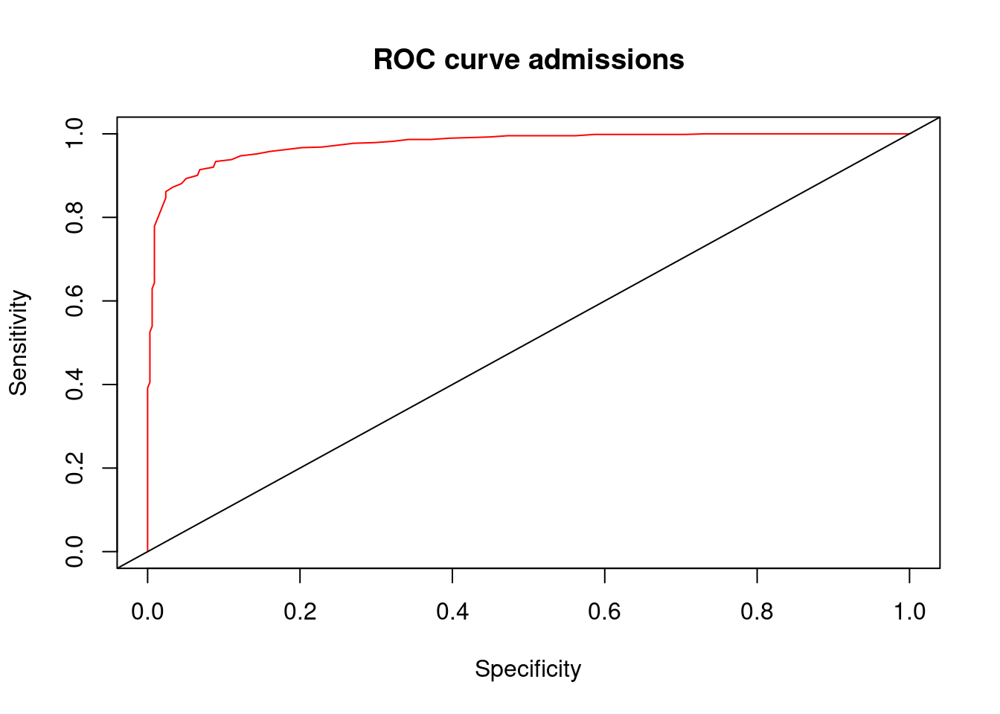
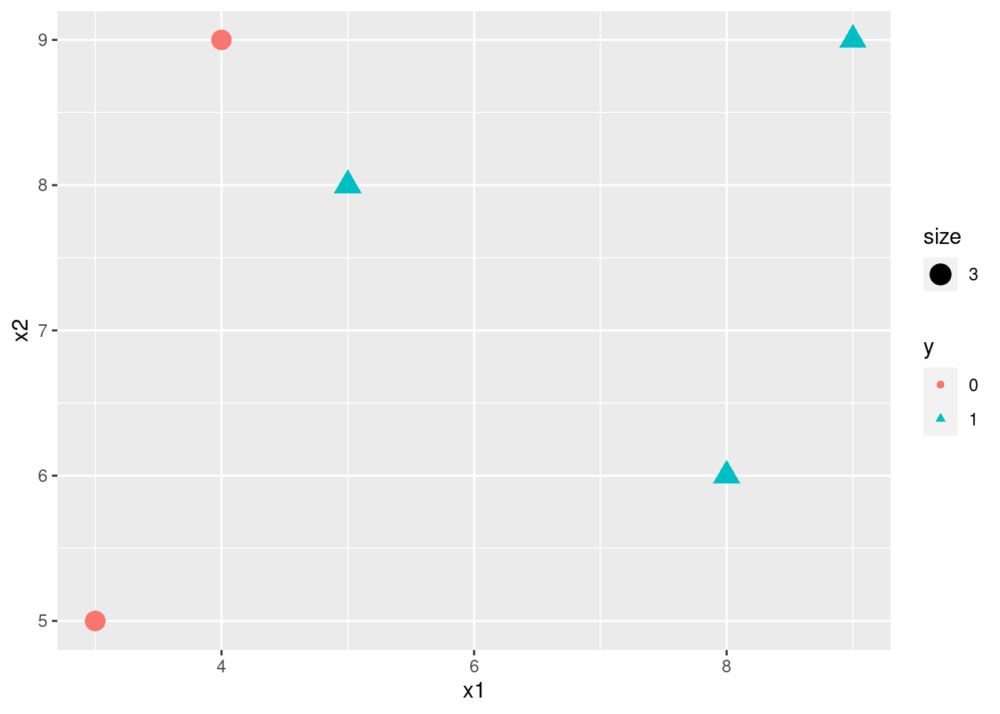

# Logistic回归 

## 相关概念

1. 因变量(Dependent variable,Y)：类别变量；
2. 自变量(Independent variable,X)：连续型变量或离散型变量；
3. 二分类分类模型:邮件分类（好邮件，垃圾邮件）；疾病诊断（是否得Covid-19)等。

## Logistic模型

+ odds: $odds=\frac{p(x)}{1-p(x)}$


+ sigmoid函数：$y=\frac{1}{1+e^{-z}}$

```r
library(ggplot2)
x <- seq(-10,10,0.01)
sigmoid <- function(x){
  1/(1+exp(-x))
}
y <- sigmoid(x)
df_sig <- data.frame(x=x,y=y)
#plot(x,sigmoid(x),col="blue")
ggplot(data=df_sig,aes(x=x,y=y))+
  geom_line(color="blue")+
  annotate("text",x=2,y=0.3,parse=TRUE,
           label="frac(1,1+e^{-z})")+
  labs(title=expression(paste("sigmoid funtion  ",sigma(z)==frac(1,1+e^{-z}))))+
  geom_hline(aes(yintercept=0.5),color="red",linetype="dashed")
```


+ logistic回归模型：是解决分类的机器学习算法，主要解决二分类的问题。因变量的估计值由条件概率和决策边界决定。$$p(y)=p(y=k|X=x)=\frac{1}{1+e^{-X\beta}}$$


## 模型估计

### 损失函数(Loss function)

$$L(\hat{y},y)=-(y*log(\hat{y})+(1-y)*log(1-\hat{y}))$$
### 代价函数(Cost funtion)

$$J(\theta)=-\frac{1}{m}\sum\limits_{i=1}^mL(\hat{y}^{(i)}-y^{(i)})$$

### 模型估计(estimation)

梯度下降（Gradient Descent）的方法。

$$\theta_j:=\theta_j-\alpha\frac{\partial}{\partial \theta_j}J(\theta)$$

### 模拟数据模型


```r
library(ggplot2)

# faked data produce
set.seed(520)
x1 <- rnorm(100,0,1)
x2 <- rnorm(100,0,1)
z <- 3+2*x1+5*x2
pr <- 1/(1+exp(-z))
y <- rbinom(1000,1,pr)

data_logreg <- data.frame(y=y,x1=x1,x2=x2)
data_logreg$y_factor <- as.factor(data_logreg$y)
head(data_logreg)
```

```
##   y          x1         x2 y_factor
## 1 0 -1.07545511 -0.7586247        0
## 2 1 -1.28608682  0.7911798        1
## 3 1 -1.21028388  0.7932912        1
## 4 1  0.08780203 -0.1222843        1
## 5 1 -0.48698853  0.6076338        1
## 6 1  2.39494281 -0.9934082        1
```

```r
# visualize data
ggplot(data_logreg,aes(x=x1,y=y,color=y_factor))+
  geom_point()+
  stat_smooth(method="glm",color="blue",se=FALSE,method.args=list(family=binomial))
```

```
## `geom_smooth()` using formula 'y ~ x'
```



```r
# model estimate
log_fit <- glm(y_factor~x1+x2,family = binomial(link="logit"),data=data_logreg)
summary(log_fit)
```

```
## 
## Call:
## glm(formula = y_factor ~ x1 + x2, family = binomial(link = "logit"), 
##     data = data_logreg)
## 
## Deviance Residuals: 
##     Min       1Q   Median       3Q      Max  
## -3.5699  -0.0877   0.0247   0.1788   3.1761  
## 
## Coefficients:
##             Estimate Std. Error z value Pr(>|z|)    
## (Intercept)   3.3905     0.2848   11.90   <2e-16 ***
## x1            2.1482     0.1878   11.44   <2e-16 ***
## x2            5.7433     0.4348   13.21   <2e-16 ***
## ---
## Signif. codes:  0 '***' 0.001 '**' 0.01 '*' 0.05 '.' 0.1 ' ' 1
## 
## (Dispersion parameter for binomial family taken to be 1)
## 
##     Null deviance: 1276.69  on 999  degrees of freedom
## Residual deviance:  377.26  on 997  degrees of freedom
## AIC: 383.26
## 
## Number of Fisher Scoring iterations: 7
```

```r
# Result analysis
#install.packages("caret")
library(caret)
```

```
## Loading required package: lattice
```

```r
pdata <- predict(log_fit,newdata=data_logreg,type="response")
head(pdata)
```

```
##          1          2          3          4          5          6 
## 0.03637469 0.99435703 0.99525852 0.94668772 0.99708267 0.94427164
```

```r
# use caret to calculate the confusion matrix
data_logreg$pre_glm <- ifelse(pdata>0.5,"1","0")
data_logreg$pre_glm <- as.factor(data_logreg$pre_glm)
head(data_logreg)
```

```
##   y          x1         x2 y_factor pre_glm
## 1 0 -1.07545511 -0.7586247        0       0
## 2 1 -1.28608682  0.7911798        1       1
## 3 1 -1.21028388  0.7932912        1       1
## 4 1  0.08780203 -0.1222843        1       1
## 5 1 -0.48698853  0.6076338        1       1
## 6 1  2.39494281 -0.9934082        1       1
```

```r
confusionMatrix(factor(data_logreg$y),factor(data_logreg$pre_glm))
```

```
## Confusion Matrix and Statistics
## 
##           Reference
## Prediction   0   1
##          0 295  41
##          1  35 629
##                                           
##                Accuracy : 0.924           
##                  95% CI : (0.9058, 0.9397)
##     No Information Rate : 0.67            
##     P-Value [Acc > NIR] : <2e-16          
##                                           
##                   Kappa : 0.8289          
##                                           
##  Mcnemar's Test P-Value : 0.5663          
##                                           
##             Sensitivity : 0.8939          
##             Specificity : 0.9388          
##          Pos Pred Value : 0.8780          
##          Neg Pred Value : 0.9473          
##              Prevalence : 0.3300          
##          Detection Rate : 0.2950          
##    Detection Prevalence : 0.3360          
##       Balanced Accuracy : 0.9164          
##                                           
##        'Positive' Class : 0               
## 
```

```r
# plot ROC
#install("ROCR")
library(ROCR)
pred <- prediction(pdata,data_logreg$y_factor)
perf <- performance(pred,measure="tpr",x.measure="fpr")
plot(perf,col=rainbow(2),main="ROC curve admissions",xlab="Specificity",ylab="Sensitivity")
abline(0,1) # add a 45 degree line
```



### Logistic回归实例模型

+ Produce a simple data


```r
# Create a hand-out data
df_logsim <- data.frame(x1=c(8,3,4,5,9),x2=c(6,5,9,8,9),y=factor(c(1,0,0,1,1)))
head(df_logsim)
```

```
##   x1 x2 y
## 1  8  6 1
## 2  3  5 0
## 3  4  9 0
## 4  5  8 1
## 5  9  9 1
```

```r
# visual the data
library(ggplot2)
ggplot(data=df_logsim,aes(x=x1,y=x2,color=y,shape=y,size=3))+
  geom_point()
```



