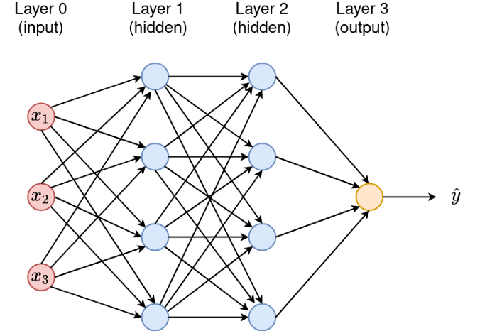

# 支持向量机和神经网络

## 支持向量机(support vector machine,SVM)

+  Support vector machines so called as SVM is a supervised learning algorithm which can be used for classification and regression problems as support vector classification (SVC) and support vector regression (SVR).The objective of the support vector machine algorithm is to find a hyperplane in an N-dimensional space(N — the number of features) that distinctly classifies the data points.

+ A hyperplane in an n-dimensional Euclidean space is a flat, n-1 dimensional subset of that space that divides the space into two disconnected parts. Hyperplanes are decision boundaries that help classify the data points.

+ Support vectors are data points that are closer to the hyperplane and influence the position and orientation of the hyperplane.

+ Pros of SVM
    - It is really effective in the higher dimension.
    - Effective when the number of features are more than training examples.
    - Best algorithm when classes are separable
    - The hyperplane is affected by only the support vectors thus outliers have less impact.
    - SVM is suited for extreme case binary classification.
+ Cons of SVM    
    - For larger dataset, it requires a large amount of time to process.
    - Does not perform well in case of overlapped classes.
    - Selecting, appropriately hyperparameters of the SVM that will allow for sufficient  generalization performance.
    - Selecting the appropriate kernel function can be tricky.
    
### 支持向量机实例

```{r svm,echo=TRUE}
# import the data set
df_svm <- read.csv("./data/Social_Network_Ads.csv")
head(df_svm)
df_svm <- df_svm[3:5]
head(df_svm)

# Encoding the target feature as factor
df_svm$Purchased <- factor(df_svm$Purchased,levels=c(0,1))
head(df_svm)
typeof(df_svm$Purchased)

# Splitting the dataset into the Training set and Test set
# install.packages('caTools')
library(caTools)
set.seed(123)
split = sample.split(df_svm$Purchased, SplitRatio = 0.75)
training_set = subset(df_svm, split == TRUE)
test_set = subset(df_svm, split == FALSE)

# Feature Scaling
training_set[-3] = scale(training_set[-3])
test_set[-3] = scale(test_set[-3])

# Fitting SVM to the Training set
#install.packages('e1071')
library(e1071)
classifier = svm(formula = Purchased ~ .,
                 data = training_set,
                 type = 'C-classification',
                 kernel = 'linear')

# Predicting the Test set results
y_pred = predict(classifier, newdata = test_set[-3])
y_pred

# Making the Confusion Matrix
cm = table(test_set[, 3], y_pred)
cm

# Visualizing the training set results
#install.packages('Rfast')
library('Rfast')
set  = training_set
X1 = seq(min(set[, 1]) -1, max(set[, 1]) + 1, by = 0.01)
X2 = seq(min(set[, 2]) -1, max(set[, 2]) + 1, by = 0.01)
grid_set = expand.grid(X1, X2)
colnames(grid_set) = c('Age', 'EstimatedSalary')
prob_set = predict(classifier, type = 'response', newdata = grid_set)
y_grid = ifelse(prob_set==0, 1, 0)
plot(set[, -3],
     main = 'SVM (Training Set)',
     xlab = 'Age',
     ylab = 'Estimated Salary',
     xlim = range(X1),
     ylim = range(X2)
)
contour(X1, X2, matrix(as.numeric(y_grid),length(X1), length(X2)), add = TRUE)
points(grid_set, pch = '.', col = ifelse(y_grid==1, 'springgreen3', 'tomato') )
points(set, pch = 21, bg = ifelse(set[, 3]== 1, 'green4', 'red3'))

# Visualizing the test set results
#install.packages('Rfast')
library('Rfast')
set  = test_set
X1 = seq(min(set[, 1]) -1, max(set[, 1]) + 1, by = 0.01)
X2 = seq(min(set[, 2]) -1, max(set[, 2]) + 1, by = 0.01)
grid_set = expand.grid(X1, X2)
colnames(grid_set) = c('Age', 'EstimatedSalary')
prob_set = predict(classifier, type = 'response', newdata = grid_set)
y_grid = ifelse(prob_set == 1, 1, 0)
plot(set[, -3],
     main = 'SVM (Test Set)',
     xlab = 'Age',
     ylab = 'Estimated Salary',
     xlim = range(X1),
     ylim = range(X2)
)

contour(X1,X2, matrix(as.numeric(y_grid),length(X1), length(X2)), add = TRUE)
points(grid_set, pch = '.', col = ifelse(y_grid==1, 'springgreen3', 'tomato') )
points(set, pch = 21, bg = ifelse(set[, 3]== 1, 'green4', 'red3'))
```

## 神经网络(Neural Networks, NN)

+ A neural network is a series of algorithms that endeavors to recognize underlying relationships in a set of data through a process that mimics the way the human brain operates. Neural networks reflect the behavior of the human brain, allowing computer programs to recognize patterns and solve common problems in the fields of AI, machine learning, and deep learning.

+ Structure of neuron network

+ Type of Neural Networks in Deep Learning
   - Artificial Neural Networks (ANN): Feedback ANN; Feed-Forward ANN
   - Convolution Neural Networks (CNN): VGG; ResNet; AlexNet; Inception v2
   - Recurrent Neural Networks (RNN): One-to-one; One-to-Many; Many-to-One; Many-to-Many

+ Types of Algorithms used in Deep Learning
   - Convolutional Neural Networks (CNNs)
   - Recurrent Neural Networks (RNNs)
   - Long Short-Term Memory Networks (LSTMs)
   - Generative Adversarial Networks (GANs)
   - Self Organizing Maps (SOMs)
   - Radial Basis Function Networks (RBFNs)
   - Multilayer Perceptron (MLPs)
   - Deep Belief Networks (DBNs)
   - Restricted Boltzmann Machines( RBMs)
   - Autoencoders
   
+ Deep Learning Frameworks
   - TensorFlow
   - Keras
   - PyTorch
   - Theano
   - Caffe
   - Deeplearning4j
   - MXNet
   - Chainer
