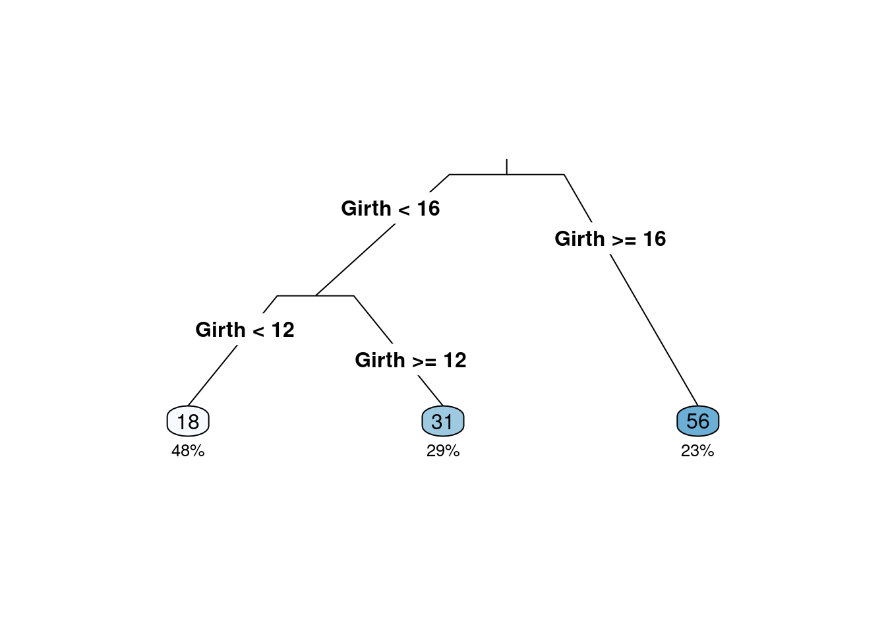
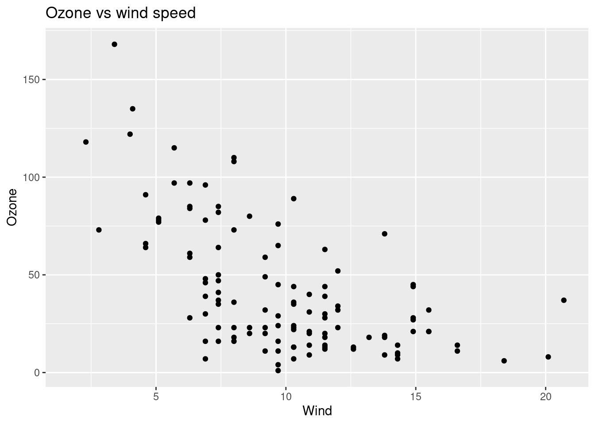
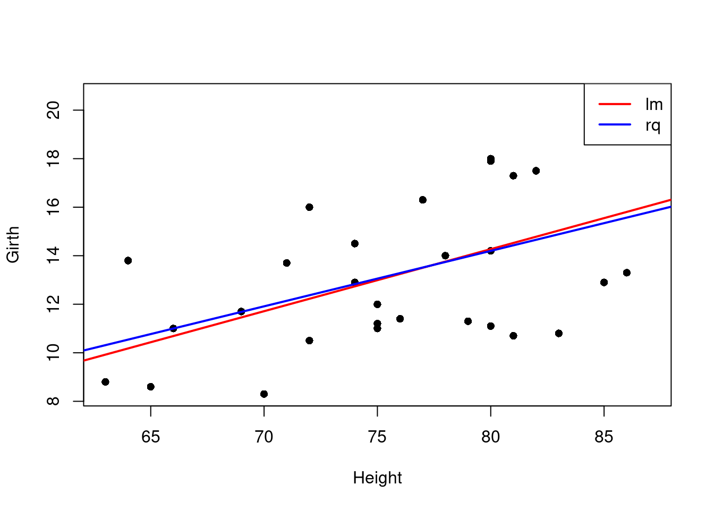

# 有监督学习概论

### 机器学习

   + 机器学习1959年由Arthur Samuel首次提出；
   + 机器学习是研究计算机算法，这个算法可通过数据产生的经验自动地改善（Machine learning (ML) is the study of computer algorithms that can improve automatically through experience and by the use of data）（Mitchell,Tom，1959）
   + 机器学习是计算机程序，如果该程序在T类任务中的表现，如P所衡量的，随着经验E的增加而提高，那么就可以说它从经验E中学习到了一些任务T和性能指标P。（A computer program is said to learn from experience E with respect to some class of tasks T and performance measure P if its performance at tasks in T, as measured by P, improves with experience E.）（Tom M. Mitchell ）
   +  一系列的数据驱动的算法和工具，它的主要目的是根据观测到的数据来预测没有观测到的数据，它的最大特点就是数据驱动。
   + 机器学习的种类:
   


### 机器学习实例

  +  房价预测：如何对房子的价格进行预测？采集与房子有关的变量：区域、房子朝向、楼层、周围是否有地铁、面积、房屋的价格等数据，构建一个回归模型来进行预测。$$y=f(X)+\epsilon$$
  
  + 垃圾邮件分类：根据邮件内容提取出一些特征关键词作为X，而响应变量y为两个是值：1垃圾邮件，0好邮件，构建一个分类器进行邮件分类。$$C(x)=P(y=1|X)$$
  
  + 我们做过的舆情分析案例（聚类分析）：使用评论数据，通过词向量技术解析得到词向量，然后进行主题分析，得到网络谣言、疫情趋势、地点（国外）、处罚、疫苗等主题，从而根据这些主题词来识别谣言。
  
  + 强化学习:玩Super Mario Bros游戏
  
 
 
## 模型及拟合

1. 模型：人们对所关心的真实世界问题的一个近似描述。
   


2. 决策树模型：是一种有监督学习的算法，使用一系列的是和否规则（if-then rules)来进行决策，和人进行决策的过程类似。


    + 数据：

```r
# install.packages{"rpart"}
# install.packages{"rattle"}
# install.packages{"partykit"}
library(rpart)
library(rpart.plot)
library(rattle)
```

```
## Loading required package: tibble
```

```
## Loading required package: bitops
```

```
## Rattle: A free graphical interface for data science with R.
## Version 5.5.1 Copyright (c) 2006-2021 Togaware Pty Ltd.
## Type 'rattle()' to shake, rattle, and roll your data.
```

```r
library(partykit)
```

```
## Loading required package: grid
```

```
## Loading required package: libcoin
```

```
## Loading required package: mvtnorm
```

```r
# inpput the file
data(trees)
head(trees)
```

```
##   Girth Height Volume
## 1   8.3     70   10.3
## 2   8.6     65   10.3
## 3   8.8     63   10.2
## 4  10.5     72   16.4
## 5  10.7     81   18.8
## 6  10.8     83   19.7
```

```r
volume <- rpart(Volume ~ ., data = trees)
rpart.plot(volume, type = 3, clip.right.labs = FALSE, branch = .3, under = TRUE)
```



```r
df <- read.csv("./data/simple4.csv")
df
```

```
##    sex haircol skirt style
## 1    F  yellow     y     n
## 2    F   black     y     n
## 3    F  yellow     n     y
## 4    F   black     n     y
## 5    M  yellow     n     n
## 6    M   black     n     n
## 7    M  yellow     y     n
## 8    F   black     n     y
## 9    M  yellow     n     n
## 10   F   black     y     n
## 11   M   black     y     y
## 12   F  yellow     n     y
```

```r
#sex <- factor(df$sex, levels = 0:1, labels = c("M", "F"))
#haircol <- factor(df$haircol,levels = 0:1, labels = c("yellow", "black"))
#skirt <- factor(df$skirt,levels = 0:1, labels = c("y", "n"))
#style <- factor(df$style,levels = 0:1, labels = c("y", "n"))
#df[] <- lapply(df,factor)
#str(df)
#output.tree<- rpart(sex~.,data=df,cp=0.02)
#print(output.tree)
#rpart.plot(output.tree)
```
   
    
3.节点纯度的度量：Gini系数和熵
    + 也称Gini不纯度，当随机选择一个特征，这个特定特征的总概率的计算（Gini Index, also known as Gini impurity, calculates the amount of probability of a specific feature that is classified incorrectly when selected randomly）.
    $$GiniIndex=1-\sum\limits_{i=1}^kp_i^2$$
    +  是数据不纯度或随机性的测度（it is the measurement of the impurity or randomness in the data points）.
    $$Entropy=-\sum\limits_{i=1}^kp_i\times log(p_i)$$
    + 不同的决策树算法使用不同的计算方法，CART树使用Gini系数，ID3和C4.5算法使用熵。（Different decision tree algorithms utilize different impurity metrics: CART uses Gini; ID3 and C4.5 use Entropy).

4.决策树例子


```r
decisiontree <- data.frame(emotion=c('sick','sick','sick','notsick','notsick','sick','notsick','notsick'),
                 temperature=c('under','over','under','under','over','over','under','over'),
                 stayhome=c('N','Y','Y','N','Y','N','N','Y'))
decisiontree
```

```
##   emotion temperature stayhome
## 1    sick       under        N
## 2    sick        over        Y
## 3    sick       under        Y
## 4 notsick       under        N
## 5 notsick        over        Y
## 6    sick        over        N
## 7 notsick       under        N
## 8 notsick        over        Y
```

- 计算步骤：

    + 选择stayhome作为因变量y,emotion和temperature作为自变量$x_1,x_2$;
    + 首先计算根结点的GiniIndex：$GiniIndex_r=\frac{1}{2}$;
    + 随机选择一个变量，如$x_2$进行根结点裂分，分别计算左节点(condition为True)的Gini系数$GiniIndex_1=\frac{3}{8}$和右节点(condition为False)的Gini系数$GiniIndex_2=\frac{3}{8}$，然后计算加权的GiniIndex$GiniIndex_w=\frac{3}{8}\times\frac{4}{8}+\frac{3}{8}\times\frac{4}{8}=\frac{1}{2}$,最后计算使用$x_2$进行根结点裂分得到的基尼不纯度的降低值$GiniIndex_r-GiniIndex_w=\frac{1}{2}-\frac{3}{8}=\frac{1}{8}$;
    + 根据上述过程选择另一个变量($x_1$)，进行类似的计算得到的基尼不纯度的降低值为0
    + 所以第一轮选择$x_2$进行裂分。
- 使用信息熵的方法进行相似的计算。
    
5.预测值、拟合值及误判率

   + 如果用训练得到的模型作用于一个(也有这几个自变量的) 数据, 那么就会得到预测值(predicted value). 
   + 对于训练模型的训练集做预测所得到的预测值也称为拟合值(fitted value).
   + 使用训练模型的训练集会产生一个误判, 这实际上是用训练集“学习到” 的模型对训练集的因变量sex做预测。
   + 混淆矩阵(confusion Matrix)是机器学习用来衡量分类好坏的方法（Confusion Matrix is a performance measurement for machine learning classification）.
   

6.过拟合

  - 机器学习的目的是得到一个泛化误差比较小的模型；
  - 如果用训练集所得到的误判率和用非训练集(或测试集) 得到的误判率之间差别很大, 则说明该模型有过拟合现象(overfitting). 
  - 在大数据时代，过拟合是模型构建过程中最易出现的情况，得到的模型是一个看上去很好，而实际上无用的模型。
  - 简单来说就是模型在训练集上得到的误差非常小（偏差较小）而在不同数据集之间得到的误差非常大（方差较大），而模型总的误差基本由偏差和方差组成。
  - 例子：买家秀和卖家秀；

```r
###Overfitting
require(data.table)
```

```
## Loading required package: data.table
```

```r
library(rpart)
require(ggplot2)
```

```
## Loading required package: ggplot2
```

```r
set.seed(456)
##Reading data
overfitting_data=data.table(airquality)
ggplot(overfitting_data,aes(Wind,Ozone))+geom_point()+ggtitle("Ozone vs wind speed")
```

```
## Warning: Removed 37 rows containing missing values (geom_point).
```



```r
data_test=na.omit(overfitting_data[,.(Wind,Ozone)])
train_sample=sample(1:nrow(data_test),size = 0.7*nrow(data_test))
###creation of polynomial models
degree_of_poly=1:20
degree_to_plot=c(1,3,5,10,20)
polynomial_model=list()
df_result=NULL
for (degree in degree_of_poly)
{
 fm=as.formula(paste0("Ozone~poly(Wind,",degree,",raw=T)"))
 polynomial_model=c(polynomial_model,list(lm(fm,data_test[train_sample])))
 Polynomial_degree=paste0(degree)
 data_fitted=tail(polynomial_model,1)[[1]]$fitted.values
 new_df=data.table(Wind=data_test[train_sample,Wind],Ozone_real=data_test[train_sample,Ozone],Ozone_fitted=tail(polynomial_model,1)[[1]]$fitted.values,degree=as.factor(degree))
 if (is.null(df_result))
 df_result=new_df
 else
 df_result=rbind(df_result,new_df)
}
gg=ggplot(df_result[degree%in%degree_to_plot],aes(x=Wind))+geom_point(aes(y=Ozone_real))+geom_line(aes(color=degree,y=Ozone_fitted))
gg+ggtitle('Ozone vs wind for several polynomial regressions')+ylab('Ozone')
```


```r
###Computing SE
SE_train_list=c()
SE_test_list=c()
for (poly_mod in polynomial_model)
{
 print(summary(poly_mod))
 SE_train_list=c(SE_train_list,sqrt(mean(poly_mod$residuals^2)))
 SE_test=sqrt(mean((data_test[-train_sample]-predict(poly_mod,data_test[-train_sample,]))^2))
 SE_test_list=c(SE_test_list,SE_test)
}
```

```
## 
## Call:
## lm(formula = fm, data = data_test[train_sample])
## 
## Residuals:
##     Min      1Q  Median      3Q     Max 
## -41.713 -17.792  -3.344  15.472  60.929 
## 
## Coefficients:
##                        Estimate Std. Error t value Pr(>|t|)    
## (Intercept)             98.0237     8.4012   11.67  < 2e-16 ***
## poly(Wind, 1, raw = T)  -5.8422     0.7842   -7.45 1.02e-10 ***
## ---
## Signif. codes:  0 '***' 0.001 '**' 0.01 '*' 0.05 '.' 0.1 ' ' 1
## 
## Residual standard error: 24.64 on 79 degrees of freedom
## Multiple R-squared:  0.4127,	Adjusted R-squared:  0.4052 
## F-statistic:  55.5 on 1 and 79 DF,  p-value: 1.019e-10
```

```
## Warning in mean.default((data_test[-train_sample] - predict(poly_mod,
## data_test[-train_sample, : argument is not numeric or logical: returning NA
```

```
## 
## Call:
## lm(formula = fm, data = data_test[train_sample])
## 
## Residuals:
##    Min     1Q Median     3Q    Max 
## -42.19 -14.61  -4.92  12.24  60.33 
## 
## Coefficients:
##                         Estimate Std. Error t value Pr(>|t|)    
## (Intercept)             157.5771    16.0821   9.798 3.08e-15 ***
## poly(Wind, 2, raw = T)1 -18.5808     3.1105  -5.974 6.52e-08 ***
## poly(Wind, 2, raw = T)2   0.6053     0.1439   4.207 6.85e-05 ***
## ---
## Signif. codes:  0 '***' 0.001 '**' 0.01 '*' 0.05 '.' 0.1 ' ' 1
## 
## Residual standard error: 22.39 on 78 degrees of freedom
## Multiple R-squared:  0.5213,	Adjusted R-squared:  0.509 
## F-statistic: 42.47 on 2 and 78 DF,  p-value: 3.334e-13
```

```
## Warning in mean.default((data_test[-train_sample] - predict(poly_mod,
## data_test[-train_sample, : argument is not numeric or logical: returning NA
```

```
## 
## Call:
## lm(formula = fm, data = data_test[train_sample])
## 
## Residuals:
##     Min      1Q  Median      3Q     Max 
## -47.103 -13.038  -3.920   9.021  63.362 
## 
## Coefficients:
##                          Estimate Std. Error t value Pr(>|t|)    
## (Intercept)             194.34698   30.01711   6.475 8.07e-09 ***
## poly(Wind, 3, raw = T)1 -31.63124    9.53487  -3.317  0.00139 ** 
## poly(Wind, 3, raw = T)2   1.94131    0.93449   2.077  0.04110 *  
## poly(Wind, 3, raw = T)3  -0.04083    0.02822  -1.447  0.15203    
## ---
## Signif. codes:  0 '***' 0.001 '**' 0.01 '*' 0.05 '.' 0.1 ' ' 1
## 
## Residual standard error: 22.23 on 77 degrees of freedom
## Multiple R-squared:  0.534,	Adjusted R-squared:  0.5158 
## F-statistic: 29.41 on 3 and 77 DF,  p-value: 8.961e-13
```

```
## Warning in mean.default((data_test[-train_sample] - predict(poly_mod,
## data_test[-train_sample, : argument is not numeric or logical: returning NA
```

```
## 
## Call:
## lm(formula = fm, data = data_test[train_sample])
## 
## Residuals:
##     Min      1Q  Median      3Q     Max 
## -42.262 -13.526  -3.561  10.257  62.494 
## 
## Coefficients:
##                           Estimate Std. Error t value Pr(>|t|)  
## (Intercept)             126.319188  52.823584   2.391   0.0193 *
## poly(Wind, 4, raw = T)1   3.550616  24.473809   0.145   0.8850  
## poly(Wind, 4, raw = T)2  -3.918866   3.872884  -1.012   0.3148  
## poly(Wind, 4, raw = T)3   0.346829   0.250332   1.385   0.1700  
## poly(Wind, 4, raw = T)4  -0.008786   0.005638  -1.558   0.1233  
## ---
## Signif. codes:  0 '***' 0.001 '**' 0.01 '*' 0.05 '.' 0.1 ' ' 1
## 
## Residual standard error: 22.03 on 76 degrees of freedom
## Multiple R-squared:  0.5484,	Adjusted R-squared:  0.5246 
## F-statistic: 23.07 on 4 and 76 DF,  p-value: 1.661e-12
```

```
## Warning in mean.default((data_test[-train_sample] - predict(poly_mod,
## data_test[-train_sample, : argument is not numeric or logical: returning NA
```

```
## 
## Call:
## lm(formula = fm, data = data_test[train_sample])
## 
## Residuals:
##    Min     1Q Median     3Q    Max 
## -41.18 -12.81  -3.65  10.19  66.73 
## 
## Coefficients:
##                           Estimate Std. Error t value Pr(>|t|)  
## (Intercept)             -47.642955 101.574573  -0.469   0.6404  
## poly(Wind, 5, raw = T)1 124.900947  65.499114   1.907   0.0604 .
## poly(Wind, 5, raw = T)2 -33.043592  15.111328  -2.187   0.0319 *
## poly(Wind, 5, raw = T)3   3.465855   1.585451   2.186   0.0319 *
## poly(Wind, 5, raw = T)4  -0.161312   0.076795  -2.101   0.0390 *
## poly(Wind, 5, raw = T)5   0.002768   0.001390   1.991   0.0501 .
## ---
## Signif. codes:  0 '***' 0.001 '**' 0.01 '*' 0.05 '.' 0.1 ' ' 1
## 
## Residual standard error: 21.61 on 75 degrees of freedom
## Multiple R-squared:  0.5711,	Adjusted R-squared:  0.5425 
## F-statistic: 19.97 on 5 and 75 DF,  p-value: 1.322e-12
```

```
## Warning in mean.default((data_test[-train_sample] - predict(poly_mod,
## data_test[-train_sample, : argument is not numeric or logical: returning NA
```

```
## 
## Call:
## lm(formula = fm, data = data_test[train_sample])
## 
## Residuals:
##     Min      1Q  Median      3Q     Max 
## -40.219 -13.286  -4.391   9.609  67.543 
## 
## Coefficients:
##                           Estimate Std. Error t value Pr(>|t|)
## (Intercept)             -1.226e+02  1.936e+02  -0.633    0.528
## poly(Wind, 6, raw = T)1  1.884e+02  1.541e+02   1.222    0.225
## poly(Wind, 6, raw = T)2 -5.271e+01  4.573e+01  -1.153    0.253
## poly(Wind, 6, raw = T)3  6.398e+00  6.626e+00   0.966    0.337
## poly(Wind, 6, raw = T)4 -3.880e-01  5.031e-01  -0.771    0.443
## poly(Wind, 6, raw = T)5  1.150e-02  1.919e-02   0.599    0.551
## poly(Wind, 6, raw = T)6 -1.321e-04  2.897e-04  -0.456    0.650
## 
## Residual standard error: 21.73 on 74 degrees of freedom
## Multiple R-squared:  0.5723,	Adjusted R-squared:  0.5376 
## F-statistic:  16.5 on 6 and 74 DF,  p-value: 5.696e-12
```

```
## Warning in mean.default((data_test[-train_sample] - predict(poly_mod,
## data_test[-train_sample, : argument is not numeric or logical: returning NA
```

```
## 
## Call:
## lm(formula = fm, data = data_test[train_sample])
## 
## Residuals:
##     Min      1Q  Median      3Q     Max 
## -40.181 -13.217  -4.417   9.583  67.517 
## 
## Coefficients:
##                           Estimate Std. Error t value Pr(>|t|)
## (Intercept)             -1.308e+02  4.205e+02  -0.311    0.757
## poly(Wind, 7, raw = T)1  1.966e+02  4.059e+02   0.484    0.630
## poly(Wind, 7, raw = T)2 -5.585e+01  1.516e+02  -0.368    0.714
## poly(Wind, 7, raw = T)3  7.010e+00  2.892e+01   0.242    0.809
## poly(Wind, 7, raw = T)4 -4.540e-01  3.080e+00  -0.147    0.883
## poly(Wind, 7, raw = T)5  1.550e-02  1.850e-01   0.084    0.933
## poly(Wind, 7, raw = T)6 -2.590e-04  5.844e-03  -0.044    0.965
## poly(Wind, 7, raw = T)7  1.641e-06  7.546e-05   0.022    0.983
## 
## Residual standard error: 21.88 on 73 degrees of freedom
## Multiple R-squared:  0.5723,	Adjusted R-squared:  0.5313 
## F-statistic: 13.95 on 7 and 73 DF,  p-value: 2.446e-11
```

```
## Warning in mean.default((data_test[-train_sample] - predict(poly_mod,
## data_test[-train_sample, : argument is not numeric or logical: returning NA
```

```
## 
## Call:
## lm(formula = fm, data = data_test[train_sample])
## 
## Residuals:
##     Min      1Q  Median      3Q     Max 
## -40.324 -13.372  -5.533   8.916  69.196 
## 
## Coefficients:
##                           Estimate Std. Error t value Pr(>|t|)
## (Intercept)              4.254e+02  9.194e+02   0.463    0.645
## poly(Wind, 8, raw = T)1 -4.396e+02  1.019e+03  -0.431    0.668
## poly(Wind, 8, raw = T)2  2.331e+02  4.508e+02   0.517    0.607
## poly(Wind, 8, raw = T)3 -6.202e+01  1.055e+02  -0.588    0.558
## poly(Wind, 8, raw = T)4  9.144e+00  1.443e+01   0.634    0.528
## poly(Wind, 8, raw = T)5 -7.876e-01  1.194e+00  -0.660    0.512
## poly(Wind, 8, raw = T)6  3.953e-02  5.873e-02   0.673    0.503
## poly(Wind, 8, raw = T)7 -1.073e-03  1.579e-03  -0.679    0.499
## poly(Wind, 8, raw = T)8  1.216e-05  1.786e-05   0.681    0.498
## 
## Residual standard error: 21.96 on 72 degrees of freedom
## Multiple R-squared:  0.575,	Adjusted R-squared:  0.5278 
## F-statistic: 12.18 on 8 and 72 DF,  p-value: 7.728e-11
```

```
## Warning in mean.default((data_test[-train_sample] - predict(poly_mod,
## data_test[-train_sample, : argument is not numeric or logical: returning NA
```

```
## 
## Call:
## lm(formula = fm, data = data_test[train_sample])
## 
## Residuals:
##     Min      1Q  Median      3Q     Max 
## -39.191 -14.464  -5.251   8.702  69.369 
## 
## Coefficients:
##                           Estimate Std. Error t value Pr(>|t|)
## (Intercept)              2.187e+03  1.881e+03   1.162    0.249
## poly(Wind, 9, raw = T)1 -2.722e+03  2.358e+03  -1.154    0.252
## poly(Wind, 9, raw = T)2  1.443e+03  1.215e+03   1.188    0.239
## poly(Wind, 9, raw = T)3 -4.100e+02  3.411e+02  -1.202    0.233
## poly(Wind, 9, raw = T)4  6.943e+01  5.801e+01   1.197    0.235
## poly(Wind, 9, raw = T)5 -7.358e+00  6.239e+00  -1.179    0.242
## poly(Wind, 9, raw = T)6  4.928e-01  4.265e-01   1.155    0.252
## poly(Wind, 9, raw = T)7 -2.026e-02  1.796e-02  -1.128    0.263
## poly(Wind, 9, raw = T)8  4.667e-04  4.241e-04   1.101    0.275
## poly(Wind, 9, raw = T)9 -4.609e-06  4.296e-06  -1.073    0.287
## 
## Residual standard error: 21.93 on 71 degrees of freedom
## Multiple R-squared:  0.5818,	Adjusted R-squared:  0.5288 
## F-statistic: 10.97 on 9 and 71 DF,  p-value: 1.659e-10
```

```
## Warning in mean.default((data_test[-train_sample] - predict(poly_mod,
## data_test[-train_sample, : argument is not numeric or logical: returning NA
```

```
## 
## Call:
## lm(formula = fm, data = data_test[train_sample])
## 
## Residuals:
##     Min      1Q  Median      3Q     Max 
## -36.654 -13.654  -4.266   8.975  66.521 
## 
## Coefficients:
##                             Estimate Std. Error t value Pr(>|t|)
## (Intercept)                5.719e+03  3.949e+03   1.448    0.152
## poly(Wind, 10, raw = T)1  -7.913e+03  5.623e+03  -1.407    0.164
## poly(Wind, 10, raw = T)2   4.640e+03  3.369e+03   1.377    0.173
## poly(Wind, 10, raw = T)3  -1.501e+03  1.126e+03  -1.334    0.187
## poly(Wind, 10, raw = T)4   2.994e+02  2.334e+02   1.283    0.204
## poly(Wind, 10, raw = T)5  -3.879e+01  3.153e+01  -1.230    0.223
## poly(Wind, 10, raw = T)6   3.330e+00  2.822e+00   1.180    0.242
## poly(Wind, 10, raw = T)7  -1.880e-01  1.659e-01  -1.133    0.261
## poly(Wind, 10, raw = T)8   6.713e-03  6.157e-03   1.090    0.279
## poly(Wind, 10, raw = T)9  -1.373e-04  1.306e-04  -1.052    0.297
## poly(Wind, 10, raw = T)10  1.226e-06  1.206e-06   1.017    0.313
## 
## Residual standard error: 21.93 on 70 degrees of freedom
## Multiple R-squared:  0.5879,	Adjusted R-squared:  0.529 
## F-statistic: 9.985 on 10 and 70 DF,  p-value: 3.571e-10
```

```
## Warning in mean.default((data_test[-train_sample] - predict(poly_mod,
## data_test[-train_sample, : argument is not numeric or logical: returning NA
```

```
## 
## Call:
## lm(formula = fm, data = data_test[train_sample])
## 
## Residuals:
##     Min      1Q  Median      3Q     Max 
## -38.409 -13.059  -3.181   5.338  64.988 
## 
## Coefficients:
##                             Estimate Std. Error t value Pr(>|t|)  
## (Intercept)                1.606e+04  7.917e+03   2.028   0.0464 *
## poly(Wind, 11, raw = T)1  -2.490e+04  1.260e+04  -1.975   0.0522 .
## poly(Wind, 11, raw = T)2   1.653e+04  8.591e+03   1.924   0.0584 .
## poly(Wind, 11, raw = T)3  -6.203e+03  3.322e+03  -1.867   0.0661 .
## poly(Wind, 11, raw = T)4   1.471e+03  8.131e+02   1.809   0.0749 .
## poly(Wind, 11, raw = T)5  -2.327e+02  1.328e+02  -1.752   0.0841 .
## poly(Wind, 11, raw = T)6   2.519e+01  1.481e+01   1.700   0.0936 .
## poly(Wind, 11, raw = T)7  -1.873e+00  1.133e+00  -1.652   0.1030  
## poly(Wind, 11, raw = T)8   9.407e-02  5.846e-02   1.609   0.1122  
## poly(Wind, 11, raw = T)9  -3.048e-03  1.942e-03  -1.570   0.1210  
## poly(Wind, 11, raw = T)10  5.750e-05  3.747e-05   1.534   0.1295  
## poly(Wind, 11, raw = T)11 -4.793e-07  3.190e-07  -1.502   0.1375  
## ---
## Signif. codes:  0 '***' 0.001 '**' 0.01 '*' 0.05 '.' 0.1 ' ' 1
## 
## Residual standard error: 21.73 on 69 degrees of freedom
## Multiple R-squared:  0.6009,	Adjusted R-squared:  0.5373 
## F-statistic: 9.446 on 11 and 69 DF,  p-value: 4.25e-10
```

```
## Warning in mean.default((data_test[-train_sample] - predict(poly_mod,
## data_test[-train_sample, : argument is not numeric or logical: returning NA
```

```
## 
## Call:
## lm(formula = fm, data = data_test[train_sample])
## 
## Residuals:
##     Min      1Q  Median      3Q     Max 
## -38.409 -13.059  -3.181   5.338  64.988 
## 
## Coefficients: (1 not defined because of singularities)
##                             Estimate Std. Error t value Pr(>|t|)  
## (Intercept)                1.606e+04  7.917e+03   2.028   0.0464 *
## poly(Wind, 12, raw = T)1  -2.490e+04  1.260e+04  -1.975   0.0522 .
## poly(Wind, 12, raw = T)2   1.653e+04  8.591e+03   1.924   0.0584 .
## poly(Wind, 12, raw = T)3  -6.203e+03  3.322e+03  -1.867   0.0661 .
## poly(Wind, 12, raw = T)4   1.471e+03  8.131e+02   1.809   0.0749 .
## poly(Wind, 12, raw = T)5  -2.327e+02  1.328e+02  -1.752   0.0841 .
## poly(Wind, 12, raw = T)6   2.519e+01  1.481e+01   1.700   0.0936 .
## poly(Wind, 12, raw = T)7  -1.873e+00  1.133e+00  -1.652   0.1030  
## poly(Wind, 12, raw = T)8   9.407e-02  5.846e-02   1.609   0.1122  
## poly(Wind, 12, raw = T)9  -3.048e-03  1.942e-03  -1.570   0.1210  
## poly(Wind, 12, raw = T)10  5.750e-05  3.747e-05   1.534   0.1295  
## poly(Wind, 12, raw = T)11 -4.793e-07  3.190e-07  -1.502   0.1375  
## poly(Wind, 12, raw = T)12         NA         NA      NA       NA  
## ---
## Signif. codes:  0 '***' 0.001 '**' 0.01 '*' 0.05 '.' 0.1 ' ' 1
## 
## Residual standard error: 21.73 on 69 degrees of freedom
## Multiple R-squared:  0.6009,	Adjusted R-squared:  0.5373 
## F-statistic: 9.446 on 11 and 69 DF,  p-value: 4.25e-10
```

```
## Warning in predict.lm(poly_mod, data_test[-train_sample, ]): prediction from a
## rank-deficient fit may be misleading
```

```
## Warning in mean.default((data_test[-train_sample] - predict(poly_mod,
## data_test[-train_sample, : argument is not numeric or logical: returning NA
```

```
## 
## Call:
## lm(formula = fm, data = data_test[train_sample])
## 
## Residuals:
##     Min      1Q  Median      3Q     Max 
## -38.775 -13.102  -3.242   5.758  65.355 
## 
## Coefficients: (1 not defined because of singularities)
##                             Estimate Std. Error t value Pr(>|t|)
## (Intercept)                1.848e+04  1.953e+04   0.946    0.347
## poly(Wind, 13, raw = T)1  -2.924e+04  3.441e+04  -0.850    0.398
## poly(Wind, 13, raw = T)2   1.990e+04  2.623e+04   0.759    0.451
## poly(Wind, 13, raw = T)3  -7.692e+03  1.146e+04  -0.671    0.504
## poly(Wind, 13, raw = T)4   1.892e+03  3.207e+03   0.590    0.557
## poly(Wind, 13, raw = T)5  -3.131e+02  6.067e+02  -0.516    0.608
## poly(Wind, 13, raw = T)6   3.583e+01  7.974e+01   0.449    0.655
## poly(Wind, 13, raw = T)7  -2.858e+00  7.340e+00  -0.389    0.698
## poly(Wind, 13, raw = T)8   1.573e-01  4.687e-01   0.335    0.738
## poly(Wind, 13, raw = T)9  -5.764e-03  2.009e-02  -0.287    0.775
## poly(Wind, 13, raw = T)10  1.298e-04  5.336e-04   0.243    0.809
## poly(Wind, 13, raw = T)11 -1.435e-06  7.039e-06  -0.204    0.839
## poly(Wind, 13, raw = T)12         NA         NA      NA       NA
## poly(Wind, 13, raw = T)13  1.059e-10  7.791e-10   0.136    0.892
## 
## Residual standard error: 21.89 on 68 degrees of freedom
## Multiple R-squared:  0.601,	Adjusted R-squared:  0.5306 
## F-statistic: 8.537 on 12 and 68 DF,  p-value: 1.345e-09
```

```
## Warning in predict.lm(poly_mod, data_test[-train_sample, ]): prediction from a
## rank-deficient fit may be misleading

## Warning in predict.lm(poly_mod, data_test[-train_sample, ]): argument is not
## numeric or logical: returning NA
```

```
## 
## Call:
## lm(formula = fm, data = data_test[train_sample])
## 
## Residuals:
##     Min      1Q  Median      3Q     Max 
## -38.775 -13.102  -3.242   5.758  65.355 
## 
## Coefficients: (2 not defined because of singularities)
##                             Estimate Std. Error t value Pr(>|t|)
## (Intercept)                1.848e+04  1.953e+04   0.946    0.347
## poly(Wind, 14, raw = T)1  -2.924e+04  3.441e+04  -0.850    0.398
## poly(Wind, 14, raw = T)2   1.990e+04  2.623e+04   0.759    0.451
## poly(Wind, 14, raw = T)3  -7.692e+03  1.146e+04  -0.671    0.504
## poly(Wind, 14, raw = T)4   1.892e+03  3.207e+03   0.590    0.557
## poly(Wind, 14, raw = T)5  -3.131e+02  6.067e+02  -0.516    0.608
## poly(Wind, 14, raw = T)6   3.583e+01  7.974e+01   0.449    0.655
## poly(Wind, 14, raw = T)7  -2.858e+00  7.340e+00  -0.389    0.698
## poly(Wind, 14, raw = T)8   1.573e-01  4.687e-01   0.335    0.738
## poly(Wind, 14, raw = T)9  -5.764e-03  2.009e-02  -0.287    0.775
## poly(Wind, 14, raw = T)10  1.298e-04  5.336e-04   0.243    0.809
## poly(Wind, 14, raw = T)11 -1.435e-06  7.039e-06  -0.204    0.839
## poly(Wind, 14, raw = T)12         NA         NA      NA       NA
## poly(Wind, 14, raw = T)13  1.059e-10  7.791e-10   0.136    0.892
## poly(Wind, 14, raw = T)14         NA         NA      NA       NA
## 
## Residual standard error: 21.89 on 68 degrees of freedom
## Multiple R-squared:  0.601,	Adjusted R-squared:  0.5306 
## F-statistic: 8.537 on 12 and 68 DF,  p-value: 1.345e-09
```

```
## Warning in predict.lm(poly_mod, data_test[-train_sample, ]): prediction from a
## rank-deficient fit may be misleading

## Warning in predict.lm(poly_mod, data_test[-train_sample, ]): argument is not
## numeric or logical: returning NA
```

```
## 
## Call:
## lm(formula = fm, data = data_test[train_sample])
## 
## Residuals:
##     Min      1Q  Median      3Q     Max 
## -39.065 -12.815  -3.778   5.350  65.972 
## 
## Coefficients: (2 not defined because of singularities)
##                             Estimate Std. Error t value Pr(>|t|)
## (Intercept)                3.007e+04  4.803e+04   0.626    0.533
## poly(Wind, 15, raw = T)1  -5.152e+04  9.105e+04  -0.566    0.573
## poly(Wind, 15, raw = T)2   3.857e+04  7.539e+04   0.512    0.611
## poly(Wind, 15, raw = T)3  -1.675e+04  3.615e+04  -0.463    0.645
## poly(Wind, 15, raw = T)4   4.734e+03  1.122e+04   0.422    0.674
## poly(Wind, 15, raw = T)5  -9.226e+02  2.384e+03  -0.387    0.700
## poly(Wind, 15, raw = T)6   1.277e+02  3.566e+02   0.358    0.721
## poly(Wind, 15, raw = T)7  -1.270e+01  3.794e+01  -0.335    0.739
## poly(Wind, 15, raw = T)8   9.013e-01  2.852e+00   0.316    0.753
## poly(Wind, 15, raw = T)9  -4.433e-02  1.472e-01  -0.301    0.764
## poly(Wind, 15, raw = T)10  1.405e-03  4.852e-03   0.290    0.773
## poly(Wind, 15, raw = T)11 -2.327e-05  8.284e-05  -0.281    0.780
## poly(Wind, 15, raw = T)12         NA         NA      NA       NA
## poly(Wind, 15, raw = T)13  5.318e-09  1.972e-08   0.270    0.788
## poly(Wind, 15, raw = T)14         NA         NA      NA       NA
## poly(Wind, 15, raw = T)15 -1.260e-12  4.764e-12  -0.265    0.792
## 
## Residual standard error: 22.04 on 67 degrees of freedom
## Multiple R-squared:  0.6015,	Adjusted R-squared:  0.5241 
## F-statistic: 7.778 on 13 and 67 DF,  p-value: 3.949e-09
```

```
## Warning in predict.lm(poly_mod, data_test[-train_sample, ]): prediction from a
## rank-deficient fit may be misleading

## Warning in predict.lm(poly_mod, data_test[-train_sample, ]): argument is not
## numeric or logical: returning NA
```

```
## 
## Call:
## lm(formula = fm, data = data_test[train_sample])
## 
## Residuals:
##     Min      1Q  Median      3Q     Max 
## -39.065 -12.815  -3.778   5.350  65.972 
## 
## Coefficients: (3 not defined because of singularities)
##                             Estimate Std. Error t value Pr(>|t|)
## (Intercept)                3.007e+04  4.803e+04   0.626    0.533
## poly(Wind, 16, raw = T)1  -5.152e+04  9.105e+04  -0.566    0.573
## poly(Wind, 16, raw = T)2   3.857e+04  7.539e+04   0.512    0.611
## poly(Wind, 16, raw = T)3  -1.675e+04  3.615e+04  -0.463    0.645
## poly(Wind, 16, raw = T)4   4.734e+03  1.122e+04   0.422    0.674
## poly(Wind, 16, raw = T)5  -9.226e+02  2.384e+03  -0.387    0.700
## poly(Wind, 16, raw = T)6   1.277e+02  3.566e+02   0.358    0.721
## poly(Wind, 16, raw = T)7  -1.270e+01  3.794e+01  -0.335    0.739
## poly(Wind, 16, raw = T)8   9.013e-01  2.852e+00   0.316    0.753
## poly(Wind, 16, raw = T)9  -4.433e-02  1.472e-01  -0.301    0.764
## poly(Wind, 16, raw = T)10  1.405e-03  4.852e-03   0.290    0.773
## poly(Wind, 16, raw = T)11 -2.327e-05  8.284e-05  -0.281    0.780
## poly(Wind, 16, raw = T)12         NA         NA      NA       NA
## poly(Wind, 16, raw = T)13  5.318e-09  1.972e-08   0.270    0.788
## poly(Wind, 16, raw = T)14         NA         NA      NA       NA
## poly(Wind, 16, raw = T)15 -1.260e-12  4.764e-12  -0.265    0.792
## poly(Wind, 16, raw = T)16         NA         NA      NA       NA
## 
## Residual standard error: 22.04 on 67 degrees of freedom
## Multiple R-squared:  0.6015,	Adjusted R-squared:  0.5241 
## F-statistic: 7.778 on 13 and 67 DF,  p-value: 3.949e-09
```

```
## Warning in predict.lm(poly_mod, data_test[-train_sample, ]): prediction from a
## rank-deficient fit may be misleading

## Warning in predict.lm(poly_mod, data_test[-train_sample, ]): argument is not
## numeric or logical: returning NA
```

```
## 
## Call:
## lm(formula = fm, data = data_test[train_sample])
## 
## Residuals:
##     Min      1Q  Median      3Q     Max 
## -39.065 -12.815  -3.778   5.350  65.972 
## 
## Coefficients: (4 not defined because of singularities)
##                             Estimate Std. Error t value Pr(>|t|)
## (Intercept)                3.007e+04  4.803e+04   0.626    0.533
## poly(Wind, 17, raw = T)1  -5.152e+04  9.105e+04  -0.566    0.573
## poly(Wind, 17, raw = T)2   3.857e+04  7.539e+04   0.512    0.611
## poly(Wind, 17, raw = T)3  -1.675e+04  3.615e+04  -0.463    0.645
## poly(Wind, 17, raw = T)4   4.734e+03  1.122e+04   0.422    0.674
## poly(Wind, 17, raw = T)5  -9.226e+02  2.384e+03  -0.387    0.700
## poly(Wind, 17, raw = T)6   1.277e+02  3.566e+02   0.358    0.721
## poly(Wind, 17, raw = T)7  -1.270e+01  3.794e+01  -0.335    0.739
## poly(Wind, 17, raw = T)8   9.013e-01  2.852e+00   0.316    0.753
## poly(Wind, 17, raw = T)9  -4.433e-02  1.472e-01  -0.301    0.764
## poly(Wind, 17, raw = T)10  1.405e-03  4.852e-03   0.290    0.773
## poly(Wind, 17, raw = T)11 -2.327e-05  8.284e-05  -0.281    0.780
## poly(Wind, 17, raw = T)12         NA         NA      NA       NA
## poly(Wind, 17, raw = T)13  5.318e-09  1.972e-08   0.270    0.788
## poly(Wind, 17, raw = T)14         NA         NA      NA       NA
## poly(Wind, 17, raw = T)15 -1.260e-12  4.764e-12  -0.265    0.792
## poly(Wind, 17, raw = T)16         NA         NA      NA       NA
## poly(Wind, 17, raw = T)17         NA         NA      NA       NA
## 
## Residual standard error: 22.04 on 67 degrees of freedom
## Multiple R-squared:  0.6015,	Adjusted R-squared:  0.5241 
## F-statistic: 7.778 on 13 and 67 DF,  p-value: 3.949e-09
```

```
## Warning in predict.lm(poly_mod, data_test[-train_sample, ]): prediction from a
## rank-deficient fit may be misleading

## Warning in predict.lm(poly_mod, data_test[-train_sample, ]): argument is not
## numeric or logical: returning NA
```

```
## 
## Call:
## lm(formula = fm, data = data_test[train_sample])
## 
## Residuals:
##     Min      1Q  Median      3Q     Max 
## -38.476 -12.354  -3.806   5.584  65.707 
## 
## Coefficients: (4 not defined because of singularities)
##                             Estimate Std. Error t value Pr(>|t|)
## (Intercept)                8.313e+04  1.232e+05   0.675    0.502
## poly(Wind, 18, raw = T)1  -1.587e+05  2.467e+05  -0.643    0.522
## poly(Wind, 18, raw = T)2   1.339e+05  2.172e+05   0.616    0.540
## poly(Wind, 18, raw = T)3  -6.616e+04  1.117e+05  -0.593    0.555
## poly(Wind, 18, raw = T)4   2.144e+04  3.744e+04   0.573    0.569
## poly(Wind, 18, raw = T)5  -4.818e+03  8.661e+03  -0.556    0.580
## poly(Wind, 18, raw = T)6   7.723e+02  1.423e+03   0.543    0.589
## poly(Wind, 18, raw = T)7  -8.921e+01  1.679e+02  -0.531    0.597
## poly(Wind, 18, raw = T)8   7.379e+00  1.413e+01   0.522    0.603
## poly(Wind, 18, raw = T)9  -4.250e-01  8.266e-01  -0.514    0.609
## poly(Wind, 18, raw = T)10  1.589e-02  3.132e-02   0.507    0.614
## poly(Wind, 18, raw = T)11 -3.133e-04  6.252e-04  -0.501    0.618
## poly(Wind, 18, raw = T)12         NA         NA      NA       NA
## poly(Wind, 18, raw = T)13  1.074e-07  2.189e-07   0.490    0.625
## poly(Wind, 18, raw = T)14         NA         NA      NA       NA
## poly(Wind, 18, raw = T)15 -4.475e-11  9.304e-11  -0.481    0.632
## poly(Wind, 18, raw = T)16         NA         NA      NA       NA
## poly(Wind, 18, raw = T)17         NA         NA      NA       NA
## poly(Wind, 18, raw = T)18  3.106e-16  6.637e-16   0.468    0.641
## 
## Residual standard error: 22.17 on 66 degrees of freedom
## Multiple R-squared:  0.6028,	Adjusted R-squared:  0.5185 
## F-statistic: 7.154 on 14 and 66 DF,  p-value: 1.035e-08
```

```
## Warning in predict.lm(poly_mod, data_test[-train_sample, ]): prediction from a
## rank-deficient fit may be misleading

## Warning in predict.lm(poly_mod, data_test[-train_sample, ]): argument is not
## numeric or logical: returning NA
```

```
## 
## Call:
## lm(formula = fm, data = data_test[train_sample])
## 
## Residuals:
##     Min      1Q  Median      3Q     Max 
## -38.476 -12.354  -3.806   5.584  65.707 
## 
## Coefficients: (5 not defined because of singularities)
##                             Estimate Std. Error t value Pr(>|t|)
## (Intercept)                8.313e+04  1.232e+05   0.675    0.502
## poly(Wind, 19, raw = T)1  -1.587e+05  2.467e+05  -0.643    0.522
## poly(Wind, 19, raw = T)2   1.339e+05  2.172e+05   0.616    0.540
## poly(Wind, 19, raw = T)3  -6.616e+04  1.117e+05  -0.593    0.555
## poly(Wind, 19, raw = T)4   2.144e+04  3.744e+04   0.573    0.569
## poly(Wind, 19, raw = T)5  -4.818e+03  8.661e+03  -0.556    0.580
## poly(Wind, 19, raw = T)6   7.723e+02  1.423e+03   0.543    0.589
## poly(Wind, 19, raw = T)7  -8.921e+01  1.679e+02  -0.531    0.597
## poly(Wind, 19, raw = T)8   7.379e+00  1.413e+01   0.522    0.603
## poly(Wind, 19, raw = T)9  -4.250e-01  8.266e-01  -0.514    0.609
## poly(Wind, 19, raw = T)10  1.589e-02  3.132e-02   0.507    0.614
## poly(Wind, 19, raw = T)11 -3.133e-04  6.252e-04  -0.501    0.618
## poly(Wind, 19, raw = T)12         NA         NA      NA       NA
## poly(Wind, 19, raw = T)13  1.074e-07  2.189e-07   0.490    0.625
## poly(Wind, 19, raw = T)14         NA         NA      NA       NA
## poly(Wind, 19, raw = T)15 -4.475e-11  9.304e-11  -0.481    0.632
## poly(Wind, 19, raw = T)16         NA         NA      NA       NA
## poly(Wind, 19, raw = T)17         NA         NA      NA       NA
## poly(Wind, 19, raw = T)18  3.106e-16  6.637e-16   0.468    0.641
## poly(Wind, 19, raw = T)19         NA         NA      NA       NA
## 
## Residual standard error: 22.17 on 66 degrees of freedom
## Multiple R-squared:  0.6028,	Adjusted R-squared:  0.5185 
## F-statistic: 7.154 on 14 and 66 DF,  p-value: 1.035e-08
```

```
## Warning in predict.lm(poly_mod, data_test[-train_sample, ]): prediction from a
## rank-deficient fit may be misleading

## Warning in predict.lm(poly_mod, data_test[-train_sample, ]): argument is not
## numeric or logical: returning NA
```

```
## 
## Call:
## lm(formula = fm, data = data_test[train_sample])
## 
## Residuals:
##     Min      1Q  Median      3Q     Max 
## -38.476 -12.354  -3.806   5.584  65.707 
## 
## Coefficients: (6 not defined because of singularities)
##                             Estimate Std. Error t value Pr(>|t|)
## (Intercept)                8.313e+04  1.232e+05   0.675    0.502
## poly(Wind, 20, raw = T)1  -1.587e+05  2.467e+05  -0.643    0.522
## poly(Wind, 20, raw = T)2   1.339e+05  2.172e+05   0.616    0.540
## poly(Wind, 20, raw = T)3  -6.616e+04  1.117e+05  -0.593    0.555
## poly(Wind, 20, raw = T)4   2.144e+04  3.744e+04   0.573    0.569
## poly(Wind, 20, raw = T)5  -4.818e+03  8.661e+03  -0.556    0.580
## poly(Wind, 20, raw = T)6   7.723e+02  1.423e+03   0.543    0.589
## poly(Wind, 20, raw = T)7  -8.921e+01  1.679e+02  -0.531    0.597
## poly(Wind, 20, raw = T)8   7.379e+00  1.413e+01   0.522    0.603
## poly(Wind, 20, raw = T)9  -4.250e-01  8.266e-01  -0.514    0.609
## poly(Wind, 20, raw = T)10  1.589e-02  3.132e-02   0.507    0.614
## poly(Wind, 20, raw = T)11 -3.133e-04  6.252e-04  -0.501    0.618
## poly(Wind, 20, raw = T)12         NA         NA      NA       NA
## poly(Wind, 20, raw = T)13  1.074e-07  2.189e-07   0.490    0.625
## poly(Wind, 20, raw = T)14         NA         NA      NA       NA
## poly(Wind, 20, raw = T)15 -4.475e-11  9.304e-11  -0.481    0.632
## poly(Wind, 20, raw = T)16         NA         NA      NA       NA
## poly(Wind, 20, raw = T)17         NA         NA      NA       NA
## poly(Wind, 20, raw = T)18  3.106e-16  6.637e-16   0.468    0.641
## poly(Wind, 20, raw = T)19         NA         NA      NA       NA
## poly(Wind, 20, raw = T)20         NA         NA      NA       NA
## 
## Residual standard error: 22.17 on 66 degrees of freedom
## Multiple R-squared:  0.6028,	Adjusted R-squared:  0.5185 
## F-statistic: 7.154 on 14 and 66 DF,  p-value: 1.035e-08
```

```
## Warning in predict.lm(poly_mod, data_test[-train_sample, ]): prediction from a
## rank-deficient fit may be misleading

## Warning in predict.lm(poly_mod, data_test[-train_sample, ]): argument is not
## numeric or logical: returning NA
```

```r
data_plot=data.table(SE_test_list,SE_train_list,degree_of_poly)
ggplot(data_plot[degree_of_poly<=8])+geom_line(aes(x=degree_of_poly,y=SE_test_list),color='red')+geom_line(aes(x=degree_of_poly,y=SE_train_list))+ylab('MSE')+xlab('Degrees of polynomial')
```

```
## Warning: Removed 8 row(s) containing missing values (geom_path).
```


## 训练最小二乘线性回归模型的例子 

- 回归(regression)：因变量(y)是连续型变量，自变量$X\in R^p$是p维的连续型或离散型变量，一般求解$E(y|X=x)$的模型。
- 线性回归模型(一般形式）,其中$\epsilon$是服从均值为0，方差为$\sigma^2$的正态分布的随机变量：$$y=\beta_0+\beta_1\times x_1+,\cdots,+\beta_p\times x_p+\epsilon=\sum\limits_{i=0}^p\beta_i\times x_i+\epsilon=X\beta+\epsilon$$
- 一元线性模型(simple linear model,SLM):最简单的线性模型，只包含一个自变量。$$y=\beta_0+\beta_1\times x_1+\epsilon$$


```r
# data come from the R basic package which related to the black cherry tree,Girth is diameter of tree, Height and Volume
data("trees")
head(trees)
```

```
##   Girth Height Volume
## 1   8.3     70   10.3
## 2   8.6     65   10.3
## 3   8.8     63   10.2
## 4  10.5     72   16.4
## 5  10.7     81   18.8
## 6  10.8     83   19.7
```

```r
plot(Girth ~ Height, data = trees, pch=16)

# run the model
fit <- lm(Girth~Height,data=trees)
fit
```

```
## 
## Call:
## lm(formula = Girth ~ Height, data = trees)
## 
## Coefficients:
## (Intercept)       Height  
##     -6.1884       0.2557
```

```r
summary(fit)
```

```
## 
## Call:
## lm(formula = Girth ~ Height, data = trees)
## 
## Residuals:
##     Min      1Q  Median      3Q     Max 
## -4.2386 -1.9205 -0.0714  2.7450  4.5384 
## 
## Coefficients:
##             Estimate Std. Error t value Pr(>|t|)   
## (Intercept) -6.18839    5.96020  -1.038  0.30772   
## Height       0.25575    0.07816   3.272  0.00276 **
## ---
## Signif. codes:  0 '***' 0.001 '**' 0.01 '*' 0.05 '.' 0.1 ' ' 1
## 
## Residual standard error: 2.728 on 29 degrees of freedom
## Multiple R-squared:  0.2697,	Adjusted R-squared:  0.2445 
## F-statistic: 10.71 on 1 and 29 DF,  p-value: 0.002758
```

```r
# visualize the results
plot(Girth~Height,data=trees,pch=16)
# plot the fitted line
abline(fit,col="red",lwd=2)
#quantile regression
#install.packages("quantreg")
library(quantreg)
```

```
## Loading required package: SparseM
```

```
## 
## Attaching package: 'SparseM'
```

```
## The following object is masked from 'package:base':
## 
##     backsolve
```

```r
fitq <- rq(Girth~Height,data=trees)
abline(fitq,col="blue",lwd=2)
legend("topright", legend = c("lm", "rq"), col = c("red", "blue"), lwd = 2)
```



- 最小一乘回归思想:计算$\frac{1}{n}\sum\limits_{i=1}^n(y_i-\hat{y_i})$

- 最小二乘回归：计算MSE=$\frac{1}{n}\sum\limits_{i=1}^n(y_i-\hat{y_i})^2$

## 模型评价

- 把数据分成：训练集(training data)、验证集(validate data)和测试集(test data),训练集用来学习模型；验证集进行参数优化和调节；测试集对模型的好坏进行最终的判定（泛化能力的评价），优点是相对比较客观，大家认可；缺点是需要较多的数据（大多数竞赛网站都不提供测试集中y的数值）。
- 交叉验证（K折交叉验证）：数据即是训练集又是测试集，把数据分成k个子集，使用其中一个作为测试集，剩下的k-1个作为训练集，依次反复进行k次训练和测试，最后把所有测试集得到的预测值进行平均，计算得到一个平均的测试误差。优点：可充分的利用数据，缺点:可能得到的解不一定是最优解，但基本为一个次优解。
- 模拟数据
- 分类模型的预测精度：混淆矩阵；
- 回归问题交叉验证预测精度标准：
   + 均方误差：$$MSE=\frac{1}{n}\sum\limits_{i=1}^n(y_i-\hat{y_i})^2$$
   + 均方误差平方根：$$RMSE=\sqrt{MSE}=\sqrt{\frac{1}{n}\sum\limits_{i=1}^n(y_i-\hat{y_i})^2}$$
   + 标准化均方误差: $$NMSE=\frac{\sum\limits_{i=1}^n(y_i-\hat{y_i})^2}{\sum\limits_{i=1}^n(y_i-\bar{y_i})^2}$$
   + 误差平均绝对值:$$MAE=\frac{\sum\limits_{i=1}^n|y_i-\hat{y_i}|}{n}$$
   + $R^2$:$$R^2=1-NMSE$$

## Exercise
