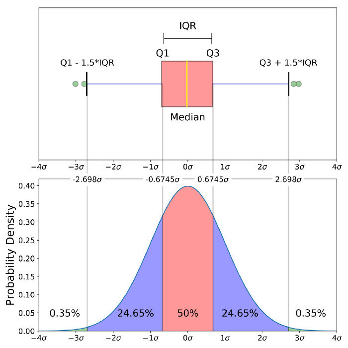
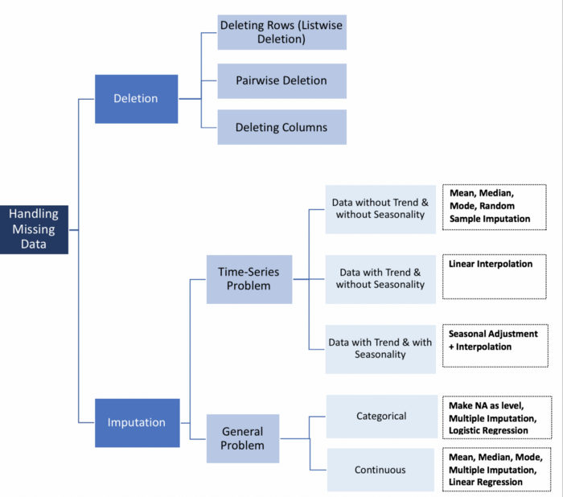
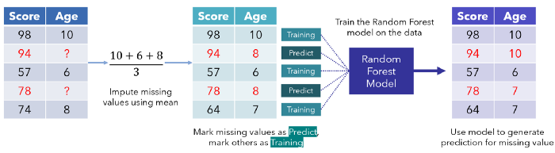

--- 
title: "数据科学导论（Introductory of Data Science）"
author: "潘蓄林"
date: "`r Sys.Date()`"
site: bookdown::bookdown_site
output: bookdown::gitbook
documentclass: book
bibliography: [book.bib, packages.bib]
biblio-style: apalike
link-citations: yes
#github-repo: rstudio/bookdown-demo
description: "2022年数据科学导论"
---

# 前言（Prerequisites）

数据科学：从数据中提取出有价值的知识。

数据：主要指大数据，符合“4V+C”（Value，Variatey，Volumn，Velocity，Complex）特征的数据；


<!--chapter:end:index.Rmd-->

# R及Python语言简介

### R简介
1. R语言是从S统计绘图语言演变而来, 可看作S的“方言”; 
2. S语言诞生于上世纪70年代的贝尔实验室,  由Rick Becker, John Chambers, Allan Wilks开发; 基于S语言开发的商业软件Splus, 可以方便的编写函数、建立模型, 具有良好的扩展性, 在国外学术界应用很广. 
3. 1995年, 新西兰Auckland大学统计系的Robert Gentleman和Ross Ihaka, 基于S语言的源代码, 编写了能执行S语言的软件, 并将该软件的源代码全部公开, 这就是R软件, 其命令统称为R语言.

### R语言安装及环境配置

- 下载R：
[R官方网站](https://www.r-project.org/)
1. 选择合适的源；
2. 根据操作系统选择合适的包下载
- 安装r软件；

### Rstudio软件安装
- 下载Rstudio：
[Rstudio官方网站](https://www.rstudio.com/products/rstudio/download/)
1. 选择free的下载；
2. 根据操作系统选择合适的包下载
- 安装r软件；
- R语言安装（win版）：[下载软件](https://cran.r-project.org/bin/windows/base/R-3.6.1-win.exe)

- 双击，按照提示完成安装（使用默认安装）

- Rstudio安装：Studio是R最佳的图形编辑环境

### R基础
```{r}
#试试R编程 
x=1:100#把1,2,...,100这个整数向量赋值到x
(x=1:100) #同上, 只不过显示出来
sample(x,20) #从1,2,...,100中随机不放回地抽取20个值作为样本
set.seed(0);sample(1:10,3)#先设随机种子再抽样
#从1,2,...,200000中随机不放回地抽取10000个值作为样本:
z=sample(1:20,5)
z[1:3]#方括号中为向量z的下标
y=c(1,3,7,3,4,2)
z[y]#以y为下标的z的元素值
(z=sample(x,100,rep=T))#从x有放回地随机抽取100个值作为样本
(z1=unique(z))
length(z1)#z中不同元素的个数
xz=setdiff(x,z) #x和z之间的不同元素--集合差
sort(union(xz,z))#对xz及z的并的元素从小到大排序
setequal(union(xz,z),x) #xz及z的并的元素与x是否一样
intersect(1:10,7:50) #两个数据的交
sample(1:100,20,prob=1:100)#从1:100中不等概率随机抽样,
#上一语句各数字被抽到的概率与其值大小成比例
pi*10^2 #能够用?"*"、?"^"等来看某些基本算子的帮助, pi是圆周率
"*"(pi,"^"(10,2)) #和上面一样, 有些烦琐, 是吧! 没有人这么用
pi*(1:10)^-2.3#可以对向量求指数幂
x = pi * 10^2 ; print(x) 
(x=pi *10^2) #赋值带打印
pi^(1:5) #指数也可以是向量
print(x, digits= 12)#输出x的12位数字

#R对象的类型
x=pi*10^2
class(x) #x的class
typeof(x) #x的type
class(cars)#cars是一个R中自带的数据
typeof(cars) #cars的type
names(cars)#cars数据的变量名字
summary(cars) #cars的汇总
head(cars)#cars的头几行数据, 和cars[1:6,]相同
tail(cars) #cars的最后几行数据
str(cars)#也是汇总
row.names(cars) #行名字
attributes(cars)#cars的一些信息
class(dist~speed)#公式形式,"~"左边是因变量,右边是自变量
plot(dist~speed,cars)#两个变量的散点图
plot(cars$speed,cars$dist) #同上


#包括简单自变量为定量变量及定性变量的回归

ncol(cars);nrow(cars) #cars的行列数
dim(cars) #cars的维数
lm(dist ~ speed, data = cars)#以dist为因变量,speed为自变量做OLS回归
cars$qspeed =cut(cars$speed, breaks=quantile(cars$speed),
include.lowest = TRUE) #增加定性变量qspeed, 四分位点为分割点
names(cars) #数据cars多了一个变量
cars[3]#第三个变量的值, 和cars[,3]类似
table(cars[3])#列表
is.factor(cars$qspeed)
plot(dist ~ qspeed, data = cars)#点出箱线图
#拟合线性模型(简单最小二乘回归):
(a=lm(dist ~ qspeed, data = cars))
summary(a)#回归结果(包括一些检验)

x <- round(runif(20,0,20), digits=2)#四舍五入
summary(x) #汇总
min(x);max(x) #极值, 与range(x)类似
median(x)  # 中位数(median)
mean(x)    # 均值(mean)
var(x)     #方差(variance)
sd(x)      # 标准差(standard deviation),为方差的平方根
sqrt(var(x)) #平方根
rank(x)    # 秩(rank)
order(x)#升序排列的x的下标
order(x,decreasing = T)#降序排列的x的下标
x[order(x)] #和sort(x)相同
sort(x)     #同上: 升序排列的x
sort(x,decreasing=T)#sort(x,dec=T) 降序排列的x
sum(x);length(x)#元素和及向量元素个数
round(x) #四舍五入,等于round(x,0),而round(x,5)为留到小数点后5位
fivenum(x)  # 五数汇总, quantile
quantile(x) # 分位点 quantile (different convention)有多种定义
quantile(x, c(0,.33,.66,1))
mad(x) # "median average distance":
cummax(x)#累积最大值
cummin(x)#累积最小值
cumprod(x)#累积积
cor(x,sin(x/20)) #线性相关系数 (linear correlation)

#一些简单图形
x=rnorm(200)#将200个随机正态数赋值到x
hist(x, col = "light blue")#直方图(histogram)
rug(x) #在直方图下面加上实际点的大小位置
stem(x)#茎叶图
x <- rnorm(500)
y <- x + rnorm(500) #构造一个线性关系
plot(y~ x) #散点图
a=lm(y~x) #做回归
abline(a,col="red")#或者abline(lm(y~x),col="red")散点图加拟合线
print("Hello World!")
paste("x 的最小值= ", min(x)) #打印
demo(graphics)#演示画图(点击Enter来切换)

#复数运算、求函数极值、多项式的根
(2+4i)^-3.5+(2i+4.5)*(-1.7-2.3i)/((2.6-7i)*(-4+5.1i))#复数运算
#下面构造一个10维复向量, 实部和虚部均为10个标准正态样本点:
(z <-complex(real=rnorm(10), imaginary =rnorm(10)))
complex(re=rnorm(3),im=rnorm(3))#3维复向量
Re(z) #实部
Im(z) #虚部
Mod(z) #模
Arg(z) #辐角
choose(3,2) #组合
factorial(6)#排列6!

#求函数极值
f=function(x) x^2+2*x+1 #定义一个二次函数
optimize(f,c(-2,2))#在区间(-2,2)内求极值
curve(f, from = -3,to=2)#在区间(-3,2)内画上面定义的函数f图

#求从常数项开始到5次方项的系数分别为1, 2, 2, 4, -9, 8的多项式的根: 
polyroot(c(1,2,2,4,-9,8))


#字符型向量和因子型变量
a=factor(letters[1:10]);a #letters:小写字母向量,LETTERS:大写
a[3]="w" #不行! 会给出警告
a=as.character(a) #转换一下
a[3]="w" #可以了
a;factor(a) #两种不同的类型
#定性变量的水平:
levels(factor(a))
sex=sample(0:1,10,r=T)
sex=factor(sex);levels(sex)
#改变因子的水平:
levels(sex)=c("Male","Female");levels(sex)
#确定水平次序:
sex=ordered(sex,c("Female","Male"));sex
levels(sex)

#序列

(z=seq(-1,10,length=100))#从-1到10等间隔的100个数组成的序列
z=seq(-1,10,len=100)#和上面写法等价
(z=seq(10,-1,-0.1)) #10到-1间隔为-0.1的序列
(x=rep(1:3,3))  #三次重复1:3
(x=rep(3:5,1:3)) #自己看, 这又是什么呢?
x=rep(c(1,10),c(4,5))
w=c(1,3,x,z);w[3]#把数据(包括向量)组合(combine)成一个向量
x=rep(0,10);z=1:3;x+z #向量加法(如果长度不同, R给出警告和结果)
x*z   #向量乘法
rev(x)#颠倒次序
z=c("no cat","has ","nine","tails") #字符向量
z[1]=="no cat" #双等号为逻辑等式
z=1:5
z[7]=8;z #什么结果? 注:NA为缺失值(not available)
z=NULL
z[c(1,3,5)]=1:3;
z
rnorm(10)[c(2,5)]
z[-c(1,3)]#去掉第1、3元素
z=sample(1:100,10);z
which(z==max(z))#给出最大值的下标


#矩阵
x=sample(1:100,12);x #抽样
all(x>0);all(x!=0);any(x>0);(1:10)[x>0]#逻辑符号的应用
diff(x) #差分
diff(x,lag=2) #差分
x=matrix(1:20,4,5);x #矩阵的构造
x=matrix(1:20,4,5,byrow=T);x#矩阵的构造, 按行排列
t(x) #矩阵转置
x=matrix(sample(1:100,20),4,5)
2*x
x+5
y=matrix(sample(1:100,20),5,4)
x+t(y) #矩阵之间相加
(z=x%*%y) #矩阵乘法
z1=solve(z) #用solve(a,b)可以解方程ax=b
z1%*%z #应该是单位向量, 但浮点运算不可能得到干净的0
round(z1%*%z,14)  #四舍五入
b=solve(z,1:4); b #解联立方程


nrow(x);ncol(x);dim(x)#行列数目
x=matrix(rnorm(24),4,6)
x[c(2,1),]#第2和第1行
x[,c(1,3)] #第1和第3列
x[2,1] #第[2,1]元素
x[x[,1]>0,1] #第1列大于0的元素
sum(x[,1]>0) #第1列大于0的元素的个数
sum(x[,1]<=0) #第1列不大于0的元素的个数
x[,-c(1,3)]#没有第1、3列的x.
diag(x)  #x的对角线元素
diag(1:5) #以1:5为对角线元素,其他元素为0的对角线矩阵
diag(5) #5维单位矩阵
x[-2,-c(1,3)]#没有第2行, 第1、3列的x
x[x[,1]>0&x[,3]<=1,1]#第1列>0并且第3列<=1的第1列元素
x[x[,2]>0|x[,1]<.51,1]#第1列<.51或者第2列>0的第1列元素
x[!x[,2]<.51,1]#第1列中相应于第2列>=.51的元素
apply(x,1,mean)#对行(第一维)求均值
apply(x,2,sum)#对列(第二维)求和
x=matrix(rnorm(24),4,6)
x[lower.tri(x)]=0;x #得到上三角阵
#为得到下三角阵, 用x[upper.tri(x)]=0)

#高维数组
x=array(runif(24),c(4,3,2));x
#上面用24个服从均匀分布的样本点构造4乘3乘2的三维数组
is.matrix(x)
dim(x)#得到维数(4,3,2)
is.matrix(x[1,,])#部分三维数组是矩阵
x=array(1:24,c(4,3,2))
x[c(1,3),,]
x=array(1:24,c(4,3,2))
apply(x,1,mean)   #可以对部分维做求均值运算
apply(x,1:2,sum)  #可以对部分维做求和运算
apply(x,c(1,3),prod) #可以对部分维做求乘积运算

#矩阵与向量之间的运算

x=matrix(1:20,5,4) #5乘4矩阵
sweep(x,1,1:5,"*")#把向量1:5的每个元素乘到每一行
sweep(x,2,1:4,"+")#把向量1:4的每个元素加到每一列
x*1:5
#下面把x标准化,即每一元素减去该列均值,除以该列标准差
(x=matrix(sample(1:100,24),6,4));(x1=scale(x))
(x2=scale(x,scale=F))#自己观察并总结结果
(x3=scale(x,center=F)) #自己观察并总结结果
round(apply(x1,2,mean),14) #自己观察并总结结果
apply(x1,2,sd)#自己观察并总结结果
round(apply(x2,2,mean),14);apply(x2,2,sd)#自己观察并总结结果
round(apply(x3,2,mean),14);apply(x3,2,sd)#自己观察并总结结果

#缺失值, 数据的合并
airquality #有缺失值(NA)的R自带数据
complete.cases(airquality)#判断每行有没有缺失值
which(complete.cases(airquality)==F) #有缺失值的行号
sum(complete.cases(airquality)) #完整观测值的个数
na.omit(airquality) #删去缺失值的数据
#附加, 横或竖合并数据: append,cbind,rbind
x=1:10;x[12]=3
(x1=append(x,77,after=5))
cbind(1:5,rnorm(5))
rbind(1:5,rnorm(5))
cbind(1:3,4:6);rbind(1:3,4:6) #去掉矩阵重复的行
(x=rbind(1:5,runif(5),runif(5),1:5,7:11))
x[!duplicated(x),]
unique(x)

#列表 list
#list可以是任何对象(包括list本身)的集合
z=list(1:3,Tom=c(1:2,a=list("R",letters[1:5]),w="hi!"))
z[[1]];z[[2]]
z$T
z$T$a2
z$T[[3]]
z$T$w
for (i in z){
  print(i)
  for (j in i)
    print(j)
}

y=list(1:5,rnorm(10))
lapply(y, function(x) sum(x^2))#对list中的每个元素实施函数运算, 输出list
sapply(y, function(x) sum(x^2))#同上, 但输出为向量或矩阵等形式

#条形图和表格

x=scan()#30个顾客在五个品牌中的挑选
x <- c(3, 3, 3, 4, 1, 4, 2, 1, 3, 2, 5, 3, 1, 2, 5, 2, 3, 4, 2, 2, 5, 3, 1, 4, 2, 2, 4, 3, 5, 2)

barplot(x) #不合题意的图
table(x) #制表
barplot(table(x)) #正确的图
barplot(table(x)/length(x)) #比例图(和上图形状一样)
table(x)/length(x)

#形成表格
library(MASS)#载入程序包MASS
quine #MASS所带数据
attach(quine)#把数据变量的名字放入内存
#下面语句产生从该数据得到的各种表格
table(Age)
table(Sex, Age); tab=xtabs(~ Sex + Age, quine); unclass(tab)
tapply(Days, Age, mean)
tapply(Days, list(Sex, Age), mean)


#编写简单的函数
#下面这个函数是按照定义(编程简单, 但效率不高)求n以内的素数
ss=function(n=100){
  z=2
  for (i in 2:n)
    if(any(i%%2:(i-1)==0)==F)z=c(z,i)
  return(z) 
}
#fix(ss) #用来修改任何函数或编写一个新函数
ss() #计算100以内的素数
#t1=Sys.time() #记录时间点
#ss(10000) #计算10000以内的素数
#Sys.time()-t1 #计算费了多少时间
#system.time(ss(10000))#计算执行ss(10000)所用时间
#函数可以不写return,这时最后一个值为return的值
#为了输出多个值最好使用list输出
detach(quine) #attach的逆运行

#画图

x=seq(-3,3,len=20);y=dnorm(x)#产生数据
w= data.frame(x,y)#合并x,成为数据w
par(mfcol=c(2,2))#准备画四个图的地方
plot(y ~ x, w,main="正态密度函数")
plot(y ~ x,w,type="l", main="正态密度函数")
plot(y ~ x,w,type="o", main="正态密度函数")
plot(y ~ x,w,type="b",main="正态密度函数")
par(mfcol=c(1,1))#取消par(mfcol=c(2,2))

#色彩和符号等的调整
plot(1,1,xlim=c(1,7.5),ylim=c(0,5),type="n") #画出框架
#在plot命令后面追加点(如要追加线可用lines函数):
points(1:7,rep(4.5,7),cex=seq(1,4,l=7),col=1:7, pch=0:6)
text(1:7,rep(3.5,7),labels=paste(0:6,letters[1:7]),
cex=seq(1,4,l=7),col=1:7)#在指定位置加文字
points(1:7,rep(2,7), pch=(0:6)+7)#点出符号7到13
text((1:7)+0.25, rep(2,7), paste((0:6)+7))#加符号号码
points(1:7,rep(1,7), pch=(0:6)+14) #点出符号14到20
text((1:7)+0.25, rep(1,7), paste((0:6)+14)) #加符号号码
#关于符号形状、大小、颜色以及其他画图选项的说明可用"?par"来查看

```

### python语言安装及环境配置

- 直接安装Anaconda编辑环境；
- python基础；

```{python pythonbasic,ehco=TRUE}
x = [1,2,3,4]
print(x[2])

```


<!--chapter:end:01-intro.Rmd-->

---
output:
  html_document: default
  word_document: default
  pdf_document: default
---
# 数据描述

### 数据的意义及获取

1. 数据的类型：使用不同的标准，可将数据分成不同的类型，如数量型和质量型；
    + 质量型(Categorical)：定类变量(Nominal)、定序变量(Ordinal)；
    + 数量型(Numerical)：定距数据(interval data)、等比变量(ratio); 
2. 数据的获取：实验数据、观察数据、网络抓取及公用数据库(UCI,kaggle)等；
   +  datalist([datalist](https://www.datasetlist.com/))汇集了多       个网站上的数据集;
   +  UCI数据库([uci dataset](http://archive.ics.uci.edu/ml/datasets.php)):创建于1987年，是一个比较有历史的数据集数据库，是一个含有数据库、领域知识及数据产生器的网站；
   + Fastai([Fastai](https://course.fast.ai/datasets)):进行图像分类、NLP及图像定位(image localization)的数据集；
   + Kaggle([kaggle](https://www.kaggle.com/datasets))：数据科学竞赛的主要网站；
   + Sklearn([Skearn](https://scikit-learn.org/stable/))：数据科学非常重要的包；
3. 数据的产生过程：总体(有限、无限，未知）和样本（总体的子集，随机性，已知）；

4. 表格型数据（结构化数据）：行(样本数量,rows), 列(变量名,columns)

```{r table_data, echo=TRUE}
library(ISLR)
#View(Auto)
head(Auto) # 查看数据的前5行
names(Auto) # 查看变量名
```

### 简单的数据汇总
```{r data_sum, echo=TRUE}
library(ISLR)
summary(Auto)
mean(Auto$mpg)

```
- 样本平均值的计算：$$\bar{Y}=\frac{1}{n}\sum\limits_{i=1}^ny_i$$
- 样本的方差：$$s^2=\frac{1}{n-1}\sum\limits_{i=1}^n(x_i-\bar{x})^2$$
- 线性相关系数：$$r=\frac{\sum\limits_{i=1}^n(x_i-\bar{x})(y_i-\bar{y})}{\sqrt{\sum\limits_{i=1}^n(x_i-\bar{x})^2}\sqrt{\sum\limits_{i=1}^n(y_i-\bar{y})^2}}$$

- 课堂练习：
统计7位同学周未的学习时间，数据为：8，11，7，13，9，5，9，计算同学学习时间的均值，中位数、四分位数、标准差和极差（使用手算）。

   + $\bar{x}=\frac{8+11+7+13+9+5+9}{7}=8.85$
   + $s^2=\frac{(8-8.85)^2+\cdots+(9-8.85)^2}{7-1}=6.81$
   + $s=\sqrt{s^2}=\sqrt{6.81}=2.6$
   + Median = 9; Mode = 9; Range = Max - min = 13-5=8
   
```{r des, echo=TRUE}
d <- c(8,11,7,13,9,5,9)
mean(d)
median(d)
mode(d)
quantile(d)
sd(d)
```
  

### 数据的可视化

1. 两个变量之间的关系：散点图(scatter)
```{r scatter,ehco=TRUE}
library(ISLR)
plot(Auto$mpg,Auto$horsepower)

```
2. 描述数量变量数据分布情况的图形：直方图(histogram)
```{r histogram,ehco=TRUE}
par(mfrow=c(1,2))
hist(Auto$horsepower)
hist(Auto$mpg)

```
3. 描述数量变量数据分布情况的图形：盒形图或箱线图(boxplot)
```{r boxplot,echo=TRUE}
boxplot(Auto$horsepower)

```

4. 把一些数目以矩形形式显示, 表面上类似于直方图, 但直方图是描述连续数量变量的, 而条形图描述离散变量或分类变量各个水平计数(频数):条形图(barplot)。
```{r barplot,echo=TRUE}
# Simple Bar Plot
counts <- table(mtcars$gear)
barplot(counts, main="Car Distribution",
   xlab="Number of Gears")
```

5. ggplot2([ggplot2](https://ggplot2.tidyverse.org/index.html)):ggplot2是一个用于声明性地创建图形的系统，基于图形语法。你提供数据，告诉ggplot2如何将变量映射到美学上，使用什么图形基元，它就会处理好这些细节。
  + 一个简单的ggplot2例子
```{r ggplot01,echo=TRUE}
library(ggplot2)
ggplot(mpg, aes(displ, hwy, colour = class)) + 
  geom_point()

```
```{r ggplot02,echo=TRUE}
# Generate some sample data, then compute mean and standard deviation
# in each group
df <- data.frame(
  gp = factor(rep(letters[1:3], each = 10)),
  y = rnorm(30)
)
ds <- do.call(rbind, lapply(split(df, df$gp), function(d) {
  data.frame(mean = mean(d$y), sd = sd(d$y), gp = d$gp)
}))

# The summary data frame ds is used to plot larger red points on top
# of the raw data. Note that we don't need to supply `data` or `mapping`
# in each layer because the defaults from ggplot() are used.
ggplot(df, aes(gp, y)) +
  geom_point() +
  geom_point(data = ds, aes(y = mean), colour = 'red', size = 3)
```

6. 漂亮图形的几大要素：
   +  数据类型（Data Component）: 不同的数据类型使用合适的图形来表示，条形图（离散型数据）、直方图（连续型数据）等。
   +  几何要素（Geometric Component）: 根据数据选择合适的的图形scatter plot, line graphs, barplots, histograms, qqplots, smooth densities, boxplots, pairplots, heatmaps, etc.
   +  坐标要素（Mapping Component）: 选择合适的横坐标和纵坐标.
   +  刻度要素（Scale Component）:选择合适的刻度. linear scale, log scale, etc.
   +  标识要素（Labels Component）: This include things like axes labels, titles, legends, font size to use, etc.
   +  Ethical Component: Here, you want to make sure your visualization tells the true story. You need to be aware of your actions when cleaning, summarizing, manipulating and producing a data visualization and ensure you aren’t using your visualization to mislead or manipulate your audience.

<!--chapter:end:02-literature.Rmd-->

# 数据整理和清理

-  从各种不同来源得到的数据可能存在数据的格式混乱、数据冗余（重复）、含缺失值(missing data)、异常值(outlier)等问题，无法直接用于模型构建，所以建模的第一步就是完成数据清洗和重构。

-  数据科学家日常的工作大约有80%的时间都用于清洗数据。

## 数据的筛选

- 选出符合条件的数据：根据一定的条件筛选出符合条件的数据子集；

```{r datacleaning,echo=TRUE}
# download data from http://data.un.org/Data.aspx?q=GDP&d=SNAAMA&f=grID%3a101%3bcurrID%3aNCU%3bpcFlag%3a0
library(tidyverse)
library(ggplot2)

gdp1 <- read.csv("./data/UNdata_Export_20220406_093714228.csv")

head(gdp1)
names(gdp1)
#levels(as.factor(gdp1[,3]))=paste0("V",1:9)
tb <- as.tibble(gdp1)
head(tb)
names(tb)

# filter year 2016 data
tb2016 <- tb[tb$Year==2016,-2]%>%spread(key="Item",value="Value")
head(tb2016,3)
names(tb2016)[2:10] <- paste0("V",1:9)
head(tb2016)
ggplot(tb2016,aes(x=V4,y=V5))+
  geom_point()+
  geom_smooth()
# Draw time series chart
tb %>% subset(Country.or.Area=="Japan") %>%
  ggplot(aes(x=Year,y=Value))+
    geom_line(aes(color=Item),size=1)+
    theme_minimal()
```

## 数据合并
- 把多个数据合并在一起；
```{r combinefiles,echo=TRUE}
NN <-  c("./data/D1.csv","./data/D2.csv","./data/D3.csv")
df <- lapply(NN,read.csv)
head(df)

# delete rows and columns
U <- NULL
for (i in 1:length(df)){
  U = unique(c(U,unique(as.character(df[[i]][,1]))))
}
Trash = c("1","2","3","4","footnoteSeqID")
U = setdiff(U,Trash)

df = lapply(df,function(x) x[x[,1]%in% U,])
df = lapply(df,function(x) select(x,-Value.Footnotes))
head(df)

# combine data
x = df[[1]]
for(i in 2:length(NN)){
  x = merge.data.frame(x,df[[i]],by="Country.or.Area")
}
head(x)
write.csv(x,"./data/dp.csv",row.names = FALSE)
```


## 数据的缺失
- 数据中经常会含有缺失值，缺失值的产生有不同的机制（完全随机缺失CMAR，随机缺失MAR和非随机缺失MNAR）;
- 在R中缺失值通常用NA(not available)表示；


### 缺失值的审视与标记


### 删除缺失值的方法及问题


### 利用可预测模型来填补缺失值

First, the missing values are filled in using median/mode imputation. Then, we mark the missing values as ‘Predict’ and the others as training rows, which are fed into a Random Forest model trained to predict, in this case, Age based on Score. The generated prediction for that row is then filled in to produce a transformed dataset.


### 处理缺失值的R包
1. MICE
(Multivariate Imputation via Chained Equations) is one of the commonly used package by R users. Creating multiple imputations as compared to a single imputation (such as mean) takes care of uncertainty in missing values.
MICE assumes that the missing data are Missing at Random (MAR), which means that the probability that a value is missing depends only on observed value and can be predicted using them. It imputes data on a variable by variable basis by specifying an imputation model per variable.
For example: Suppose we have X1, X2….Xk variables. If X1 has missing values, then it will be regressed on other variables X2 to Xk. The missing values in X1 will be then replaced by predictive values obtained. Similarly, if X2 has missing values, then X1, X3 to Xk variables will be used in prediction model as independent variables. Later, missing values will be replaced with predicted values.
By default, linear regression is used to predict continuous missing values. Logistic regression is used for categorical missing values. Once this cycle is complete, multiple data sets are generated. These data sets differ only in imputed missing values. Generally, it’s considered to be a good practice to build models on these data sets separately and combining their results.
2. Amelia
3. missForest
4. Hmisc
5. mi

### 实例
```{r mdcase,echo=TRUE}
#install.packages("mice")
#install.packages("missForest")
library(mice)
library(missForest)
#load data
data <- iris 
# Get summary
summary(data)
#Generate 10% missing values at Random
iris.mis <- prodNA(data, noNA = 0.1)
#Check missing values introduced in the data
summary(iris.mis)
# Removing categorical data
iris.mis <- subset(iris.mis, select = -c(Species))
summary(iris.mis)
md.pattern(iris.mis)

# make it beautiful missing pattern
#install.packages("VIM")
library(VIM)
mice_plot <- aggr(iris.mis, col=c('navyblue','yellow'),
numbers=TRUE, sortVars=TRUE,
labels=names(iris.mis), cex.axis=.7,
gap=3, ylab=c("Missing data","Pattern"))

# impute the missing data using mice
imputed_Data <- mice(iris.mis, m=5, maxit = 50, method = 'pmm', seed = 500)
#m — Refers to 5 imputed data sets;maxit — Refers to no. of iterations taken to impute missing values;method — Refers to method used in imputation. we used predictive mean matching
summary(imputed_Data)
#check imputed values
imputed_Data$imp$Sepal.Width
#get complete data ( 2nd out of 5)
completeData <- complete(imputed_Data,2)
#build predictive model
library(dplyr)
fit <- with(data = iris.mis, exp = lm(Sepal.Width ~ Sepal.Length + Petal.Width))
#combine results of all 5 models
#combine <- pool(fit)
summary(fit)
```


<!--chapter:end:03-method.Rmd-->

# 有监督学习概论

Some _significant_ applications are demonstrated in this chapter.

## Example one

## Example two

<!--chapter:end:04-application.Rmd-->

# Final Words

We have finished a nice book.

<!--chapter:end:05-summary.Rmd-->

`r if (knitr:::is_html_output()) '
# References {-}
'`

<!--chapter:end:06-references.Rmd-->

# Logistic回归

This is an R Markdown document. Markdown is a simple formatting syntax for authoring HTML, PDF, and MS Word documents. For more details on using R Markdown see <http://rmarkdown.rstudio.com>.

When you click the **Knit** button a document will be generated that includes both content as well as the output of any embedded R code chunks within the document. You can embed an R code chunk like this:

```{r cars}
summary(cars)
```

## Including Plots

You can also embed plots, for example:

```{r pressure, echo=FALSE}
plot(pressure)
```

Note that the `echo = FALSE` parameter was added to the code chunk to prevent printing of the R code that generated the plot.

<!--chapter:end:07-ref.Rmd-->

